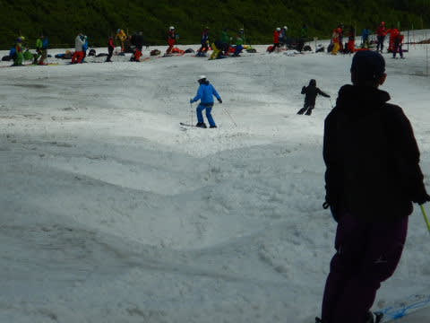

# 2020/6/20(土)，月山スキー場へ行ってきた！！滑れるのはTバーのみ．Tバー20分待ち…

📅 投稿日時: 2020-06-21 00:36:09

ってなことで．

昨日の予告通り，本日は月山へ滑りに

行ってきました！！

いやーーー．

ホントに久しぶりにスキー板を

履いたよ…（感動の嵐）

ってなことで，早速，本日の

月山レポートです！！

えー．

まず．

朝8時前の駐車場は…

まだ半分以上空きがある，ガラガラ状態！

もう少し混むと思ったけど…

リフト乗り場に向かう道は…

ありゃ．

雪が少ない！！！

…これは，もうリフト滑るのは無理な

わけだ…(涙）

リフト券売り場もほとんど列はなく．

…県間移動自粛終了して激混みになると

思ったけど，やっぱり大斜面が滑れなくなった

のが効いたか…

ちなみに，リフト往復券は1100円．

写真の右下に写っている案内にあるように，

大斜面が立ち入り禁止になったので，

リフトを滑って降りてくることはできなくなり，

回数券や半日券，一日券はなくなってます…

ってなことで．

誰も並んでいない，ガラガラのリフトで

山頂へ！

朝は雨が残っていたものの，

リフト乗り場付近は，時折日も射すような

天気になって来たのですが…

…リフト降り場付近はダメです（涙）

ガスって全然見えません(泣)

リフトを降りても．

なんだか，上部のTバーコースが

全く見えないんですけど…っ！？？

とりあえず，

リフトを降りてから，こんな足場の悪い

ところをしばらく歩き…

ようやっと雪のある所へ出ました！！

うはーーー！

雪だ！

雪だ！！

実に2か月半以上ぶりに，

雪に再開です…！！（激烈に感動）

…しかし．

数日前に，リフトで滑れる大斜面，

沢コースは終わっちゃったので．

ここからは滑れず．

これからさらに，Tバー乗り場まで

登っていかねばなりません…(涙)

Tバーで滑れるところまでは，

まだここからかなりの距離を歩いて

登ること数分…

息を切らしながら，

やっとTバー乗り場へ到着！！

実に．

実に久しぶりに．

板を装着っ！！

あぁ…

これから，ついに待ちに待ってたスキーが

できるのだ！！

ってことで．

Tバーに乗って上に向かいますが…

Tバーの長さは100m弱．

結構短いです．

で．

Tバーのてっぺんに着きますが…

…

…

見えんよ．

何も…(泣）

でも．いい．

それでも，滑れるだけシアワセなのだ！！！

雪質は，圧雪も何もかかってないナチュラル

バーンですが，狭い範囲を多くのスキーヤーが

すべるので，そこそこ踏まれた感じで，

まぁまぁ滑りやすい雪．

…全然見えませんが…

って感じで，短いTバーをグルグルしていたら…

なんだか，だんだんTバーの列が伸びてきましたね…

そして，営業開始30分~1時間経った頃には．

…Tバー10分待ち超えてきた気がするん

ですが！？？

距離は100mもない短いTバーなので．

待つより歩いた方が早いと，ハイク

アップする人多数．

…みんな，そこまでして滑りたいん

だね…←あなたもハイクアップしていた一人でしょ？

ってなころに，さらに追い打ち．

2本あるTバーのうち，1本がワイヤ不良により

一旦営業見合わせ(涙）

そのため…

Tバー待ちは，20分を超えてきました…(激泣）

ゲレンデは見えず，

Tバーのコースは短い上に，

待ち時間がありえないほど長い…

正常な判断ができる状態なら，

まず常識的に帰っていたと思うのですが．

…実に2か月半，スキーがお預け状態

だったため，飢餓状況で正常な判断を

失っており．

こんな状況でもひたすら滑り続けていると…

をを！？？？

昼過ぎには，ちょっと視界が晴れてきましたよ！？？

いい感じに見えるようになってきましたよ！？？

（この写真，Tバー降り場から撮ったのですが．

　乗り場の列までの距離で，Tバーで滑れる

　距離がどのくらいの長さかわかりますね…）

いや，

ようやっとすっきりゲレンデが

見えるようになって来たよ…！！！

…でも．

午後には修理していたTバーが動き出し，

2本体制になったとはいえ．

…Tバーの待ち時間は，相変わらず

10分越え(涙)

まぁ，でも．

この時期に，これだけいい天気で，

しっかりコブも滑れるし．

コブだけじゃなく，フラットバーンも

ちゃんと滑れるんだから，恵まれてる…

（2か月半のスキー断ちで正常な判断を失っている）

…Tバー待ちはすごいけど…

と，実に久々のスキーを楽しんでいたら．

また，午後2時半過ぎには，

ガスが出て来ちゃったんですけど！？？（涙）

ってなことで．

午後もガスが出たり，ちょっと日が

射したりという感じでしたが…

結局最後まで，Tバー待ちはすごい

ままだったのでした…

ってなことで．

本日はもうこの程度にして．

切り上げることにしますか…

と，午後3時前に切り上げて．

下山したのですが．

下山するころには，リフト山頂駅から

滑ったコース全貌がようやく見えるように

なっており…

うむ．

結局，この上の部分だけを，

Tバー＆ハイクアップでほぼ一日，

ずっとグルグルしていたのか…

2か月半のスキー禁断症状から，

こんなコースでも

ひたすら滑り続けてしまいましたが．

…おそらく普通のシーズン，この狂気の

Tバー待ち時間だったら．

2-3本滑って帰っちゃってただろうな

と思った，Skier_Sだったのでした…

## 💬 コメント一覧

### 💬 コメント by (一緒に滑った人)
**タイトル**: Unknown
**投稿日**: 2020-06-21 00:55:16

お疲れさまでした。

私たちは早々に月山を降りて、トラヤワイン2升、蕎麦、ラーメン、うどんを道の駅西川で購入し、月山筍をタッチの差で奪われたので、山の家に戻ってゲットしました。

そのあとゲソの天ぷらが美味しいまるきやさんでざる蕎麦とゲソ天食べて、寒河江で佐藤錦買って、下道で400kmの帰路につきました。

福島の柳津で粟まんじゅう、栗まんじゅう買って、柳津西山温泉で2ヶ月ぶりのスキーで疲労した身体を癒し、自宅に日付が変わる直前に着きました。

無給油での往復に成功！燃費は14.4km/lでした！少々レヴォーグ1号より燃費が苦しかったです。

### 💬 コメント by (親父スキーヤー)
**タイトル**: Unknown
**投稿日**: 2020-06-21 09:40:28

お疲れ様でした

禁断症状は回復された事でしょう

雪解けとヤブ軍団の勢い恐ろしや…ですね

毎度ながら行った気分にさせられました

楽しませて頂きました！

又来シーズンも楽しみにしております

来年は日本3億のスキーヤー皆さんにとって良いシーズンであります様に！！

### 💬 コメント by (Skier_S)
**タイトル**: 実は1泊2日
**投稿日**: 2020-06-22 01:32:17

＞一緒に滑った人さま

土曜はお世話になりました～！

ホントに久しぶりにお会いできて良かったです…

こちらは日曜も滑りましたが，日曜の方がコンディション良かったです…

私はかなりエコランしたので，往復の燃費は15.2km/Lでした！

＞親父スキーヤーさま

…禁断症状は治まったけど，なんだかもっと広くて長い

コースを滑りたくなってしまいました…（寝た子を起こす状態）

日曜も滑ってきたので，日曜のレポートもお楽しみに！

…そして．ホントに来シーズンこそいいシーズンでありますように…

### 💬 コメント by (ikkun)
**タイトル**: Unknown
**投稿日**: 2020-06-25 12:22:20

Σ(ﾟ∀ﾟ)お疲れ様でした？

いやいや パワーだけではなく 気持ちって奴ですかね   凄いです   解禁？になりGWの仇を？もあるかもと 感じた先週の海沿いの国道でもありましたが？  景色嬉しいですよね(^^)ありがとうございます

### 💬 コメント by (Skier_S)
**タイトル**: ＞ikkunさま
**投稿日**: 2020-06-25 23:49:15

久々のスキーは疲れました…

