# 3月18，19日の週末の志賀高原スキー場の天気は？…土曜は湿った雪，日曜は晴れ

📅 投稿日時: 2023-03-16 06:33:30

ダメでした．

昨日も自宅で仕事をしている途中，

机で突っ伏して寝てしまい，

夜中に目覚めたものの，そのまま

布団に移動して寝てしまい．

Blogが更新できませんでした…（涙）

いや．

結局，机で突っ伏して寝た時間も

含めると．

実に久しぶりに，7時間半ほどの

長時間寝ました…！！

…そのせいで仕事が終わらず，今日は

ほぼ徹夜に近く（泣）．

こんな時間にBlog書いてます…

いや．

冷静に考えるとBlog書いてるどころじゃ

ないんですけど，さすがに2日間更新

しないと，

「Skier_Sは死んだか？」

とみんなに思われそうなので…

（実際はほぼ死んでるに等しい）

しかし，夜中に起きてられないで

意識を失うことが多いので．

どうも最近，ちと疲れが溜まっている

ようですね…←いや，間違いなく疲れてると思う

ってなことで．

本日も志賀高原特派員レポートから

ですが…

今日の志賀高原は朝からすっきり晴天！！

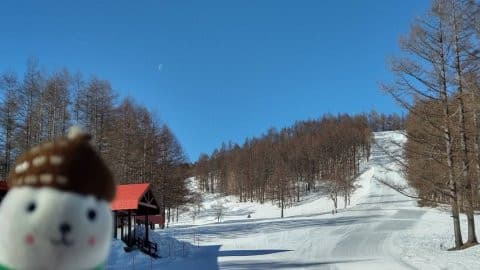

ただ，あさイチから0℃を上回る

高温だったようです…（涙）

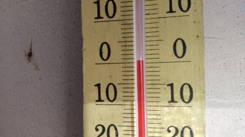

とはいえ．

あさイチは締まったシマシマで最高！（だったらしい）

適度にエッジが食い込む，滑りやすい

バーンだったみたいですね．

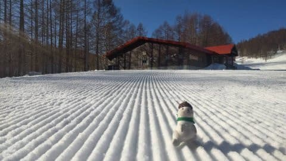

朝のうちはいい感じのバーンも．

今日は気温が上がってしまい，日差しも

あったので，午後は緩んじゃったようです

けど…

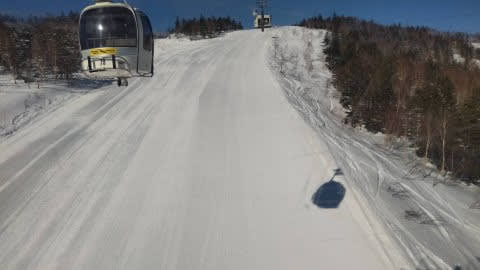

ってなことで．

相変わらず高温が続き，ありえない勢いで

雪が融けつつあるこの2週間ですが．

…果たして，この週末までの天気やいかに？？

水曜深夜恒例の，週末の志賀高原の天気予想です！！

まずは，明日木曜，16日の850hpa気温図を見ると…

うーーーん．

赤い0℃線は志賀高原より北．

志賀には+3℃線がかかっていて．

これで降ると，雨か雪か微妙ですが…

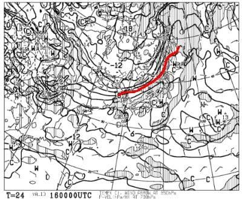

地上天気図を見ると．

志賀高原には降水域がかかってないので．

木曜は晴れの一日かな？

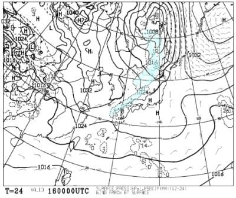

そして翌17日(金)の850hpa図ですが…

この日は赤い0℃線がギリギリ志賀高原

ちょうどの位置に．

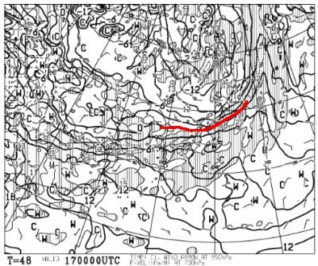

で，この日の地上天気図は…

明確に志賀には降水域はかかってないけど，

近くで降水が予想されているので．

この日の志賀高原は，雪が時折パラパラと昼間に

舞う程度の雪かな～

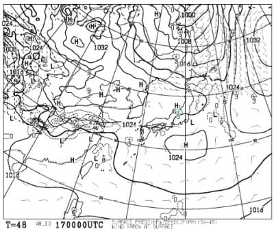

で．

肝心な18日土曜の850hpa図は．

まぁ，赤い0℃線はギリギリ志賀高原．

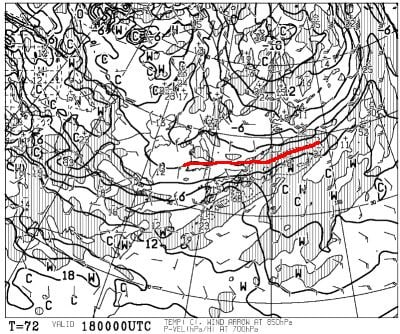

そして，地上天気図を見ると…

ここは，本州は北東北を除いてすべてが

降水域に入ってしまっており．

これは…志賀でも降りますね．

ただ，気温は0℃線が志賀にかかっている

レベルであれば，降るのは固体だと思って

安心できますが…

ただ，かなり湿った雪ですね(涙)

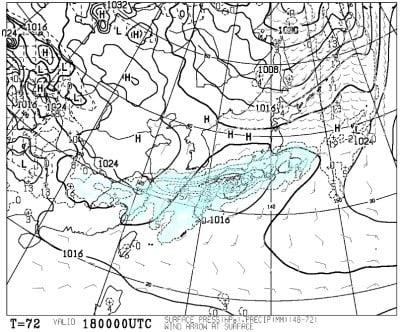

そして19日日曜は…

850hpaの0℃線は，志賀より南に

下がってくれるので，ちょっとは

冷えますかね…

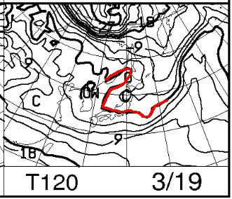

でも降らない．

冷えた日に降ってほしいんだけど…

この日は高気圧が近づいてきて，晴れますね

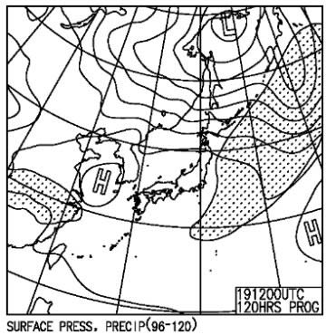

ってなことで．

まとめると．

16日(木)：朝イチは晴れ．気温は朝から

　0℃近い．午前は雪は緩む．

　午後に向かって気温が下がり，

　昼ごろから曇り始める．

　夕方は気温がマイナスになり，

　ゲレンデは一部カリカリになるかも

17日(金)：朝イチは曇り．-3℃程度．

　おそらく終日曇りで，

　一瞬雪が舞う時があるくらい．

　あさイチのバーンはカリカリに

　硬めのシマシマ．

　場所によってはコロコロも出るかも．

　昼間も気温は0℃程度で，硬めの

　バーンコンディションが続きそう．

18日(土)：前日夜から湿った雪が降る．

　あさイチの気温は-3℃程度．

　朝の積雪は5-10cmくらいで，

　あさイチのバーンは硬めの下地の

　上に重い新雪がうっすら乗った感じ．

　昼間も湿った重い雪が降ったり

　やんだりの終日曇り～雪降り．

　昼間も10cmくらい重い雪が積もる．

19日(日)：朝のうちは雲が多いけど…

　晴れそう．

　朝の気温は-3℃程度かな？

　終日ギリギリマイナス気温をキープして

　くれそう…

　あさイチのバーンは昨日の新雪が

　圧雪された比較的いいコンディション！

　急斜面は下地の硬いところが出てくる

　かもしれないけど，天気も悪くなく

　締まったバーンが滑れるので

　比較的いいコンディションかな…

って感じで．

相変わらず気温が高めの日が続くけど．

一応土曜は液体ではなく雪になってくれそうで．

重い雪だけどちょっと積もってくれて，

そのおかげで，日曜朝は比較的まともな

バーンで滑れるんじゃないかな～…

でも．

私は滑りに行けない可能性が…

18，19，21日の3日の休みを費やしても

仕上げられるとは思えない，月末締切りの

大量の原稿が…(涙)

そもそも平日もこんな時間にBlogを

書かなきゃならん時間になっちゃう上に，

休日をすべて仕事に費やさなきゃ

終わらないとは，なんということか…

ご無体．

ご無体すぎる…（激泣）

## 💬 コメント一覧

### 💬 コメント by (レインボー75)
**タイトル**: Unknown
**投稿日**: 2023-03-16 14:08:32

木曜日の志賀高原情報

朝の上林+5℃　蓮池+3℃。白樺は硬め、唐松はやや硬め。寺子屋には9時10分着。下から見て右から、エターナル(永遠)　リップス(唇)　フィロソフィ(哲学)。この今日は硬めの三コースを交互に。

帰りのファミリーがまたまたベスト。まっ平らに仕上がって快適そのもの。

ダイヤに着くと急にもこもこ。すでに柔らかい唐松から、今年から無料になったキッズパークで、無料貸し出しのスクートの練習。やってみると案外楽しいですよ。なんせ無料なんだから。

夜のイタリア戦のために昼前に終了。しっかり応援しなくっちゃ！

### 💬 コメント by (アリス)
**タイトル**: Unknown
**投稿日**: 2023-03-16 17:31:17

S様

こんにちは👋😃

今日は人生初めてのニゴン一番機‼️

レインボーさんには朝礼も無事終了🎵

パノラマ、白樺ファーストも発体験🎵

ニゴンスタートも魅力ありますね✨

午後から寺子屋へ行くと天才キッズのnaoちゃん発見❗️一段と速い、上手い、華麗の三拍子です✨

リフトで一緒になり、naoちゃんパパはSさんの特派員もしているWさんと同一人物と知り驚きです😱

明日もヤケビ一番スタートします🎵

### 💬 コメント by (Skier_S)
**タイトル**: これからダメな天気が続く
**投稿日**: 2023-03-17 02:39:17

＞レインボー75さま

今日も気温は高かったけど，意外と楽しめたみたいですね…

しかし，季節が1か月早く進んでますね．

12月は1か月遅く進んだのに…（泣）

＞アリスさま

そうです…naoパパさんは貴重な写真をいっぱい送ってくれる，

優秀な特派員なのです…

明日も気温は上がるけど，曇り空なのでそこまでひどく雪は緩まないと思います…！

### 💬 コメント by (富山県民)
**タイトル**: Unknown
**投稿日**: 2023-03-18 09:16:34

こんにちは。

３月１９日は晴れそうですね。

私は３月１９日に長野県のピラタス蓼科スノーリゾートに初めて行きます。

ライブカメラを見ると雪が降っていました。

明日は重めですが新雪が楽しめそうです。

天気も晴れの予報なので景色が楽しめそうです。

初めてのピラタス蓼科スノーリゾート、楽しみです。

今週末はスキーやな行けないのですか。

それは残念ですね。

私も去年の２月の下旬と３月上旬は休日出勤で週末でもスキーに行けませんでした。

しかも休日出勤当日、地元のスキー場が半額のサービスデーがありさらに当日は快晴なのに休日出勤で行けなくて悔しい思いをしました。

### 💬 コメント by (Skier_S)
**タイトル**: ＞富山県民さま
**投稿日**: 2023-03-19 03:04:53

明日の19日は晴れると思います！

晴れて冷えて，いいコンディションになりそうですが…

時間が経つと，アイスバーンの下地が出てくるかもしれません．

お気をつけて滑ってきてください…！

