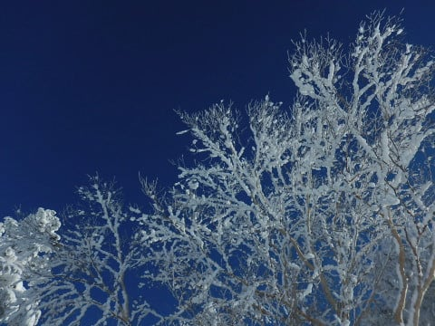

# 爆走！スーパーキッズたち…でも，娘には曲がることを教えないといかんな

📅 投稿日時: 2019-01-11 05:03:47

🏷️ カテゴリ: [スキー雑談](c1f9d2cb7478308da16419928ea3945e9.md)

ということで．

今シーズン，すでに滑走日数

13日になるわが娘．

…最近では，志賀高原で一緒に滑って

くれる子供たちがいるので．

どうやらこのシーズン，娘もかなり気合が

入っているらしく．

12月中はほぼ毎週滑っていたわけですが．

もう．

なんというか．

一緒に滑ってくれるこの子たちが，

ハンパないんですよ…

まぁ，ホントに．

ハンパなく速い．

うちの娘はそれほど上手いわけじゃないけど．

その子たちについて行くために．

リフト一本分，限りなく直滑降に近いラインで，

ノンストップで滑り降りていきます…

唐松コースを滑った時．

途中で全く止まる気配のない，一筋の直滑降跡が．

リフト降り場からリフト乗り場までくっきりと

続いているのを見て．

一瞬で分かりました．

「これ，うちの娘のシュプールだ…」

もう，そんなですから．

私も娘のトップペースには，もうついて行けません．

初日の出と同時に「よーいドン！」

で200人がスタートする，焼額恒例の

新春ファーストトラックでも．

ここ10年以上，毎年私がGSコースの

一位でゴールし続けていたという，

GSコースのトップの座をキープして

きていたというのに．

（総合トップは，オリンピックコースを落下して

　いく某H夫婦にかないませんが…）

今年は，ついにGSコーストップの座を，

娘に奪われてしまいました（涙）

いつの日か，娘に

「遅いよ！」

と言われる日が来るだろうと思ってましたが．

まさか，こんなに早く来るとは思って

ませんでした（涙）

そう．

それは，12月のある日のこと．

[Gokuさん](https://red.ap.teacup.com/gokurakuskier/)と私という，20000mゴールドな2人が

揃って，ガンガン滑っていたときのこと．

最初は，小学校高学年ペアの，娘＆お友達と

一緒に滑っていたんですが．

Gokuさんと私が，その子供たちに置いて

行かれてしまい．

搬器数台先のリフトに乗ったなぁ…

と思ったら．

その後，リフトに乗るたびに離されていき．

…そして，1時間ほどたつと．

なぜか後ろから追いかけてくる子供たち！

うぎゃーーーー！

小学生に，リフト1週差つけられた！？？

それも，20000mゴールドの二人が，

まったく手を抜かずに滑っていると

いうのに…！？？？？

…おそらく，私やGokuさんと一緒に滑った人なら．

私とGokuさんの滑りが決して遅くない…

というより，ゲレンデでかなり速い方で

あることを知っているはず．

そんな我々に，リフト一周差つけるとは…！

お前ら，どんだけ速いんじゃ～っ！！

そして．

我々に一周差をつけるまで．

リフト何本分もトップスピードで

滑り続けられる，その体力の小学生離れ

していることよ…（恐怖）

どうやらこの時．

このスーパーキッズたち二人．

たまたま焼額にやってきていた，

日本でのシーズン滑走標高差ダントツトップ，

世界25位の記録を誇る世界ランカーの某KonSukeさんを

追いまわし．←全然「某」になってないから

挙句の果てには，先に滑ってリフト乗り場で

待ってプレッシャーをかけるという．

[とんでもないことをやっていた](https://ameblo.jp/unbalance1/entry-12426753913.html)ようで…

KonSukeさん，その節はご迷惑おかけしました

とりあえず．

どうやら，娘や，娘と一緒に滑る子供たち．

世間の常識からずれているひたすら

止まらずトップスピードで滑り続ける，

20000mな方々と滑る機会が多いからか．

「スキーは休まず止まらず，トップスピードで

　滑り続けるものだ」

と刷り込まれてしまっているようで…

そのせいで．

なぜか娘は，直滑降大好きなスピード命の

直線番長と化してしまったわけで．

…どうやら，私は．

娘の育て方を間違えたらしい…

しかし．

うちの娘はちょっと危ないけど．

この小学生たちだったら．

20000m行けちゃうかも…（恐怖）

## 💬 コメント一覧

### 💬 コメント by (Kon  Suke)
**タイトル**: Unknown
**投稿日**: 2019-01-11 12:04:25

子供たち早いですね。

特に娘さんは・・・・。

Ｈ口道場に入門し、正統派直滑降を教えてもらいましょう。

### 💬 コメント by (サトシ父)
**タイトル**: 私も見ました
**投稿日**: 2019-01-11 13:24:58

先月Ｓさんにご挨拶させていただいた時に爆走キッズ軍団に遭遇しました…お父さん達大変そうでしたね。我が家の中１の息子も見習ってほしいものです。

### 💬 コメント by (Goku)
**タイトル**: もはや…
**投稿日**: 2019-01-11 19:11:14

もうあの子たちには付いていけません。

キレキレターンのサクラちゃんも凄いけど、スピード少年団も凄いです‼

あの手の競技があれば、表彰台独占間違いなし‼

因みに、後日GSコースでも周回遅れになりました。

### 💬 コメント by (葛飾の S)
**タイトル**: やっぱり
**投稿日**: 2019-01-11 20:22:57

焼額山の有名人と一緒に滑ってる逝かれた子供達は、

やはり関係者(近親者)だったんですねー。

何回か目撃してる間にSさんと娘さんとGOKU夫妻は見分けがつくようになったんですが、この前見たかっ飛びボーゲン男の子も、普通じゃないですねー(^^)

### 💬 コメント by (しんちゃん)
**タイトル**: 回復力も半端ない
**投稿日**: 2019-01-11 21:19:09

スーパーキッズ、早朝からナイターまで滑り倒した挙句、一晩寝れば体力が回復しているんですよね。

スピードに加え、回復力も半端ないですね。

### 💬 コメント by (musi)
**タイトル**: 微笑ましいですね
**投稿日**: 2019-01-11 22:11:07

わが子7歳も楽しんではいるのてすが、朝が遅くて朝礼見に行きたくてもナカナカ実現しないんですよね。4日から高熱出してくれて八方尾根キャンセルさせるし。（病院に連れていったら、その夜から私は5日高熱にやられました）。来週コソ志賀に向かいます。sさんの風邪は如何でしょうか、徒然日記が読めなくならないように、ご自愛ください、また、来週末ゲレンデだけ雪積もらせるように、気圧配置お願いします！

### 💬 コメント by (Skier_S)
**タイトル**: 3連休は天気良さそう！
**投稿日**: 2019-01-12 00:30:15

＞Kon Sukeさま

あの時は娘がご迷惑をおかけしました（汗）．

しかし，うちの娘にはもう少し曲がることを教えないと…

H口道場はちょっと恐れ多くて．

娘がもっと危ない方向に行きそうです(笑)．

＞サトシ父さま

あの時は，確か暴走キッズたちを追いかけていた

タイミングでお会いした気が…

いや，もうついて行くの大変ですから(笑)．

あの暴走っぷりは，あんまり見習わない方が良いかと…

＞Gokuさま

いやーー．

もう，ついて行けませんよね…

しかし，GSコースで周回遅れですか！！！

それはすごすぎる…

＞葛飾のSさま

あら．

暴走キッズたち，ご覧になってましたか…

しかし，私のことをもう何度も目撃されているんですね．

次はぜひ声をかけてやってください…

＞musiさま

7歳くらいだとそんなものだと思います…

うちの娘も，朝イチに並ぶようになったのは，

小学校3年か4年くらいからです．

しかし，高熱で八方キャンセルは痛かったですね…

そして，ご自身もやられちゃいましたか．

…来週19，20日ですが．タイミングの悪いことに，

私は志賀に行けない可能性が高いです…

20日に何とかスキーに行けないか調整中なのですが（涙）

