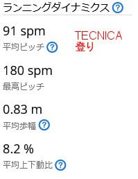
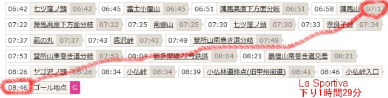

# トレランシューズ対決…今度はHOKA Speedgoat5で小仏P⇔陣馬山往復！HOKA・La Sportiva・TECNICAの対決結果やいかに！？その3

📅 投稿日時: 2023-07-30 06:42:31

🏷️ カテゴリ: [登山・旅行](c1d637a11a25b457ac978d197adbdafc5.md)

ってなことで．

[前回](e8c2a2c0c69f2bcc5278c8399af368e80.md)．

La SportivaのUltra Raptor2 MID GTX：3時間15分

TECNICAのSupreme MAX3.0：　　　 2時間58分

HOKAのSpeedgoat5：　　　　　　　　2時間46分

という三つのトレランシューズのタイム

比較をしたわけですが…

今回はトレランシューズ対決の

最終回．

なぜHOKAのタイムが良かったのか，

疲労が少なくて済んだのかを，

Garminさんの詳細データをもとに

もっと細かく解析してみます！！

ってなことで．

Garminさんのランニングダイナミクスの

データを見てみますが…

登りが多い小仏P⇒陣馬山の行きは，

三つのシューズともそこまで

大きな違いはないですね…

ただ，TECNICAとHOKAの歩幅が

大体一緒で，La Sprotivaよりは

広くなってます．

これは，平坦なところでは，TECNICAと

HOKAが，適度なロッカーやソールの反発力を

使って歩幅が広がっているのかなぁ．

ただ，HOKAはそこまで反発力がないので，

ソールのロッカーが効いてるのかも？

とりあえず，TECNICAとHOKAは歩幅が

広めになってます．

　

　

なので，上りタイムだけを比較すると．

La Sportivaのタイムは登り1時間53分．

TECNICAのタイムは登り1時間40分．

HOKAのタイムは登り1時間39分．

ってなことで…

以外にも．

TECNICAとHOKA，登りの多い行きは1分しか

差がないんだ…！！！

大きく違うのは，下りですね…！

下りも歩幅はLa Sprotivaに比べ，

TECNICAとHOKAが広いですが…

HOKAの歩幅が，かなり広くなってます！

さらに大きく違うのがピッチ．

La SprotivaとTECNICAでピッチの差が

5なのに対し．

TECNICAとHOKAでは，12も違う！

歩幅が広がっていて，さらにピッチも

早いので…

これがHOKAが速い理由ですね…！！

　

　

ってなことで．

下りのタイム差を見てみると…

La Sportivaのタイムは下り1時間29分．

TECNICAのタイムは下り1時間23分．

HOKAのタイムは下り1時間15分．

というわけで．

下りだけで，

TECNICAに比べてHOKAのタイムが8分早いです！！

下りのHOKAのタイムが圧倒です！

この理由を考えると…

自分の体感とランニングダイナミクスがよく

一致していていて．

HOKAのSpeedgoat．

鬼グリップなので，下りが怖くないのだ．

ブレーキをかけたくなる下りで，

重力のなすがまま加速しても怖くないのだ．

もう一度下りのデータを見てみると．

La Sportivaだけ最高ピッチが220と

かなり早くなってるけど…

これは，下りでスピードが出すぎるのが怖くて，

「ダダダダ…」とブレーキをかけたときに

ピッチがぐっと上がっているのを示してます．

TECNICAでも，最高ピッチは200を超えてるけど．

HOKAの最高ピッチだけ183と圧倒的に低いのは，

「ダダダダ…」とブレーキをかける足遣いを

することがなかったということ．

　

　

それでいて，HOKAの「平均ピッチ」が高く，

歩幅も広いのは…

下りで全然怖くないのでスピードを載せて，

平均ピッチを上げられたというのと，

それでいてかなり歩幅を取れているので…

滑るのが怖くて小刻みに足を運ぶ必要が

少なかったということを示してます！！

いや．

以前も書いたけど…

HOKA，やっぱり下りマシーンなんですよ．

鬼グリップで滑らないからスピードを出せるし，

クッションが強いので，スピード出しても

膝や足の裏に衝撃が来ないし…

下りですごいスピードが乗せられます！！

ってなことで．

ゆっくり歩く急な登り

La SportivaもTECNICAもHOKAも，

ほぼ同じタイム．

ほぼフラットな部分

ソールの反発力や適切なロッカーで，

TECNICAとHOKAがLa Sportivaより早く，

両者大体同じタイム．

わずかな下り

TECNICAとHOKAがLa Sportivaより速いけど，

グリップが強くクッションがいいHOKAが

TECNICAよりわずかにスピードを乗せられる

急な下り

鬼グリップで滑らず，そんなにブレーキを

かけずに降りることができるHOKAが

圧倒的に速い

という結果でした～！！

去年のHOKAのSpeedgoat MID GTXより，

今回のHOKAのタイムが40分ほど早くなったは，

やっぱり1年たって歩き方＆走り方が

上達したか…あるいは[VAAMのおかげ](e8b6d72454481512a12bcfd15198af308.md)なのかな…？？

この1年で，かなりタイムアップしたんだなぁ…

あ，

そうそう．

誤解を招きそうなので，ここでしっかり

書いておきますが．

La Sportivaはタイムが遅いといっても．

走ろうとするとそこまでスピードが

乗せられない

というだけで．

心拍数150とかで追い込むようなハイペースで

走る…ってのじゃなければ．

ミッドカットで足首までホールドがあり，

アウターもかなり頑丈だし．

ソールもしっかりしているので…

今回のような緩やかな道ならまだしも，

走ることができない，こんな道や険しい岩場を

ゆっくり確実に登る必要がある山歩きなら．

私は迷わずLa Sportivaを履いていきます…！！

…ってなことで．

今回，Garminさんのデータをもとに，

同じコースを3週連続で，３つのシューズの

履き比べをしたわけですが．

最初のLa Sportivaのときは，ところどころ

走ることはあるものの，ほぼ歩いて時折

立ち止ることもある，平和な山歩きだったのが…

（青が走り，緑が歩き，オレンジは停止）

TECNICAでは，青い走りの比率が

ちょっとずつ増えて…

最後のHOKAでは，半分くらい走って，

一度も立ち止まっていないという．

…こうして，

スキーのオフシーズンにトレーニングも兼ねて，

平和にゆっくり山歩きでもしようかな…

というのが，

着実にトレランに進化していってしまっている

変化を目の当たりにして．

これは危ない…

トレランはやらない．

平和に山を歩くんだ…！

と，改めて心に刻まないと危ない方向に行きそうだ…

と自戒を誓った，Skier_Sだったのでした．

## 💬 コメント一覧

### 💬 コメント by (油漏＠あちこち)
**タイトル**: Unknown
**投稿日**: 2023-07-30 10:00:21

来年の志賀のトレランでお会いしましょう。

４０キロコースなら、１０時間の制限時間ですので、平和に山歩きできます。自戒を維持しながら、夏の志賀高原愛を満喫しましょう。私もギョリンソウやニッコウキスゲ、あやめに加え、風景写真も撮りながら、楽しみました。

しかしながらSさんなら、寺子屋から一ノ瀬の下りと、奥志賀の下りではスキーヤーのスイッチが入ってしまうと予想します。

### 💬 コメント by (Skier_S)
**タイトル**: ＞油漏れ＠あちこちさま
**投稿日**: 2023-07-31 04:26:33

いや…この週末，21㎞の山歩き（標高差2200m）を全力でやっても7時間かかったので，

40㎞を10時間で行けるかなぁ…

しかし，リザルト見るとトップの人は3時間台でゴールしてるんですね．山道を6分/kmペースで走るって，人間じゃない…（恐怖）

