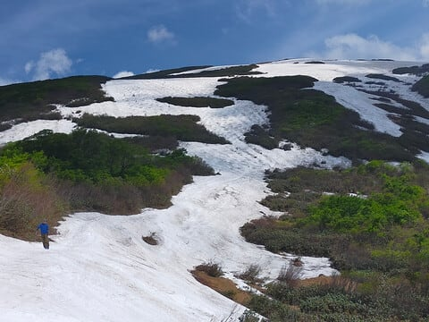
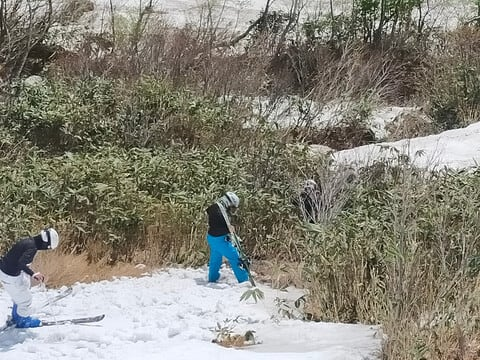
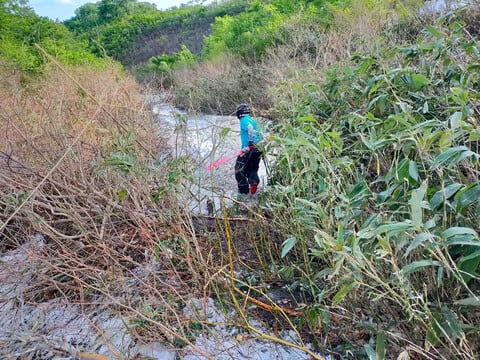
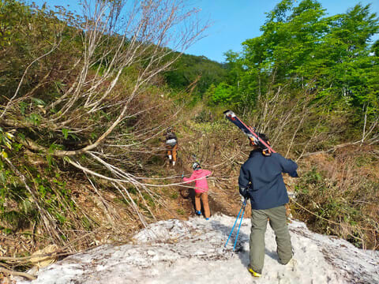
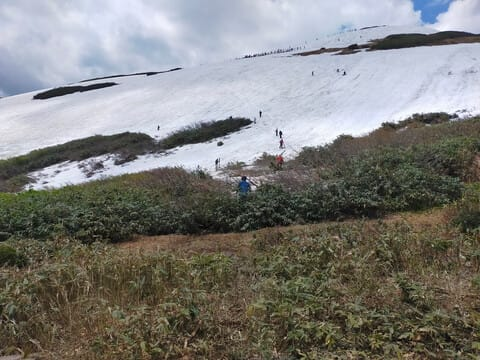
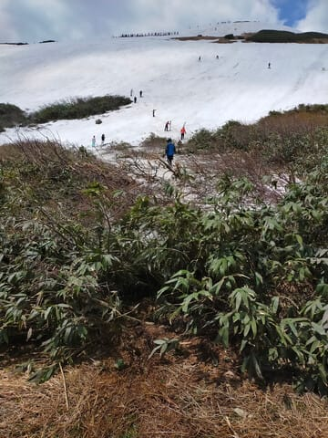
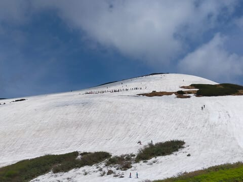
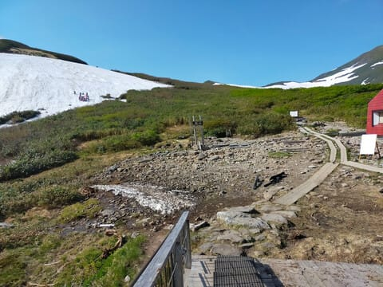

# 2024/6/8(土)の月山スキー場で滑ってきたよ！速報レポート…大斜面はひどい藪漕ぎ．リフト乗場は下から登り．リフト降場も明日はたぶんかなり登るパターン．Tバーも混雑

📅 投稿日時: 2024-06-09 02:28:31

🏷️ カテゴリ: [2024スキー滑走日記](c453f687e8a0f05679e95831d0a02cd0c.md)

えー．

本日，月山へ無謀日帰りスキーに行ってきて．

営業開始からラストまで滑ってしまい…

ついさっき帰ってきました．

いや…

8時リフト開始前から並んで，

16時半まで滑ってしまいました…

そして往復950km一人で運転(泣)

睡眠1時間で一人日帰り月山はやっぱり

疲れました…←当たり前だ

ってなことで．

もう，今日起きてからの活動時間が

25時間を越えているので．詳細レポートは

明日書くとして．

とりあえず，今日の月山速報モード！！

本日は晴天でしたが．

うーん．大斜面，かなり狭くなってます（涙）

そして．

コースの最後の部分．

かなり激しい藪漕ぎしなくてはならない

感じになりました…

夕方はもっと藪漕ぎ距離が伸びて，

さらに下はかなりの泥水が流れて

いるので．

日曜に行く人がいれば，泥だらけに

なってもいいブーツとウェアで

行くことをおススメ…

沢コースも2-3か所板を脱がないと

いけない場所があります．

…でもここ，明日まで人が通れる状態で

残ってくれるかな？？

藪が立ち始めると，一気に広がるので…

ちなみに，リフト乗り場は，リフトの

建物の下からエンヤコラとこの泥の坂を

登っていかなくてはならない最終形態に

なっています（泣）

リフト降り場も，今日はぎりぎりリフト

降り場から登らなくてもゲレンデに

出られるコースがぎりぎり突っ切れましたが…

夕方ラストのころは，もう笹がかなり立って，

突っ切るのは困難になってきてたので．

明日の日曜は，ここを突っ切るのは無理だと

思います…

そして．

Tバーも1本しか動いてないので．

かなり混んでます．

私は滑ってませんが，待ち時間は

長そうです．

…ってなことで．

リフトも乗り降りするのにかなり歩いて

登らなきゃいけない最終形態だし，

大斜面はかなりドロドロになる藪漕ぎ

必須，沢コースも数か所板を脱いで移動…

という感じで．

かなり厳しい感じの月山でした…

いや．

でも眠い．

深夜1時に出かけて，

往復1000km弱運転，

営業開始からラストまで滑って

深夜1時に帰宅したら．

普通こんなBlog書かないと思う…

もう2時過ぎてるよ（涙）

とりあえず，こんな状況でもちゃんと

レポート書いているところを褒めて

ください←読者に強要するんじゃない

とりあえずこれからシャワーだけ浴びて，

もう寝ます…

おやすみなさい．
