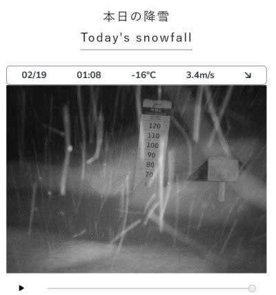
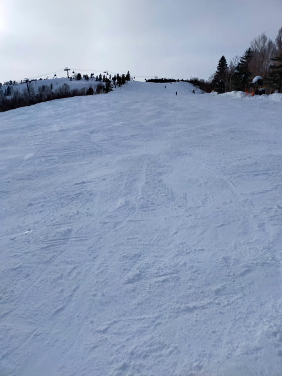

# 2025/2/16(日)の志賀高原焼額山スキー場詳細レポート！…予想より晴れ間が多く，気温もプラスで雪が緩んだ暖かい一日

📅 投稿日時: 2025-02-19 08:28:37

えー．

昨晩も気がついたらBlog寝てしまっていたので．

今日も朝更新！

で．

昨日の18日の火曜日も，志賀高原では

朝までに50cm以上積もったバフバフ

パウダーデーだったようですが…

19日水曜も朝はバフバフですよ～！

深夜1時段階ですでに夕方から50cm以上

積もっていますし，これから明日も

ほぼ一日積もりそうなので．

一体，どのくらい積もるのか想像が

つかない降りになりそうです…！

（[焼額山スキー場ライブカメラ](https://www.princehotels.co.jp/ski/shiga/livecamera/)より）

この冷え冷え雪降り期間が日曜までは

続きそうなので…

ここ数日はパウダーデーが続きます…

ホントにここまでまとめて降らなくても，

もう少し分散して降ってほしい…

ってなことで，本題へ．

いまさら感がありながらも，昨日書くつもり

だった，16日の日曜の志賀高原，詳細

レポートです！

えー．

まず．

朝イチの志賀高原への上り坂はいつもより

雪が少なくて．

スキー場付近は本格積雪路だったものの，

意外と雪が少なめで，スタックしている

車もなく，順調に上がれました…

で．

いつも通り8:30の営業開始前に，焼額

第1ゴンドラのオープン待ちに並びますが…

今日はそこそこ人がいますね…

とりあえず．8:30営業開始のゴンドラで

山頂に上がると…

山頂の気温は-5℃で，金曜の予想が

ドンピシャ！

すごいぞ！我が天気予想！！←自画自賛

そして，天気も「曇ったり晴れたり」

というのが当たったのか…まずは曇り空で

スタート．

でも…

今日の雪は，昨日昼間にょっと緩めに緩んだ

雪が夜中に冷やされたおかげで，しっかり

締まったいい感じのハイスピードめの

シマシマバーン！！

いやーーーー！！

最高！！！

最高のシマシマだよっ！！

しっかり締まっているけど，エッジが

快適に食い込んで気持ちよく板が回り込む，

この快楽といったら…！

と，最高のシマシマバーンを滑っていたら．

曇り空が晴れていき…

2本目を滑るころには日が射してきて，

晴天の下シマシマが滑れる最高

コンディションに！

朝9時過ぎには，見事な晴天になって

来ましたよ…！！！

結局この日は雲が多く，ときおり太陽が

隠れたりしたものの．

基本的には晴れ，ときおり雲に太陽が

隠れる…

という天気でした．

で．

朝のうちは結構雪質も良く，

トップシーズンらしい雪だったのですが…

あまりにも天気が良く，さらに気温もぐんぐん

上がっていき．

昼間は気温が+3℃くらいまで

上がりそう

という残念な予想が見事に当たってしまい，

昼間にはプラス2℃くらいまで気温が

上がったこともあり…

午前10時頃には，日が当たるバーンは

雪が緩み始め…

ユルユルにはならなかったものの，

ちょっとしっとりして固まっていく

雪になっちゃいました（泣）

そのせいで，日が射すバーンは

ダマダマがコース前面に現れる

感じになってきましたが．

でも，水を吸ったようなザブザブ雪に

ならなかったので，そこまで滑りにくく

無かったですよ～！！

そして．

ゴンドラは午前中に最高このくらい

並ぶことがありましたが…

これだけ待ったのは1-2回くらい．

昼になると，いつも通りゴンドラは

ガラガラになっちゃったし…

リフトは終日混雑しなかったし…

コースの人口密度も，多いところで

こんな感じで．

コースト場所によってはガラガラの

ところもあったし．

そんなに混まない一日でした～！！

天気は基本的に晴れたいい天気が

続き．

ときおり雲が増えて日がかげった

ものの．

北アルプスがきれいに見えるくらい

の天気で．

それでも，日が当たるバーンは雪は緩んだ

ものの，日が当たらないところや山頂

付近は，ラストまで雪質はいいままで…

かなりガラガラないい雪質のコースを

滑れましたよ～！！

逆に，ちょっと緩んだ雪が踏まれた

コースは，むしろ雪がちょっと重くなった

ぶん，コースが荒れず，夕方まで

完全にフラットなまま！！

いつもなら荒れてくる場所も，

今日はリフトストップが近づく夕方に

なっても完全フラットなままでした！！

…ただ．

夕方になって気温が冷えてくると．

日差しが強くて結構緩んだ部分は，

それが冷えてちょっと硬めの雪に

なってきましたが…

エッジが効かないほど硬いわけではなく，

むしろフラットでスピードが出る，

楽しいバーンでした～！！

ってなことで．

午後はゴーストタウンかと思うほど

人が少なくて，それでいて荒れてない

バーンを思う存分楽しむことができ…

今日もいつも通り，日が暮れかける

営業終了時間まで，しっかり楽しんで

来たのでした…

いやーーー．

良かった．

この週末は，土日ともちょっと気温が

上がったものの，そこまで雪は悪くならず．

むしろ先週の吹雪が続いた天気に比べれば，

穏やかでいい天気で，思いっきり

楽しめるいいコンディションでした…！！

今は志賀高原は激烈に積もっていて，

今週末も雪が降り続けそうなので．

この週末ほど天気は良くなさそうですが．

今週末は雪降りのパウダーが楽しめそう

ですよ～！
