# 丹沢山に登ってみたその2…山頂まで

📅 投稿日時: 2022-08-11 01:05:21

🏷️ カテゴリ: [登山・旅行](c1d637a11a25b457ac978d197adbdafc5.md)

えー．

…明日は祭日ですね…

というか，明日からホントは7日間の夏休みの

予定だったのですが…

どうやら祭日の谷間の12日も，お盆の15日も

仕事になりそうな予感…（涙）

まぁ．

どっちにしろ出社しなくても，

家で宿題しなきゃならないので．

会社で宿題するか，家で宿題するかの

違いだけなんですけどね（涙）

あぁ…

このお盆休み，一度はどこかの山に

登りに行きたかったけど．

夏休みそのものが完全消滅する

事態になるとは…（泣）

とりあえず．

今日は丹沢山レポートの続きです…

（そろそろBlogを書き続けるのもヤバいかも）

ってな感じで．

花立山荘へ向かってえっさほいさと

登り続けると…

途中から，ちょっと見晴らしが

良くなってきました！

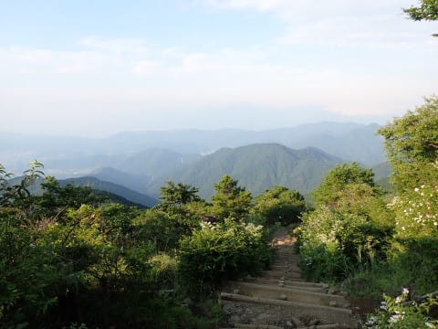

…天気も良くて，いい感じに見えますが．

麓の気温が35度越え予想のこの日．

標高1000m超えでも気温は30℃近く…

暑い．

暑いよ…！

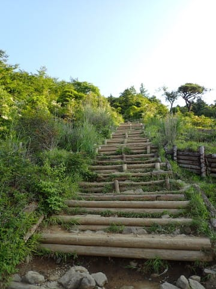

そんな中．

スタートから1時間18分で花立山荘を通過…！

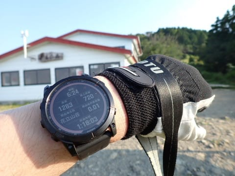

ちょっと暑いので．

ここで5分ほど休憩．

眼下に，麓の秦野の街並みが見えますね…

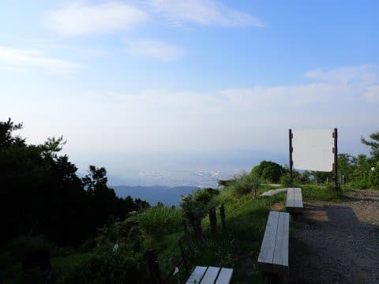

ここからしばらくは結構緩やかな登りで，

散歩道といったのどかな道が続きます…

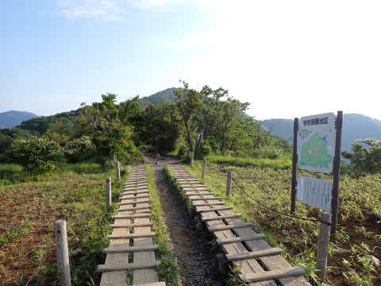

塔の岳の手前にわずかな登りがあったものの．

天神尾根に比べれば，楽勝の緩い坂で．

最後の登りを登り切ると…

塔の岳山頂に着いたようです！

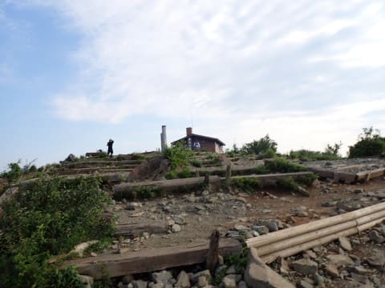

スタートから1時間45分で，塔の岳山頂へ

到着！！

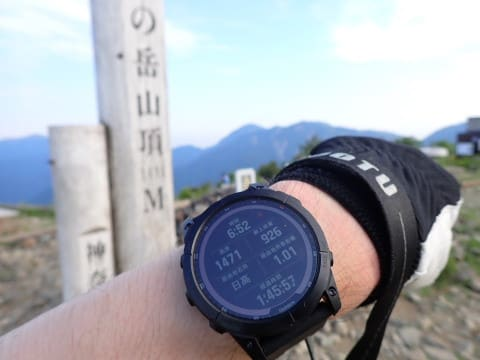

…塔の岳，1491mのはずなので．

ここでもGarminさんの高度計と

20mほど誤差がありますね…

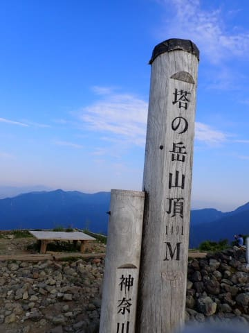

塔の岳山頂，見晴らしも良くて…

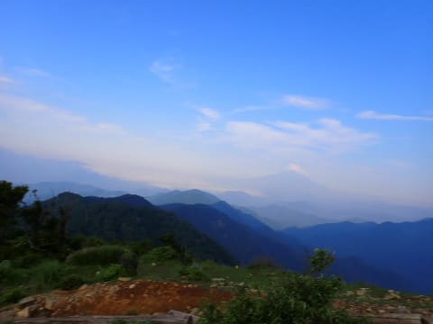

今日は富士山もすっきり見えますね！

とりあえず，富士山を眺めつつ，

10分ほど休憩タイム…

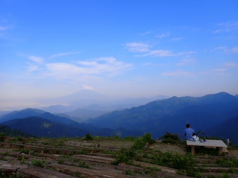

そして．

7時に塔の岳を出発し，丹沢山へ向かいますが…

うむ．

丹沢まで，残り2.6km．

標準コースタイムは約90分だけど…

45分くらいで着くかな？

と思ったら．

塔の岳からは，いきなりかなりの

下りで…

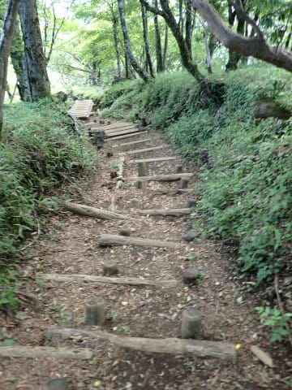

途中，木橋みたいなところもあったり．

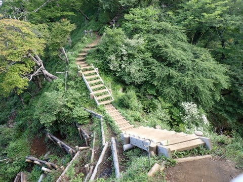

意外と結構上り下りがあるなぁ…

塔の岳から約200ｍダウン，

300mアップくらいですが．

それほどひどい上り下りは無く．

何度か登ったり降りたりを繰り返すと…

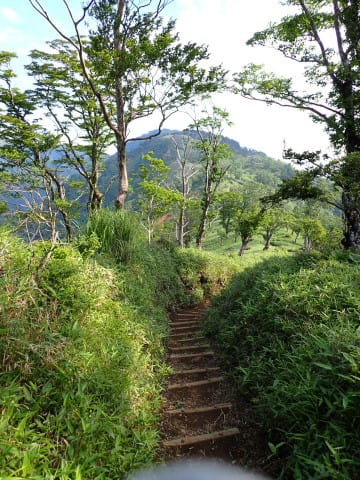

見えてきたあのてっぺんが，丹沢山頂かな？

ラストスパ―――ト！！

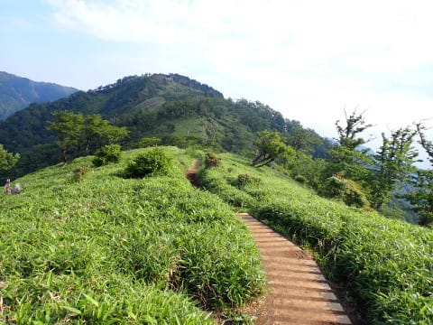

ってなことで．

目の前の坂を上り切ったら…

Garminさんに，コース完了表示が！

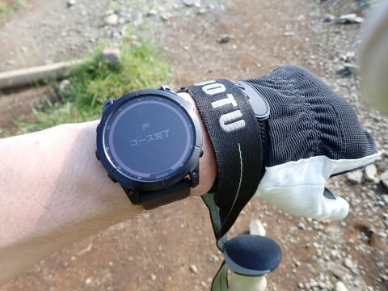

そうです！

丹沢山山頂に到着です！

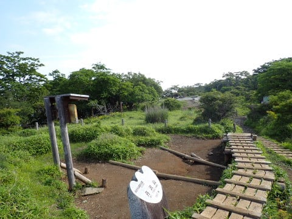

Garminさんの表示を見ると，駐車場から

2時間33分で着きました～！！

塔の岳から39分ってことになりますね…

駐車場から2時間半での登頂を狙ってたけど，

3分オーバー…ちょっと惜しい．

でも，だいたい予想通りの時間で登頂！！

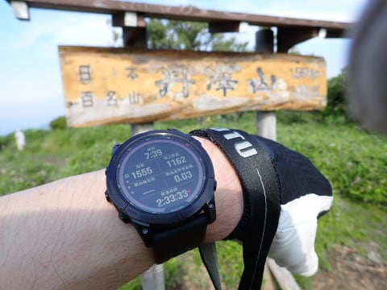

…でも．

実は丹沢山って初めて登ったんですが．

山頂，見晴らしが無いんですね（涙）

知らなかった…

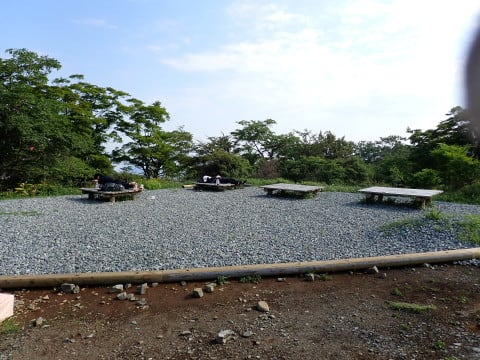

とりあえず，カロリー摂取して，

20分ほど休憩タイム！

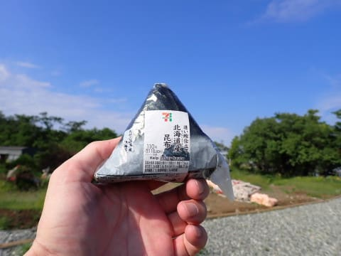

## 💬 コメント一覧

### 💬 コメント by (真美子)
**タイトル**: Unknown
**投稿日**: 2022-08-11 18:25:07

高校時代はワンゲルで、毎月丹沢山系へ行っていました。なので、とても懐かしいblogでした。

これからも仕事が忙しくても、何があってのblogを続けてください。12月27日から2泊3日で志賀高原焼額山スキー場へ行きます。お会いできるのを楽しみにしています

### 💬 コメント by (Skier_S)
**タイトル**: ＞真美子さま
**投稿日**: 2022-08-12 01:03:35

丹沢山がホームグラウンドだったんですね…！

よく整備されていて良かったので，このあと3週連続丹沢山系に行っちゃいました．

この次の週は二の塔，三の塔経由での塔の岳，さらに次の週は青根スタートの蛭ヶ岳に行ってきました…

とりあえず，何とかBlogは続けます．

そして，年末の志賀高原，行けると思いますが娘が受験なので…

お会いできると良いのですが，今シーズンはどうなるか残念ながらまだ未定です（涙）

