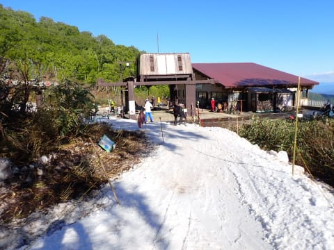

# 2024/5/25(土)の月山スキー場で滑ってきたよ…今日は板を履いてリフト乗り降り可能！天気は午前中は雨，午後は晴れでちょっと寒め．沢コースもまだいける

📅 投稿日時: 2024-05-26 00:10:14

ってなことで．

今日は月山を滑ってきました～！

とりあえず，睡眠時間2時間で滑りに来て，

いつも通り朝から最後まで滑って．

近くの宿がなかったので，夕食を食べて

ちょっと離れた宿に落ち着いたら

もうこんな時間…

それなのに，Blogを更新する自分．

えらい！！

…明日また6時半起きなのに…

というわけで．

本日の月山ですが．

駐車場はかなりいっぱいで．

…これは今日は混むかな？？

と思ったけど．

意外とあさイチのリフト乗り場は

ガラガラで．８時営業開始を過ぎたくらいの

時間では，リフト待ちはほぼゼロ．

…そして．

昨日は板を履いて乗車できなかったリフト

ですが．

今日は乗り場まで滑りこめるようになり，

板を履いたままリフトに乗車できるように

なっていました～！！

リフト降り場もちゃんと雪がつけてあって…

ゲレンデまで，板を履いて滑れるように

なってました～！！

…ただ．

あさイチは，駐車場までは雨が降ってなかったのに．

ゲレンデは完全に雨（涙）

11時過ぎごろまで，パラパラと降り続ける感じで．

レインウェアを着ないとかなり厳しい感じ（泣）

それどころか…

午前中はゲレンデにもかなりガスが出て，

コースも結構見にくい感じ（泣）

雨のおかげで，板は滑ってくれるんだけど…

ゲレンデは見にくいし，気温もかなり低くて

ウェアのジャケットを着ないと寒いほど．

午前中はガスで視界が悪く，さらに

気温が低いうえぬれて寒いという天気の

ため，かなりガラガラだったし．

沢コースも，下のほうがかなり狭くなって

いたものの，まだ中間部分はそこそこの

幅で滑ることもできたし…

リフトもほぼ待ち時間がなく．

雨でぬれる以外は，思った以上に

快適にリフトぐるぐるできました…

やはり，リフトに板を履いて

乗れるのが大きい！！

降り場も，今日はしっかり雪がつけて

ありました…

そして．

11時過ぎには，ガスも晴れ始めてきて…

ようやっと大斜面も見えてきましたよ！

そして．

12時を過ぎてくると日も射し始め…

13時になると，本格的に晴れてきましたよ！！

天気が良くなってきたから午後券で

滑ろうという…という人が多かったのか．

午後券スタート時間に一瞬リフト待ちが

伸びた瞬間がありましたが…

でも，それ以外はほぼリフト待ちなし！！

ガスが晴れて，山頂まで見えるほど視界が

回復してきたので．

トラバースラインを通って，大斜面へ向かいますか…

トラバースラインはこんな感じで．

トラバースラインを渡り切った先の

大斜面は…

全面コブ斜面！！

リフト待ちはなかったけど，

大斜面はレッスンなども多く，

結構人が多かったかなぁ…

大斜面下部から見ると．

昨日は途切れていたリフト乗り場．

ピステンでかなり雪を入れたのか，

また真っ白に戻っているのが

わかりますね．

ただ．

大斜面や沢コースの雪の量は…

まだ5月ですが，6月上旬並みかな…

1－2週間程度，例年より雪解けが早い

気がします．

とはいえ．

ラストは天気も良く．

それでいて気温もそんなに上がらなかったので，

雪も比較的よく．

リフト乗り場も最後まで雪はついてたし…

沢コースは午後は荒れたけど，

終日人が少なめで飛ばせたし．

大斜面は全面コブが楽しめたし．

朝は残念な天気だったけど，

今日は一日楽しめた月山でした～！

また明日も滑ってます！
