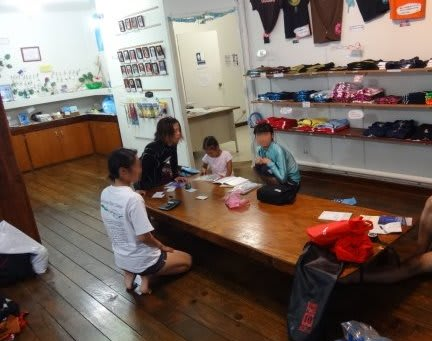
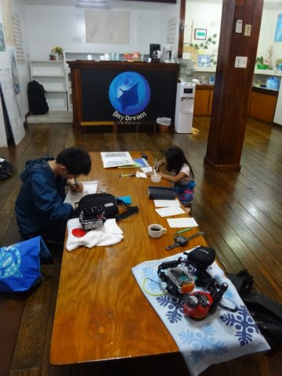

# 2014年10月，小学生の子連れでパラオへダイビングに行ってみた，その26…ホテル断水！？

📅 投稿日時: 2015-09-11 02:23:39

🏷️ カテゴリ: [ダイビング日記](ce3a7a8d424d112fce83ee85c81a0e344.md)

ということで．

徒然スキーヤー日記

というタイトルからしての義務である，

週末のスキー場巡りレポートが続きましたが．

また，パラオダイビング旅行記，再開です…

うーん．

今日のは，文字ばっかりで面白くないかも．

とりあえず．

パラオ旅行記へ，Go!

--

ダイブショップから，

『市内全域断水』

という，衝撃の事実を告げられた，Skier_S一家．

ショップ「パラオのKBブリッジ（空港から市内に行くときに通る橋）に

　併設されている水道管が壊れたらしく…，

　市内全域，断水しているみたいなんですよ」

し，市内全域，断水！？？

…このショップだけじゃなく，

自分たちが泊まってるホテルもアウトってこと…！？？

S「そ，それって…

　このショップの水が止まってるだけじゃなく，

　我々が泊まっているホテルも水が止まってるってことですか？？」

ショップ「そうみたいです…ただ，明日の朝には

　また水が出るようです．

　断水は，夕方から朝までだけだとか…」

S「…って，これからホテルに帰ってもシャワーも浴びれないって

　こと…？？？」

ショップ「ホテルはタンクがあるから，

　タンクの水がある限りは水が出るでしょうけど…

　ただ，地区によって何時に水が止まって，何時に出るかが

　ぜんぜん違うらしいし．

　タンクの水もいつなくなるかわからないし．

　これからホテルに帰って，水が出るかどうか…」

…なんと．

やっぱり，ホテルもダメか…

S「…水が出る，明日の朝まではガマンってことですか…」

ショップ「いや，夕方からの断水は今後毎日続きます」

S「え？？」

ショップ「配水管の修理が終わるまでずっと，昼しか水が

　出ません．直るまで，1-2か月かかるんじゃないかな」

S「……（絶句）」

…これは．

これからあと2泊．

ダイビングが終わってホテルに帰っても，

シャワーも浴びれないどころか．

トイレすら流せない

ということか…っ！！？？

それは，ツラいっ！！

ホテルの部屋の流れないトイレの前で途方に暮れる，

自分の姿が頭に浮かぶ…（涙）

S「市内全域，断水なんですよね…」

ショップ「地区によって，止まる時間の早い・遅いは

　あるけど，全域です…ただ，遅いところは午後7時

　過ぎまで水が出ているところもあるとか」

うーむ．

市内はどこに行っても水が出ないとなると．

水が出るホテルに移動するとかの手段も，

とれなということか…っ！！

…とりあえず．

この現実を受け入れるしかない，ということだな．

飲み水はスーパーで買えるし．

残り2泊，夜にトイレが流せないのを我慢して

過ごすか…（涙）

と，一通りの状況を聞かされた上で．

（神妙にパラオの惨状を聞くみんな）

その後，ちょいと落ち込み気味で，

ログづけを開始したわけですが…

その時．

ショップ「Sさん，電話です」

は？

電話？

パラオにいる私に名指しで？

誰から？

## 💬 コメント一覧

### 💬 コメント by (マルハバ)
**タイトル**: さすがに・・
**投稿日**: 2015-09-11 09:33:51

断水はツライですね。

昔、パレイシアホテルに泊まる

ダイビングツアーに参加したんですが

出発前日になって旅行社から

「ホテルのプロパンガスがなくなってしまって

滞在中お湯が使えません」

というのはありましたね。

でもそのおかげで

PPRに無料アップグレードになったという

とってもラッキーなパラオのアクシデントでした。

### 💬 コメント by (Skier_S)
**タイトル**: マルハバさま
**投稿日**: 2015-09-12 03:44:26

パレイシアを予約して，PPRですかっ！！

それは，超ラッキーですね．

…しかし，ホテルでプロパンガス切れって…

すごいですね．

さすが，パラオ！？？

ところで．

今年はどこかに潜りに行きましたか？？

### 💬 コメント by (マルハバ)
**タイトル**: 今年も・・
**投稿日**: 2015-09-13 17:37:56

子供と休みの調整が付かず

どこにも行けそうにありません（涙）

以前は平気で学校ズル休みさせてたんですが・・(汗）

家族全員パスポートが切れちゃってるんで

行くとしたら沖縄でしょうか？

マイレージはたっぷり残ってるんで、来年こそは・・

### 💬 コメント by (Skier_S)
**タイトル**: マルハバさま
**投稿日**: 2015-09-13 21:24:34

あら．

今年はパスポート切れですか…

我が家の2回目遠征は10月に，西表の予定です．

マイレージがたっぷり残っているなら，

来年はぜひ…！

