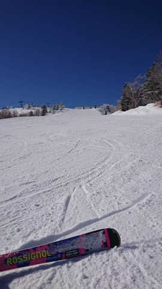

# 2023/1/17(火)の志賀高原スキー場特派員からの写真！

📅 投稿日時: 2023-01-18 09:29:16

ダメだ…

今週末こそスキーに行くぞと気合を入れて，

2日間で合計睡眠4時間という状況で

仕事をやっつけていたけど…

昨日は夜中の2時に机で突っ伏して寝て．

そのまま朝まで寝てました…(泣)

まぁ，そうなるわな…という感じですが．

だもんで，昨日も特派員から写真を

送ってもらっていたのですが昨晩は更新できず．

朝に更新！！

まず．

今日からは…

久しぶりのおこみん特派員復活です！！

あさイチの積雪は，2-3cm程度．

バーンは多少硬めながらも，朝は上に

新雪が乗って，エッジが効くいい感じの

シマシマだったようです…！

あさイチの気温は-10℃近くと

いい感じで冷えた一日で．

朝のうちは曇り空だったようですが…

朝9時過ぎには青空が覗いてきて．

昼前にはすっきり最高の晴れになってきた

みたいです！！

さすが平日，ゴンドラもリフトもガラガラで．

ゲレンデも，誰もいませんね…

晴天でガラガラってうらやましい…！！

ただ．

日陰や急斜面は，昼ごろには殺人コロコロが

結構出てきたみたいです…

うーん．土日の高温が惜しい…(涙)

でも．

月曜はツルツルバーンで，

それに比べればまだ状況は良く．

コロコロが出てきたのもバーンの

一部だけだったようなので．

志賀高原のバーンコンディションは

改善しつつあるみたいです…

とりあえず，20日から21日にかけて，

10cmほど積もりそうなので．

週末はもう少し改善しそうかな．

そのあと，23日から25日は冷えて

雪が降りそう！！

…週末には間に合いませんが，

ここの冷え込みに期待…！！

## 💬 コメント一覧

### 💬 コメント by (レインボー75)
**タイトル**: Unknown
**投稿日**: 2023-01-18 16:18:17

水曜日の志賀高原情報

朝の湯田中はフロントにカリカリ氷がへばりつき、今日もいい雪の予感。

いつものようにニゴンに並んでいると、一ゴン故障で一ゴンスタートの仲間がニゴンへ。東館宿泊者は車で奥志賀に送ってもらったとか。結局一ゴンが動いたのは12時頃。今夜修理するとの情報も。

おかげでニゴンはやや混み。それでも私らで最大5分待ちくらい。

雪質はやや硬めのベスト。エス様のよだれを垂らす姿が目に浮かぶようです。

昼は獅子で五目焼きそば。それも大盛に初挑戦。結果は敗退。そんなに食えん。

午後は三高で基礎練習。広いし充実した一日でした。早く者場に戻ってきてくださいな！

### 💬 コメント by (アリス)
**タイトル**: Unknown
**投稿日**: 2023-01-18 16:37:24

S様

連日環境が変わる志賀高原が楽しいです🎵

天気、気温、霧、景色と変わりますが雪があってスキーが出来る楽しさを実感しています☺️

本日も二高スタート❗️

白樺で見事にレインボーさんにブチ抜かれ😭

唐松、白樺廻し後は二ゴンからGS経由でオクシーへ🎵こちらも快適です😆🎵🎵

やはり水曜日は、週の中で一番空いているような実感です🎵

### 💬 コメント by (かず)
**タイトル**: Unknown
**投稿日**: 2023-01-18 18:49:44

今シーズン会えてないですね…もうすぐヤバそうなパウダーですね

### 💬 コメント by (Skier_S)
**タイトル**: 今週末こそスキーに行きたい
**投稿日**: 2023-01-19 05:19:50

＞レインボー75さま

雪はだんだん硬くなってきているんですね…

硬い雪は怪我しやすいのでご注意くださいね！！

＞アリスさま

志賀高原を楽しんでいる様子，うらやましい…

ガラガラの平日スキー，私もやってみたいです．

今日もそこそこ冷えそうなので，バーンは硬いままかな…

＞かずさま

今シーズンは確かにまだ一度もお会いしてませんね…

20日はそこまですごい雪にならず，20日から21日はそこそこ降りそうです．

でも，一番積もりそうなのは23日から25日にかけてですね．ここは積もりそう！

