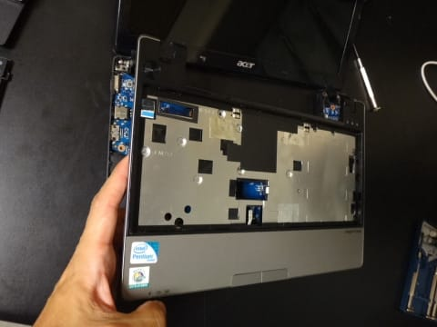

# ACER aspire 1830Zの時計バックアップ電池を交換してみた　その1

📅 投稿日時: 2014-10-17 00:44:29

ということで．

パラオから帰ってきたというのに．

まだ，その前に行った石垣旅行記どころか．

その前のフィリピン旅行記が書きあがって

いないというのに．

…今日もいろいろばたばたしているので．

書きためておいたネタ，昨日の続きです…

----

再起動するたびに，[毎回，時計がリセットされてしまう](ebaf2aea8ee2f484a722434d7e58f7b95.md)ように

なったわがノートパソコン，ACER aspire1830Z．

どうやらクロックのバックアップ用のボタン電池が

お亡くなりになってしまったようなので，

この電池を，交換してみましょうか…

と，いろいろ調べてみたけど．

どこにも，このパソコンの電池交換をした人の

報告がないんですね～

＃3万円程度のこんな激安パソコンを，そこまでして

＃直そうという人が，誰もいないんでしょうね…

ってことで．

適当に分解することにしてみました～（笑）．

まず，初めに．

目につく裏蓋を外します．

ねじの上に，「はがすと保証効かなくなるよ～」

というシールが貼ってありますが．

こんなものは全く気にせず，あっさりはがして．

ねじを外しましょう．

こんな感じで，裏蓋が外せます…

この状態で．

じっくり見たけど．

…ボタン電池らしきものは，みあたらない．

…

交換する可能性があるものだから，

裏蓋開ければ，すぐそこに電池があるかも…

という，甘い期待は裏切られたようです（涙）．

…さらに分解が必要かっ！！

とういことで．

さらに分解を続けるわけですが．

次はHDDを外します．

赤矢印の二か所のねじをはずして，HDDを

青矢印方向に引っ張れば…

いとも簡単に外れます．

そのあとは，筐体のねじを外します．

矢印の12か所かな．

この写真の，右側．

USBコネクタのところのねじを見落としがち

なので，注意しましょう！

そして，次はキーボード．

キーボード上側に，こんな感じでツメがあるので…

この爪を4か所，こんな風に押し込むと…

いとも簡単に，キーボードが外れます．

あ～，このとき．

「キーボードが外れた！」

って喜んでひっばらないでください．

こんな感じのFPCケーブルで，

本体とつながってますので，まだ完全には

外れませんよ～！

このFPCケーブルコネクタ．

拡大するとこんな感じで…

茶色いケーブル押さえ部分，これを

こんな感じで跳ね上げると…

簡単に外れます．

で．

この，キーボードコネクタの下に．

こんな感じで，「MB」と書かれた，

別のFPCケーブルがあります．

このFPCケーブルも，外しましょう．

FPCコネクタの茶色い部分が，

こんな感じで矢印方向にスライドします．

こいつがロック機構なので，スライドさせると

FPCケーブルがあっさり抜けます．

そのあとは，矢印の4か所のねじを…

こんな感じで外していくと…

トップパネルが外せます．

ちょっと，トップパネルを外すとき．

「バキバキ」

って感じで，ちょっと怖いですが．

すき間にドライバを差し込んで外していきましょう！！

そうすると，マザーボード上面とご対面です！

…が．

けど．

…まだ，ボタン電池が発見できないのですがっ！！？？？

一体，電池はどこに…

…

…

うむむむ？？

この，矢印の部分．

拡大してみると…

ここに，「RTC」の文字がっ！

…どうやら，このコネクタにつながっているのが

ボタン電池のようです．

…ようです．

が…

ケーブルが，マザーボード裏側に回っていて．

このままでは，電池交換ができない…（涙）．

どうやら．

まだ，分解を続けないといけないようです（泣）．

ってことで．

マザーボード左側にある，FPCケーブルを外します．

こいつも，こんな感じでストッパをスライドさせると…

簡単に外れます．

そして，矢印部分のねじを外すと…

マザーボードが外せます．

USBコネクタなどが引っかかるのを，枠をゆがませ

ながら外さないといけないので，ちょっとドキドキです．

マザーボードをめくると…

ようやっと，マザーボードの裏に，

RTCバックアップ用電池様を拝むことが

できましたっ！

…結局，ほとんど完全分解しないと，電池までたどり着けないのね．

このPC…（疲労）

…次は，電池交換編に続きます！

＃同じPCを使っている人なんて読者にいないだろうから，

＃続きを期待している人はいないでしょうが…

## 💬 コメント一覧

### 💬 コメント by (TAPPU)
**タイトル**: 参考にさせて頂きました
**投稿日**: 2016-09-08 09:04:46

ファンの換装で、参考にさせて頂きました。

とても助かりました。ありがとうございます。

子蓋を開けたら、ケーブル下に、さらにネジ1個隠れていましたよ。

### 💬 コメント by (Skier_S)
**タイトル**: TAPPUさま
**投稿日**: 2016-09-09 02:06:59

こんなブログが何かの役に立ったなら

幸いです…

でも．

ケーブル下にねじがありましたっけ？

今，本体が無いので確認できず…

すいません．

しかし，まだACER ASPIRE1830Zが

現役なんですね…

私のはどうも電源周りの故障で，

完全にお亡くなりになってしまいました（涙）

これからも大事にお使いください！

### 💬 コメント by (TAPPU)
**タイトル**: Unknown
**投稿日**: 2016-09-20 10:49:40

ありがとうございます。

妻の愛機として現役です。

なかなかコスパの良いマシンです。

40年近く前、TTLなどを買い込んで8ビットマシンを手作りしていたころからのハードウエア・ファンです。最近のマシンの技術は、全く手の届かないブラックボックスマシンですね。

### 💬 コメント by (Skier_S)
**タイトル**: TAPPUさま
**投稿日**: 2016-09-21 01:43:37

40年前！

そんな昔からですか…

私も分解マニアで，

デジカメやら携帯やらPCやら，

壊れたものはいろいろ直して

来ましたが（笑）

＃デジカメ2個イチ化とかで

＃復活させたりした思い出が…

最近の機械は，確かに分解して

直せないものが多いですね…（涙）．

### 💬 コメント by (通りすがり)
**タイトル**: Unknown
**投稿日**: 2020-06-24 22:36:10

参考にさせていただきました。

ありがとうございました。

トップパネルがどうしても外れねぇと悩んだんですが、一か所、アンテナ線の下にネジが隠れており、それを外したら外せました。新しい電池は半田を使わず、剥がした電極を折り曲げてテープでぐるぐる巻いて固定しましたが、うまくいきました。

ssdにもしたし、これでまだしばらく使えます。

### 💬 コメント by (Skier_S)
**タイトル**: ＞通りすがりさま
**投稿日**: 2020-06-25 00:16:34

この記事が役に立ったなら良かったです…

私も実は1回，はんだ付けせずに修理したのですが．

しばらく経つと，コードが電池から浮いてしまったのか

またすぐに時計がリセットされるようになってきたので，

はんだ付けしちゃったのでした…

そして，SSD化もされたのですね！

私はこのマシンのHDDが遅いのに我慢できず，買い替えてしまいましたが．

今から考えると，このマシンをSSD化しておけば

今でも現役で使えたのかもしれません…

### 💬 コメント by (助かりました)
**タイトル**: 記事見れて助かりました。
**投稿日**: 2021-12-23 17:36:03

aspire 5536という機種だったのですが、急に電源入れても真っ黒の画面になってしまいBIOSメニューまでもいかなく起動しなくなりました。たまに起動することもありなかなか原因がわからなかったのです。

最初は静電気かと思い、いろいろリセットとかしてたんですけど、一度だけ起動した時に時計を見たら２時間ほどずれてました。

なので、CMOS電池が怪しいかなと思いここにたどり着きました。

解体方法は、そちらの機種に似ていましたのでとても参考になり綺麗に外すことができました。

結局、aspire 5536のCMOS電池はキーボード側のプラスチックを浮かすと中央下部のトラックパッド後ろに、CR2032のスロットが見え無事に簡単に交換できました。

交換したところ、快調に動作するようになりました。

ここの記事を見なかったら捨てることになっていたt路思いますので本当に感謝です。ありがとうございました。

私も5536は、4Gメモリ、512G SSD、windows7で運用してるので今のところ快適に使えています。

これで事務作業にはまだまだ現役で使えそうなので本当に助かりました。ありがとうございました。

### 💬 コメント by (Skier_S)
**タイトル**: ＞助かりましたさま
**投稿日**: 2021-12-24 01:49:02

こんな記事が役立ったのなら良かったです…

機種は違うようですが，参考になったのですね．

私も古い機種を長持ちさせる人なので，Aspire 5536,ぜひ大事に使ってやってください…

