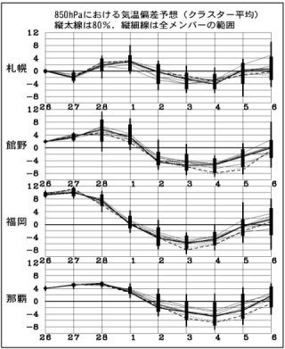

# 祈りが届いたのか？寒気再来！

📅 投稿日時: 2011-02-28 00:00:47

22日の日記に．

なんか，3月1日に向けて，スキーヤー殺しの高温になりそう，

と書いたのですが．

皆さんの祈りが通じたのか，平年より気温は高めですが，

それほど高くならずにすみそうな感じになってきました．

とはいえ，28日の午前中は，気温が高く，スキー場でも雨になる

可能性が高いですが…短時間ですみそうです．

その後．

3月2日から冷えますっ！！！！！

3月6日まで冷えます．

1月の大雪時期，パウダー三昧時期並みに冷えます．

3月上旬とは思えない冷え込みです．

この，3月2日以降の平年気温比を見てください．

2月28日までの高温傾向はどこへ，というくらい冷え込みます．

これを見ても，3月2日以降，日本は0度線の中にすっぽり．

見事な寒気に覆われてます．

さらに…

5400hpa線が北緯35度以南まで下りてくるなんて…

1月のパウダーぶっ続けのころのような寒さじゃないですか．

このグラフでは，2月12日に同じようなところまで網掛け部分が

下りてきてますが，この日は夜中に大雪で，次の日はひざ～

腰パフだった日です．

大体，この網掛け部分が下がるところはパウダーが楽しめる

と思っておおむね外れは無いです…

ということで．

次の週末は，3月と思えないいいコンディションになる可能性大！
