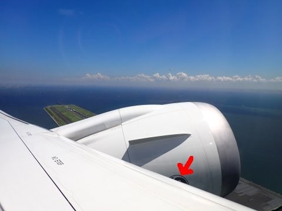

# 2023年8月，座間味で親子3世代ダイビング！その1…いざ，出発！

📅 投稿日時: 2023-09-06 00:48:42

🏷️ カテゴリ: [ダイビング日記](ce3a7a8d424d112fce83ee85c81a0e344.md)

ということで．

ついにやってきた出発当日．

夏休みで混雑する羽田空港にやってきたの

ですが…

なんと．

驚くことに．

この私が，飛行機に乗るのも実に

約4年ぶり…！！

確か2019年の11月に，[中1週間で2回米国に
出張](e0be8e99dcaa7131dcb3a21424485caae.md)して以来の飛行機搭乗じゃないかな？？

うーむ．

それまで，海外・国内出張やら旅行やらで，

かなりの高頻度で飛行機に乗っていた

飛行機好きの私が．

実に4年弱も飛行機に乗ってなかったのか…

とりあえず．

朝10時半出発予定の沖縄便に乗りますが．

知らぬ間にANAのSkipサービスがなく

なっていたとか，いろいろルールが

変わっていたことに，時代から取り残された

ことを感じつつ，搭乗ゲートをくぐります．

そして，これから乗る機体を見て…

ふむ．国内線仕様のB787だよな…

と思って搭乗したのですが．

中に入ってみると…

え？国内線なのに全席ディスプレイ付き？？

…これ．787は787でも…確か，2022年度に

導入されたばかりの，

GEnxエンジン搭載版の最新鋭787-9じゃないか？？

ANAの787って，ロールスロイスの

Trent1000シリーズのエンジンを採用して

いたはずだけど．

例の2018年ごろのTrentエンジン不具合による

運行停止措置に懲りたのか．

（[この記事](ec959ccef6e54ecfd0505637ee8a810f2.md)に，不具合のトレントエンジンが外されて

運行できなくなった787が写ってます）

確か去年から，GEエンジン搭載版の787-9を導入開始

していて．

GEエンジン版の新機材は，国内線でも大型

ディスプレイを積んでいるのが売り，

と聞いていたけど…

どうやら久しぶりの飛行機搭乗で，

レアな新型機にあたったようです…！

しかし…安全のしおりを見てみたけど．

安全のしおりの写真は，787-9ですらなく，

787-8だな…

ただ．エンジンを見ても…

GEらしきマークは見えないし．

昔のロールスロイスRB211とGEのCF6エンジン

みたいに，わかりやすい外観の違いがないので，

ホントにGEのエンジンか気になってたけど…

でも．787って，地上にいるときは主翼は

まっすぐなんだけど．

上空に上がると，羽がかなり上向きに

反り上がるので有名なので…

離陸した直後にしっかりのぞき込むと…

主翼が反り上がって，エンジンポッドが

ちょっと持ち上がった関係で，

それまで主翼に隠れていたGEマークの一部が

かすかに見えました！

これはやっぱり…ANAに入ったばかりのGEnx-1B

エンジン搭載の最新787-9ですね！！！

ってな感じで．

久しぶりに乗った飛行機が，ちょっと

レアものだったことに喜びながら．

RWY16Rから離陸だった今回．

RWY16LからパラレルTake offした機体が

平行に飛んでいるのを眺めつつ…

しばし，機内モニターで何ができるのかを

遊んでいると．

映画やら，地図とかいろんな情報を見れる

ようで，結構楽しかったのですが…

特に面白いと思ったのが，この画面．

一見コックピットから見える景色みたいに

地図を表示して．

その右側に高度，左側に速度，下側に磁方位が

HSI風に表示される，HUD風の画面を

見ることができます…

高度，速度がわかって面白いけど．

バンク打っても画面は傾かないし（笑）．

左側の速度がIASじゃなくて

GS（対地速度）の473ktという異常に高い

数字を示していることに，わかる人は異常な

違和感を感じるはず…

ということで．

私がマニアックな楽しみ方をしている

一方で．

娘は平和に，売店で買ったお弁当を食べつつ，

映画を見て，空の旅を楽しんでいたのでした…

（それが普通の人の飛行機の楽しみ方だよ…[続く](e47dca67764f5674bf599bbcf2eb1288b.md)）
