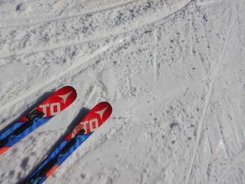

# 2020/12/6(日)志賀高原，焼額山スキー場の速報レポート…一日晴天！午前中はリフト待ち10分(涙)．でもコース幅いっぱい滑れて良かったよ

📅 投稿日時: 2020-12-07 01:01:15

ということで．

本日も，わがホームゲレンデの焼額を

滑ってきていたわけですが．

いつもの大事なお約束事項として，

リフト営業終了時間までしっかり滑る

という自らの義務を確実に遂行してしまった

おかげで．

今日も帰宅が遅かったので，

本日も，速報モードにて…

まず，本日も志賀高原への登り道．

…昨晩は雪が降ってないのに，

ところどころ積雪がある積雪路．

明日以降も，しばらく路面積雪は

残りそうなので，志賀に行く方は

ご注意を…

そして．

あさイチに焼額に到着し．

唯一営業している第4ロマンスリフトに

並ぶわけですが…

…

ええ！？？？

なんだか昨日より開業待ちのリフトの

列が長くないですか？？

うーむ…

今日は混みそうな予感…

とりあえず．

朝イチリフトで山頂へ出ると…

うほーーーー！

あさイチは，結構しっかり締まった，

いい感じのシマシマ！！

昨晩から天然雪は1mmもありませんが，

昨晩打った人工降雪がしっかり踏み固められた，

結構固めで，スピードが乗るシマシマ！

ぐはーーー！

これは楽しいよ！

ただ…

本日の雪は，硬めの人工雪ということもあり．

2-3本は快適だったけど．

すぐにところどころコロコロが散乱した

バーンになっちゃいました…(ちょい涙)

まぁ，でもコロコロは所々にある程度で，

全面コロコロバーンじゃないからまだいいかな…

と，思っていたら．

…

なんだか，8:30のオープンから30分も経った

9時過ぎには…

げげげげげげげ！！！

なんだこりゃ？？

リフト待ちの列が，すごい長さに…！！

まぁ，秩序良く一列に並んだからこんな

長さになってるけど，これで最大リフト

待ちはせいぜい10分程度．

…先週や，昨日の熊の湯に比べればまだ

マシなレベルですかね…

でも，

リフト待ちがひどかったのは，

9時過ぎから11時ごろまでの2時間だけ．

11:30を過ぎると，列もこんな感じで

せいぜい1分，最大2分待つかどうか…

という程度になったし．

コース幅もいっぱい滑れるので，

ゲレンデの人口密度が高くなりすぎる

こともなく，好きなラインで気持ちよく

滑れたし…

まぁ，午後2時過ぎくらいからはちょっと

雪が緩んだこともあり，

斜度がある斜面は，ちょっと荒れ気味の

雪になってきたものの．

すっきり晴天で，コース上の雪も十分に

ある感じの焼額，結構楽しめましたよ～！！

また明日，詳細レポートやります！！

## 💬 コメント一覧

### 💬 コメント by (Hide)
**タイトル**: うらやましい
**投稿日**: 2020-12-07 12:46:56

S 様

年末まで行けない私はいつもレポート見させて頂きながらうずうずです。

8月から車も動かしてないし・・・動くか？

しかし4ロマは・・・乗ってる間に寝ちゃいません（笑）

### 💬 コメント by (ikkun)
**タイトル**: Unknown
**投稿日**: 2020-12-07 18:54:16

そして焼額山( *´艸｀) 実は３月末地元のスキークラブで滑りに参りましたさ(笑)  一人じゃないっていいですね🎵

### 💬 コメント by (ikkun)
**タイトル**: Unknown
**投稿日**: 2020-12-07 18:56:11

ちなみに「私をスキーに連れてって」借りてきて突っ込んでます  ( *´艸｀)

### 💬 コメント by (ヒータロゥ)
**タイトル**: Unknown
**投稿日**: 2020-12-07 20:19:00

土曜日にシーズンインできました。ご一緒させていただきありがとうございました。娘も喜んておりました。

骨折のリハビリ中でかなりビビりながら滑りましたが、やっぱりスキーは楽しくヤケビはサイコーです。

### 💬 コメント by (Skier_S)
**タイトル**: コメント回答遅くなりました！
**投稿日**: 2020-12-10 02:37:15

＞Hideさま

4ロマ，乗ってる間に2度ほど寝てました（笑）．

長いですよね…

長いので，寒いナイターなんか体が冷えて地獄です．

高速リフトにしてほしいなぁ…といつも思います．

＞ikkunさま

あら？焼額いらっしゃったことあるんですね！

土日だったら見かけている可能性も…

そしてわたスキ鑑賞してましたか．

ツッコミどころたくさんの映画ですよね…

＞ヒータロゥさま

週末はお会いできてよかったです！

リハビリスキーも楽しめたようで良かったですね．

そして娘さんのスピード好きも相変わらずのようで…

また一緒に滑りましょう！

娘さんにも，また一緒に滑りましょうと言っていたとお伝えください（笑）．

### 💬 コメント by (ikkun)
**タイトル**: Unknown
**投稿日**: 2020-12-14 18:52:54

ありがとうございますm(__)m わたすき ライト背負ったシーン かの 渡辺三郎さんであるのは有名なお話し( *´艸｀)パンチパーマ分かりますよね   講習を頂いた事があるのでなんか嬉しいのです

### 💬 コメント by (Skier_S)
**タイトル**: ＞ikkunさま
**投稿日**: 2020-12-15 06:29:33

渡辺三郎さん，懐かしい…

今から見ると，「こんな時代もあったんだ…」

というバブル感にあふれる映画ですよね．

もう，歴史ドラマと化してる感じがあります（笑）

### 💬 コメント by (ikkun)
**タイトル**: Unknown
**投稿日**: 2020-12-16 19:33:26

ありがとうございますm(__)m DVDのコメントの中に「サロット商品化してくれたら良かったのなあ😆」なんてお話ししてましたですよ( *´艸｀)まだbubbleでしたかね？

### 💬 コメント by (Skier_S)
**タイトル**: ＞ikkunさま
**投稿日**: 2020-12-17 02:26:30

SALLOTは，数年前にコピー版復刻製品が限定で発売されていた気が…

ゲレンデでも時々見ますよ（笑）

