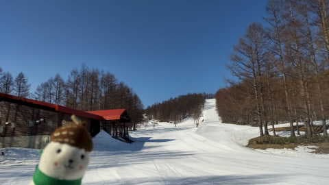
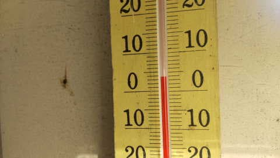
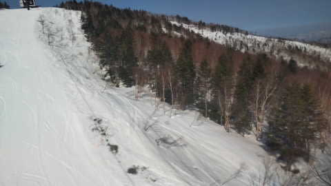
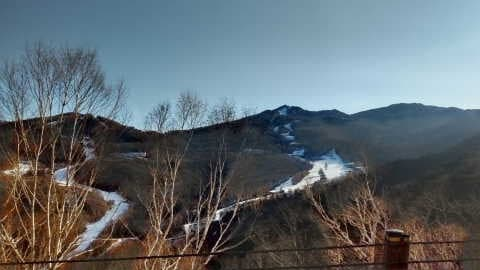
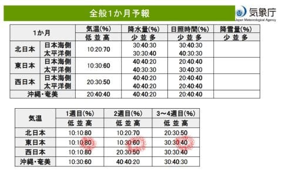
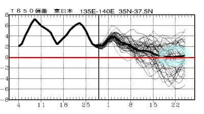
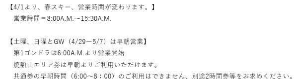

# 3月30日(木)も，志賀高原特派員によると高温の晴れ(泣)．そして4月の一か月予想も気温が高そうだけど，4月後半は平年並みの戻るか？

📅 投稿日時: 2023-03-31 04:01:01

あぁ…今日ももうこんな時間だよ（泣）

年度末が憎い…

ホントは，3月上旬に乗った来年度モデルの

スキー板の試乗レポートも書きたいんだけど．

記事を書いている時間がない…(涙)

ってなことで．

特派員写真で記事を書くと，

時間をかけずに記事が書ける

という内情は内緒にしておいて．←ここで書いたらばれるから

今日も特派員の写真に頼るわけですね．

で，30日の木曜の志賀高原は…

うーむ．

相変わらずの晴天だったみたいですね…

雪が解けるから晴れなくていいんだけど…

そして，気温は朝からプラス(泣)

昨日よりも気温が高いよ…

…晴れてプラス気温だから，

一見シマシマのバーンも，朝から

結構緩めだったようですが．

朝の数本は気持ちよかったみたいですね…

…そして．

高温と日差しで，コース脇の土も

だんだん広がってきてます…

奥志賀のダウンヒルコースに，この時期に

こんな土が出てくるなんてこと，

あったかな！？（激泣）

西舘や東館はさらに雪が減ったみたいで…

ダメだ．

今シーズンは雪解けが早すぎる…(泣）

で．

今日は木曜日なので，気象庁の一か月予報の

発表日です！！

果たして，これからの4月．

3月の異常高温が終わって，奇跡の

冷え冷え4月になるのか？？？

いつも通り，マニアックな[FCXX92](https://www.sunny-spot.net/chart/FCXX92.pdf)を見てみると…

…

…やっぱりダメか(涙)

1週目は高温になる確率が先週の予想から

変わらず80％と，これまで見たことのない

高い確率だし…

2週目も60%と，気温が低くなる可能性は

著しく低いです（泣）

そして，3－4週目もそんなに冷えなさそう…

あぁ…奇跡の4月は来なかったか…（ため息）

…でも，4月下旬は何とか気温は平年並みまで

戻ってきてくれそうですね…

でも，この雪の融けっぷりを見ると．

4月下旬だと，平年並みに戻っても，もう

遅い感じですが（涙）

うーん．

これで雪が完全に消えた5月以降に激冷えに

なったりしたら，ブチ切れていいですか？？

いいですよね？？

とりあえず．

今週末も気温が高そうで．

そして土日とも晴れそうな予想になってきました（泣）

いや…

この時期，晴れなくていいんだよ．

曇っていてくれた方が，ストップ雪に

ならなくていいんだけど…

朝から雪は緩そうで，そして晴れの日差しが

降り注ぐと…

土曜は朝からユルユル雪確定だし．

この週末は，ストップ雪覚悟か？？？

ただ，焼額は今週末から，朝6時スタートの

早朝営業が始まります！！

通常営業も8時スタートと30分早まります！！

（[焼額山ホームページ](https://www.princehotels.co.jp/ski/shiga/winter/)より）

うん．

この週末はたぶん，早朝が勝負だな…

## 💬 コメント一覧

### 💬 コメント by (レインボー75)
**タイトル**: Unknown
**投稿日**: 2023-03-31 14:08:47

金曜日の志賀高原情報

朝から暖かい。上林+7℃、蓮池+4℃。しかし日射しが強くないのでゆるむのが遅れ、２時間を白樺→サウスで快適に滑れ、シーズン一番の上達を感じてラストランができました。

このブログを通じてお知り合いになれた皆様、来年もまたゲレンデでお会いしましょう(私が生きていたらの話ですが)。

エス様、夏はスキーができないのに、ご無理などなさらぬよう、冬眠ならぬ夏眠して力を蓄えておいてくださいね。

あっという間のシーズンでしたが、皆様ありがとうございました。

### 💬 コメント by (Skier_S)
**タイトル**: ＞レインボー75さま
**投稿日**: 2023-04-01 00:18:58

今シーズンもお疲れ様でした．

今シーズンラストランがいい滑りになってよかったですね！！

また山小屋にお邪魔します…

