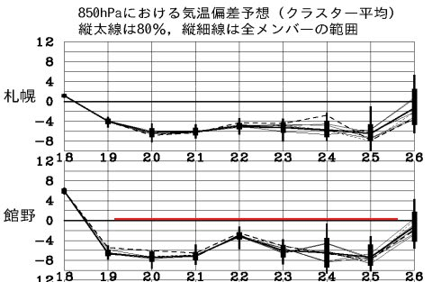
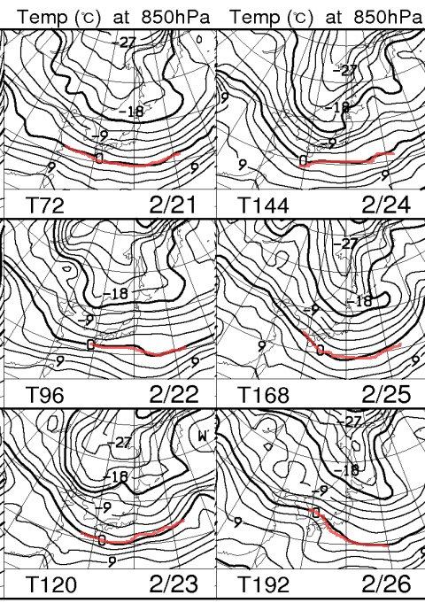
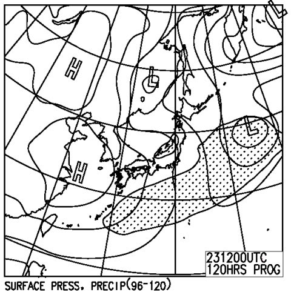
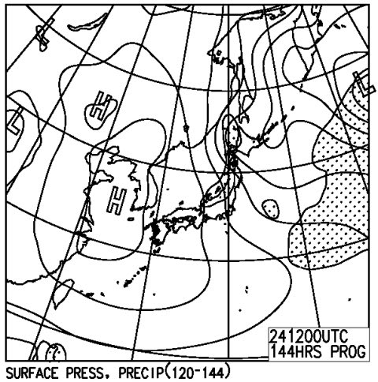

# この週末の志賀高原の天気は…冷え冷えな感じだけど，積雪はそれほどないかな～

📅 投稿日時: 2013-02-20 01:53:25

🏷️ カテゴリ: [スキー天気予想](c6554f5c3c106093b511a8daae23757e8.md)

えー．

これから一週間．

冷えますね～っ！

冷え冷えな一週間ですね～．

こんな感じで．

これから一週間．

平年より8度ほど低い日が続きますね～．

22日にちょっと気温が上がるけど．

それでも平年より4度低いくらい．

そして，FXXN519の，850hpa気温を見ると…

これから一週間，0度線はずっと日本より南まで下がったまま…

いやーーーー．

寒そうです．

しかし．

しかーし．

これからの一週間．

冷えるけど．

志賀高原では，あんまり降水量がなさそうなのだ…

雪雲が流れてきても，ちらちら降る程度．それほど積もらない感じですね～．

うーん．この週末，パウダーは厳しいかな～．

とりあえず．

土曜の予想天気図は…

こんな感じで．

新潟に降水域を示す網掛けがかかってますが．

…信州までは雪雲は流れてこないかな．

このままだと，小雪～晴れ．

まぁ，パウダーは期待できないけど，冷えて天気もそこそこ．

今の天気図のままなら，太陽も拝めそうなので，

朝のうちは久しぶりの整地大回りデーになりそうですね～．

そして日曜は．

…この天気図なら，結構な雪になりそう．

土曜の夜から降ってくれればパウダーいけるかもしれませんが，

うーん．

雪になるとしても，日曜の朝からかな～．

むしろ，昼間にもさもさ降って，昼間のゲレンデがぼこぼこになっていく

パターンかも．

ただ．

まだ，日曜の天気はちょっと流動的です．

これからの予想のわずかな違いで，雪になるか晴れるか大きく変化しそう．

また，直前に予想します…

とりあえず．

この週末も冷え冷え，バーンコンディションはよさそうで．

トップシーズンのゲレンデが楽しめそうですよ～．

## 💬 コメント一覧

### 💬 コメント by (aqura)
**タイトル**: Unknown
**投稿日**: 2013-02-20 11:34:30

今週は、志賀高原行きます。直前予報も期待しています。

### 💬 コメント by (ゆうこ)
**タイトル**: こんばんは
**投稿日**: 2013-02-20 23:50:10

今週も有休使って金曜日から志賀高原行きます！

今月、週4勤務です。もう週5日も会社に行けない体になってしまいそうです。

天気予報待ってます。

今週は初心者と行くので、吹雪にならないで欲しいです。

始めてのスキーで吹雪になったら二度と行きたくなくなるんじゃないかと心配です。

### 💬 コメント by (Skier_S)
**タイトル**: 直前予報おたのしみに
**投稿日**: 2013-02-21 03:42:28

>aquraさま

はいはい～．

金曜の夜に予想しますので…

期待していてください．

>ゆうこさま

金曜から志賀ですか…！

うらやましいです．

金曜も，土曜と同じで，晴れ時々小雪が舞うかも…って感じで，穏やかな感じですね～．今のところ．

日曜がまだ分かりませんが…

金，土は楽しめると思いますよ！

土日，私は焼額滑ってますので～

### 💬 コメント by (うえき)
**タイトル**: 志賀高原リフト券
**投稿日**: 2013-02-21 15:39:58

初めてコメントさせていただきます。

志賀高原の早割リフト券を3600円で購入したものの、ドタキャンがいて1枚あまってしまいもう一度志賀高原へと思っている私ですが、行けるのが4月になってしまいそう・・・

4月の志賀高原の雪の感じはどうですか？？

予定は4/2-3を予定しています。

### 💬 コメント by (Skier_S)
**タイトル**: うえきさま
**投稿日**: 2013-02-21 23:54:12

はじめまして～．

ようこそ，このマニアックなブログへ．

えー．

4月2，3ですが…

まだ，さすがピンポイントでこの時期の天気はわかりませんが．

運が良ければ，比較的良い雪質で終日滑れることも

あります．

運が悪ければ，かなり気温が上がってどぼどぼの雪に

なることも…

4月上旬は，かなり幅が広いです．

でも，運が良ければかなり冷え冷えのいい雪で滑れますし．

志賀高原では，まだまだ雪の量はたっぷりありますよ～．

### 💬 コメント by (ゆうこ)
**タイトル**: 晴天！
**投稿日**: 2013-02-22 17:23:43

今日は予告通り志賀高原来てます。

晴天で本当最高でした。

昨日雪が降ったようで、雪質もよくて楽しかったです。

有休とったかいがありました。

明日も天気だといいですが。

### 💬 コメント by (Skier_S)
**タイトル**: ゆうこさま
**投稿日**: 2013-02-22 21:58:41

あー．

今日はやっぱり最高でしたか．

明日も最高だと思いますよ…

時折雪が舞う可能性も高いですが．

土日は焼額滑ってますので～

