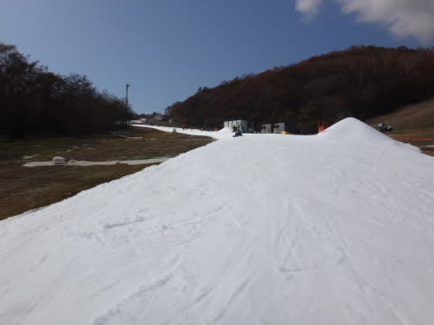

# 11月6日，日曜のイエティは…それほど混まなかったけど，昼間は雪がイマイチか．

📅 投稿日時: 2016-11-07 03:03:11

🏷️ カテゴリ: [2017スキー滑走日記](c7d777cecfc91bdf0fa464ad62c6d49ab.md)

ということで．

今週末は，日曜にYetiに行ってきたわけですが．

すっきり晴天で始まった，

朝8時の一般ゲレンデオープン．

雲一つない快晴！

人も少ないし…

行け――ッ!

…と，思ったら．

ありゃ？？

なんですか～っ！！？？

このザクザク雪はっ！？？

アイスクラッシュの大粒ザラメのような雪が，

踏み固められずにばらまかれてる感じで．

全く締まっていない，板が潜るような

スピードが出ない雪…（涙）．

せっかく人の少ない朝イチなんだけど…

快感度はちょいと低め（残念）．

うーん．朝9時ごろまではリフト待ちも少なく．

コースも人が少なめで，

せっかくかっ飛ばせるチャンスなのに…

とてもスピードが出せる雪じゃないのが，

残念すぎるっ！

…でも．

ゲレンデオープン以来，それほどひどい大雨や

高温に祟られていない今シーズン．

＃いつぞやは，オープン後に台風に襲われたことも…

おかげで，コース幅は着実に広がり．

この時期としては比較的広めでは？？

雪の厚みも十分で，土が出てくるようなところは

ほとんどないですね～．

で．

リフトは午前10時ごろにちょいと混んだけど．

並行するペアリフトが動き出してから…

最大5分も待ってない感じかな．

だいたい，平均してこのくらいのリフト待ち

でした…

で．

午前中は，割と人が少なめだったのは良いのだが．

…強烈な日差しで，気温がぐんぐん上がり，

トレーナーで十分なくらい暖かくなったので．

…雪が…

板に張り付く，溶けかけの感じに…（泣）．

せっかくのクリアなコースなのに，

緩斜面で雪が滑らないので．

スピードが出ない…（涙）．

朝イチはザク雪，昼間は張り付く雪で．

うーむ．

午後になってもリフト待ちは少ないけど，

快感度は低め…

ただ．

午後2時を過ぎてくると，うっすらと雲が

掛かり始めてきましたね…

日が隠れてくると．

ウェアのジャケットを着ないと寒いくらいの

気温になり．

板が滑るようになってきましたよ！

…これはいい！

…と，思ったら．

今日も例外なく，

なぜか夕方の方が混むという，

このスキー場のパターンにはまり．

あれ…リフト待ちが5分近くに…

そして，コースの人口密度もアップ（ちょっと残念）．

うーむ．

今日のYetiは．

ザク雪（朝）→張り付く雪（昼）→混雑（夕方）と．

残念ながら，あまり快感を得られないまま，

昼間営業終了の4時を迎えました…

残念っ！！！

…残念だなぁ…

…

やっぱり，このままでは帰れないなぁ…

…

明日も仕事だけど．

ナイター，行くしかないよね←終わってる人の思考パターン

ってことで．

ナイター営業開始の一番に飛び込み…

ガラガラの人がいない，圧雪したての

シマシマバーンへ，Go！！！

うぉぉぉぉ！

朝イチと違って，雪が締まって最高っ！！

人も少なく，スピードも出せて．

コース幅が広がったのもあって．

Yetiの緩斜面と思えないほど，イイ！

ナイター開始後，3本ほどは．

間違いなく今シーズン最高の3本でした！←って言っても，今シーズンまだ4日目でしょ

…ただ．

ナイター開始30分も経つと．

リフト待ちも3分を超えてきて…

コース上の人も増えてきて，飛ばせなく

なってきたので．

翌日の仕事も考え，この日は終了としました…

うむ．

なんて大人な判断だろう！←某komuさん始め，いろんな人に訴えてみる

ということで．

木曜ほどのガラガラシアワセバーンでは

無かったけど．

そんなに激烈にリフトが混んだわけでもなかったし．

ナイター開始30分だけでも来た価値があったな！

## 💬 コメント一覧

### 💬 コメント by (yama)
**タイトル**: ナイター
**投稿日**: 2016-11-07 06:34:01

昨日はナイターまで残ったかいがありましたね。今シーズンは良いスタートを切れていると思います｡志賀高原も今年は新雪三昧と行きたいですね。

### 💬 コメント by (komu)
**タイトル**: よく帰れましたね…
**投稿日**: 2016-11-07 19:40:12

昔、土曜仕事してオールナイトで朝まで滑りそのまま仕事に行くという暴挙に出た事がありました。

お互い大人になりましたね

### 💬 コメント by (ひーちやん)
**タイトル**: 大人の判断凄い
**投稿日**: 2016-11-07 21:27:10

日曜なのに、ナイター数本で、決断。素晴らしい（普通の人）。あの３日は、幻。いや、シーズンインしたばかり、これからまだまだ。インフルエンザ流行ってきました。私は、スキー行けなかったので、予防接種しました？（笑）また、ご一緒お願いします

### 💬 コメント by (Skier_S)
**タイトル**: 大人になりました…
**投稿日**: 2016-11-08 02:28:24

＞yamaさま

いやーーー．

ナイター，最初の3本最高でしたね！

これからのトップシーズンに期待です…

＞komuさま

土曜仕事で，鉄やスキーのあとにまた出勤ですか！？？

すでに，人間がやることじゃないですよ…（笑）

私は大人になりました（＾＾

ところで，この週末は滑らなかったのですか？

＞ひーちゃんさま

いや．

普通の人になりました（胸を張って）

しかし…

完全に風邪をひいてしまったようです（涙）．

今週末までに治さないと…

またご一緒お願いします～！

