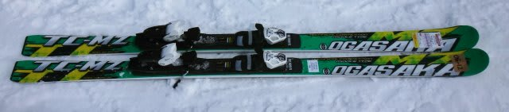
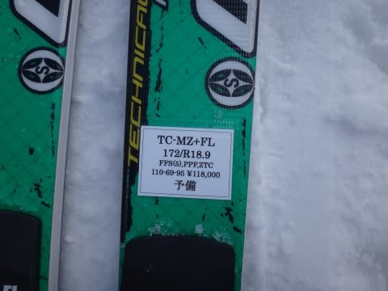
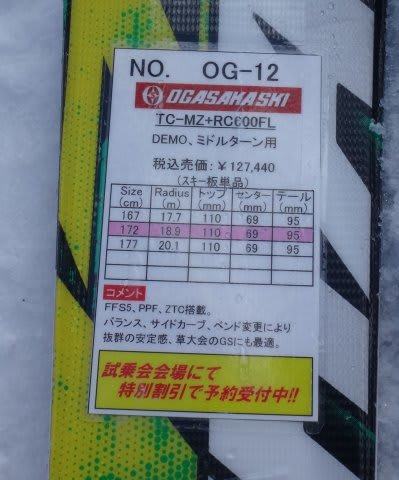
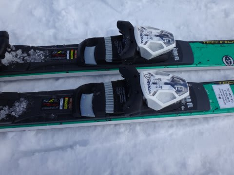
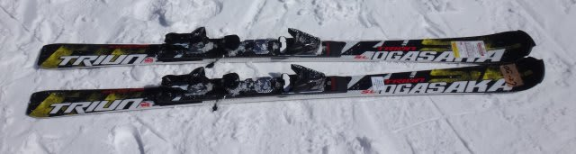
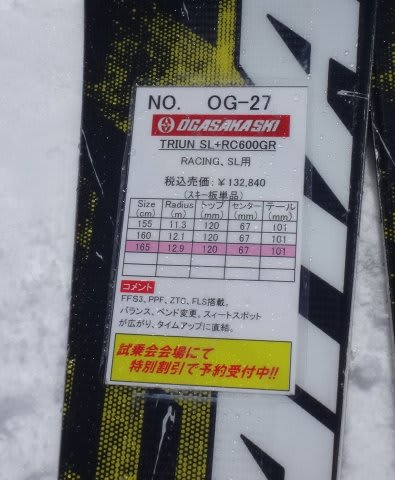
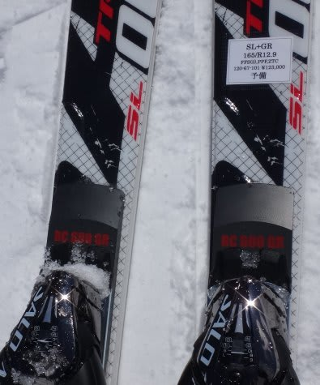

# 2015シーズンモデルのスキー試乗レポート18…OGASAKA編その2

📅 投稿日時: 2014-05-14 01:09:43

🏷️ カテゴリ: [スキー板試乗](c0bd8048615710cee890e403a36cc9a2b.md)

あー．

なんと．

実はまだ10機種以上残っている試乗レポート．

…まだまだ続きます．

＃レポートが全部終わるころには，

＃もう来シーズンに入ってるんじゃないか？

＃って，スローペースですが…

今日はオガサカの2機種です～．

----

OGASAKA TC-MZ (RC600FL) 172cm

基礎中回り用．

この板は，プレートは弱めのFLプレートを積んだモデル．

サイドカーブは結構ゆるく，中回りというより，

サイドカーブなりに滑るとかなり縦に落とせる大回り板に

感じます．

でも，板のグリップは適度にコントロールしやすく，

板を動かしやすいので，動かせば，普通に小回りが

できてしまいます．

エッジグリップがユルユルではないのに，動かしやすい

というのは，さすがにオガサカ…

大きく動かすと小回りもできるし，

動きを小さめにして，板をたわませるように力を使うと

グリップの範囲内で中回りまでもっていけます．

動かさないで板なりに滑っていくと，縦に落ちていく

大回りができます．

比較的軽快で，かなり縦に落とした大回りから，

小回りまでいけるので，オールラウンドゲレンデ用と

しては，かなりイケてる感じ．

…でも，軽快さゆえにトップスピードでの

安定性は大回り専用機には劣るところはあるけど．

強い感じがほしければ，プレートをGRにする

選択肢もあるので，結構幅広く使える，

オールラウンド板としてはいいかも．

OGASAKA TRIUN SL (RC600GR) 165cm 

SL競技用．

試乗したのは，強めのGRプレートを入れたモデル．

滑ってみたところ…

これは，よく回る．

しっかりグリップして，たわんで回ってビン！って感じで

返ってくる，結構元気な板です．

荷重ポイントは，基本的に板のセンター．

谷回りで，センターよりトップよりを抑えていくと，

きれいに回っていきます．

テールの張りはそれほど強くないので，テールを使っても，

板がまっすぐ走って抜けていく感じはないです．

テールまで乗っていっても同じ半径で回り続けるので，

そういう意味では，リスクが少ない板かな．

前後動を使わず，トップよりを押さえ続ければ．

しっかりエッジグリップで回る，粘りのある

フレックスの板です．

…ゲレンデでも十分行けそうな感じですね～．
