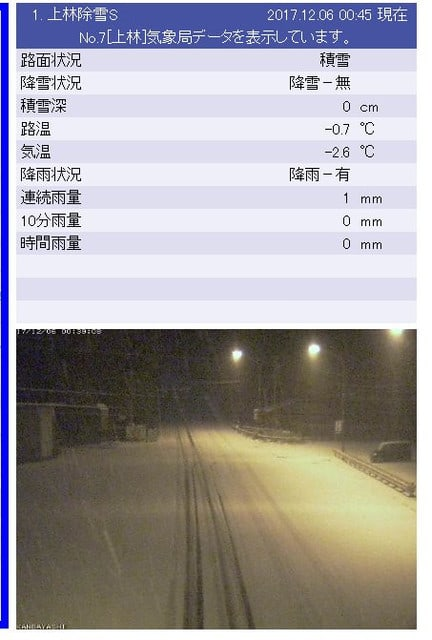
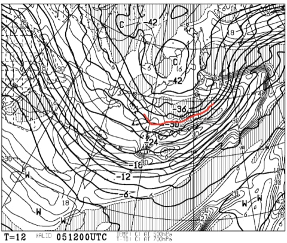
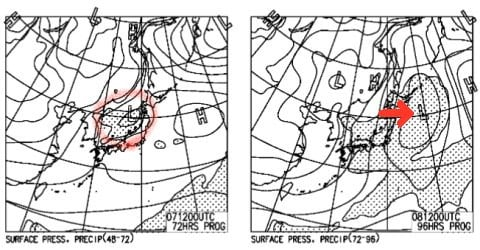
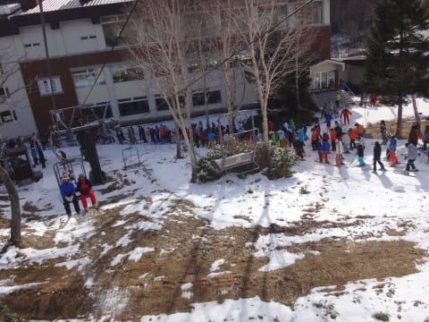
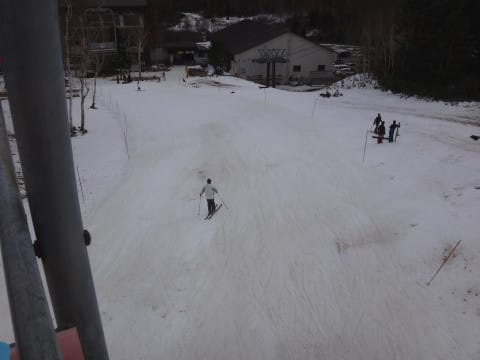

# 今週は冷え冷え！…7日は日本海側のスキー場＆白馬方面は新雪！そして，この週末も…積もるかも？

📅 投稿日時: 2017-12-06 02:03:08

🏷️ カテゴリ: [日記](cc4b5682fb7b8b144980957a978653fb0.md)

えー．

TVのニュースや天気予報を見ている人は

知っていると思いますが．

冷えますね．

冷えますよ～！

これからしばらく…

で．

現在．

志賀高原でも結構雪になっているようです…！

西風でそれほど積もらないかな～，と

思っていたら．

5日夜の500hpa気温を見てみると．

をを！

赤線で記したマイナス30℃の寒気が

下りてきてるよ！

これは，真冬の本格的冷え込みを意味していて．

そこそこの雪が降る目安…．

…これだと．

西風でも，根性のある雪雲が北アルプスを

越えて，志賀高原までやってくるレベル．

うーむ．

今晩は，志賀高原でもちょっと積もりそうですね…！

で．

6日は一日雪が降り続けそうで．

日本海側，白馬なんかのスキー場は．

7日の木曜日朝，かなりのパウダーが

積もってるかも？

…そして．

7日から8日の地上天気図を見てみると．

左側，7日の図に赤丸で囲ったように，

日本海上に低気圧が発生して．

それが，右側の図，8日の段階で

太平洋側に通過していく予想になってきたので．

…志賀高原も，この低気圧通過で，

雪が積もりそうな感じになって来ました…

まだ，今の段階では，

どのくらいの積雪になりそうかは分かりませんし．

ホントに積もるか，確定ではありませんが…

土曜の朝，志賀高原でも，新雪の可能性が出て

きましたね～．

あー．

でも．

志賀はひざパフとかまでは積もらないと思います．

たぶん．

今の予想のままだと，ブーツパフくらいかな～

日本海側に近い，白馬やかぐらなんかは

結構積もりそうな予感がするんですが…

とりあえず，また明日，定番の天気予想をやるので．

その時にはもう少し精度が上がると思います…

しかし．

恵まれまくっている今シーズン．

11月からほぼ全面可能な熊の湯＆かぐらで滑り．

先週は焼額のゴンドラで滑り．

もう，12月第1週にして．

すでにトップシーズンに突入している感じなので．

そろそろパフパフパウダーが滑りたい

という欲求が…

いや，せっかく[太い板を買った](e56c11ebadfa98e86c1f0cbe36198f076.md)ことだし，試してみたいんですけど…．

あぁ…太い板を履いてみたい…っ！！！

…しかし．

普通だったら．

12月1週が終わったところなら，

「やっと人工雪の短いコースを滑れたよ」

って感じだけど．

この時期に，もうこんなふうに

「そろそろパフパフも滑りたいなぁ…」

って思えるなんて…

贅沢にもほどがある

と．

ごく一瞬だけ思ってしまったSkier_Sなのだった…

PS.

昨年の12月第一週はこんな感じで，

焼額はペアリフト1本のみ営業で激込み．

雪も薄くてヤバい状況だったなぁ…

ゴンドラが動き出したのは，12月23日だったし…

それに比べれば，今年は恵まれすぎてる！！！

## 💬 コメント一覧

### 💬 コメント by (yumi)
**タイトル**: 今朝はまっ白
**投稿日**: 2017-12-06 06:50:01

今日、起きたら外はまっ白です。

ベランダの手すりには５～６㎝の湯田中です。☃️☃️☃️

ちなみに、昨日はまぁまぁいい天気でした。時よりみぞれでしたが、Wさん情報によると山🗻はいい天気だったみたいです。

長野市と湯田中と山の上では大分違いますねぇ。

### 💬 コメント by (Skier_S)
**タイトル**: yumiさま
**投稿日**: 2017-12-07 06:27:21

湯田中で5－6cmなら，

そこそこ積もったんですね！

これから寒い日が続くと思います…

山の雪が良くなるといいんですが．

どっさり積もってくれないかな～

