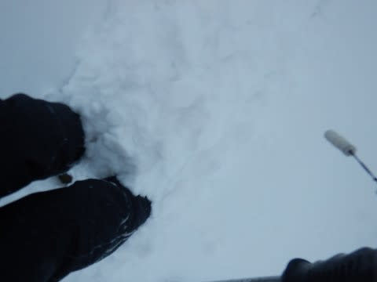
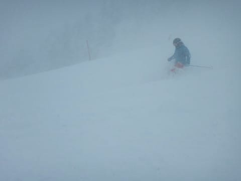
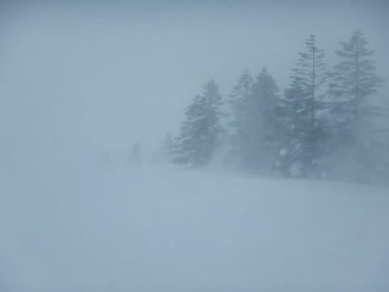
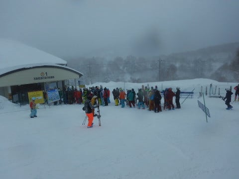
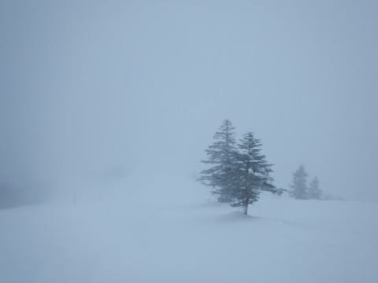
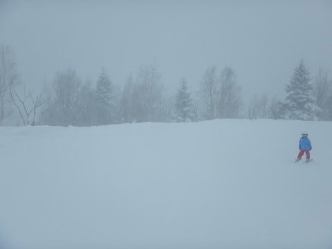

# 2月18日，日曜の志賀高原速報…朝から吹雪（涙）．朝イチは脛～膝パフパウダーだけど重かった…

📅 投稿日時: 2018-02-19 04:55:19

本日も．

帰宅がなぜかとんでもない遅い時間に

なってしまっているので．

日曜夜（月曜早朝？？）恒例，

速報モードにてお送りします！

いやー．

今朝…というか，日曜朝の志賀高原．

思ったより積もってましたよ…！

…でも．

パフパフパウダーじゃなく．

ちょっと重めの新雪で，

脛パフ程度でしょうか…

一晩で積もった積雪深はスネより深いのですが．

重い新雪で板が潜らないので脛パフに…

って感じですか．

それでも，朝の数本は良かったけど，

重くてすぐ踏み固まっちゃうような雪

だったので，おいしかったのは3-4本程度…

天気は朝から吹雪気味で．

強風のため，奥志賀が第1ペア以外の

全てのリフト・ゴンドラが止まっていたので．

午前中は，焼額ゴンドラがかなりの待ちに…（涙）

でも．

焼額第1ゴンドラのゲートの外にまで列がついたのは，

9時半～11時頃までの，1時間ちょいで．

11時半を過ぎると，ゲレンデもガラガラになってきました…！

…だけど．

今日も激寒で．

風も強く．

吹きさらしのリフトに乗っていると

凍死するかと思うレベルの寒さで．

…さらに．

午後になると雪がやむはずの天気が，ひたすら雪が降り続き．

それほど積もるような降りではなかったけど．

結局営業終了まで雪が降り続けました…（泣）．

結局，この土日は完全に雪降りの2日間でした…

うーむ．

狙ったように週末降らなくていいんだけどなぁ…

平日に降って，土日に晴れてくれると嬉しいなぁ←かなり利己的

まぁ．

でも．

この週末の雪で，雪不足気味だったゲレンデも

雪が増えたし．

寒くて冷え冷えだったけど．

良かったということにしておこう…

ってことで．

明日詳細モードやります～！

今日は眠いので，おやすみなさい…

## 💬 コメント一覧

### 💬 コメント by (michi)
**タイトル**: 寒かったですね
**投稿日**: 2018-02-19 18:56:46

昨日はお疲れ様でした。

久々に一人でしたが皆さんと一緒に滑れて楽しめました。

一人だったら速攻帰っていたかも⁉️（笑）

また宜しくお願いします(^^)

### 💬 コメント by (yumi)
**タイトル**: 下は晴れてた⁉️☀️
**投稿日**: 2018-02-19 19:12:12

Sさぁ～ん✨

日曜日も定時？１１時過ぎに山を下りましたが、サンバレーの辺りから晴れてましたよ。

その名の通り、サンバレーだけが晴れていることはたまにありますね😁

今日は昨日の吹雪が嘘のように晴れ渡って、おくしーでは、昨日のままの新雪で60～90㎝位のふわふわ、ぱうぱう🎉でした🎵

熊🐻落としで、半日、落ちてました。💨💨💨

### 💬 コメント by (ほっぽ)
**タイトル**: Unknown
**投稿日**: 2018-02-20 00:59:18

日曜日はmaeさんに見つけてもらい数本ご一緒しました。

ゴンドラ待ちで前方にＳさんご一行様を発見しましたが、残念ながら捉えられず。。。

午後は知り合いが滑っている熊の湯に移動しましたが、酷寒の地でリフト乗車は修行以外の何者でもなく、クワッド終了とともに上がりました。

### 💬 コメント by (Skier_S)
**タイトル**: そして，また雪が降らない日々が続く…
**投稿日**: 2018-02-20 02:14:52

＞michiさま

日曜はまた賑やかでしたね～！

申し合わせたわけでもないのに，

知らぬ間にみんな集まってくるのが

面白いですよね．

これだけ同じペースで滑れる人が

自然に集まってくるようになると，

もう他のスキー場には行けなくなります（笑）．

＞yumiさま

やっぱり，日曜は山雪だったんですね…

麓は晴れてたんですか．

月曜は最高のスキー日和だったでしょうね…

うらやましすぎます…

なぜ，この週末の天気が，せめてどっちかに

一日ずれてくれなかったのか（涙）．

私も晴れの新雪を滑りたいです…

＞ほっぽさま

この日曜も，ご一緒できませんでしたね…

朝はいつもの集団爆走メンバーが集まって

いたのですが（笑）．

日曜の熊の湯は，寒かったですよね…！

焼額より寒いのに，リフトで滑ってたら

死んじゃいますよね…

高速リフトならまだしも，第2ペアで

山頂までいったら凍死間違いなしですよね．

クワッド終了で上がるのは，人間的

判断だったと思います（笑）

