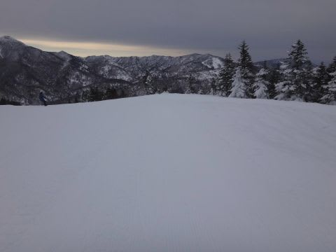
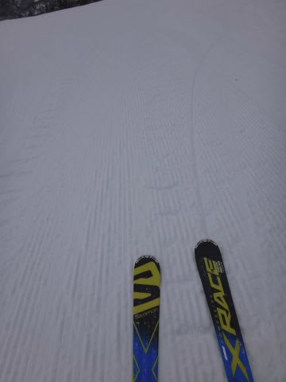
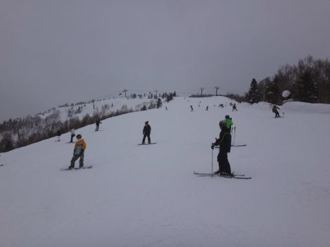
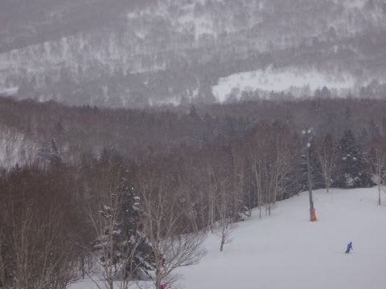
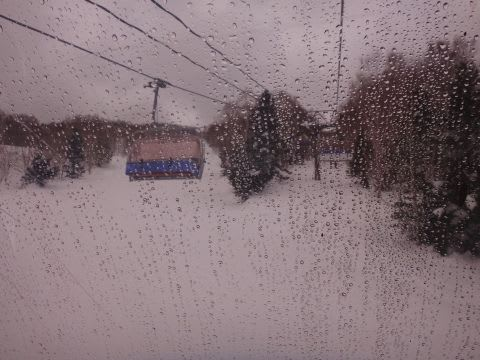
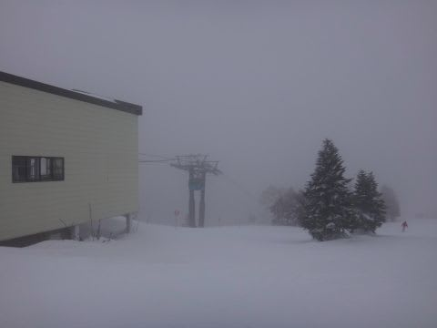
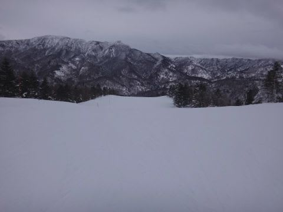

# 2月5日，日曜日の志賀高原の速報レポート…昼前から湿った雪，標高の低いところではみぞれ（涙）

📅 投稿日時: 2017-02-06 00:43:52

🏷️ カテゴリ: [2017スキー滑走日記](c7d777cecfc91bdf0fa464ad62c6d49ab.md)

ということで．

今日も帰宅が遅いので，速報モードにて…

えー．

予想通り，曇り空で始まった本日．

…とはいえ．

朝イチのゲレンデは，エッジがガッツリ食いつく

丁度いい感じの快楽圧雪バーンがお出迎え！

いやーー．

イイよね！

ゲレンデ状況，いいよね！

今日はホントに荒れた天気になるのかな～…

とか言いながら滑っていたら．

うーん．

10時ごろには人口密度が上がってきて．

ちょっと大回りはきつくなってきたなぁ…

と，思いながら滑ってたら．

…あら？

11時近くに，ぱらぱらと雪が降り始めましたよ…？？

まぁ，午前中は時折パラパラぱらつく程度だし．

雨にならずに良かったなぁ…

と，思っていたら．

1時過ぎに，またパラパラと．

今度は1時間ほど降り続けたんだけど…

今度のは，なんだかかなり雨っぽい感じ（涙）．

…しかし．

ここは，数日前からの．

私の必死の祈りの効果のおかげで←読者のみなさんの祈りのおかげなのでは？

焼額はぎりぎり「雪だよね？これ，雪だよね？？」

って感じのものがふってましたが．

ジャイアントに行った人曰く

「ジャイアントは雨だった…（泣）」

ということだったので．

私の祈りのおかげで焼額だけ雪だったようです

志賀でも標高が低いところは．

雨だったようです…

で．

午後2時ごろには，山頂付近は

ガスも出始め．

強風で，ゴンドラは1，2ゴンともに減速

運転に…（ちょっと涙）

まぁ，とはいえ．

夕方まで結構バーンコンディションはフラットで．

ゲレンデ自体は，結構滑り良かったかな～！

ってことで．

焼額はぎりぎり雨にならずに，セーフっ！！

って感じの本日でしたが．

雪自体は終日フラットで，結構滑り良かったので．

まぁ，そこそこ楽しめた一日だったかな？？

とりあえず．

また明日，本日の詳細レポートやります～！

追記：また明日，ドサドサ降りそう…

ちょっと重めの雪ですが，また積もりそうな感じ…

…ってか．

6日昼からは，かなりの寒気が入って．

8日まで降り続けるかも？？

## 💬 コメント一覧

### 💬 コメント by (はなげ親分)
**タイトル**: 現在の一の瀬
**投稿日**: 2017-02-06 13:44:30

顔に当たるとかなり痛い雪が続々入荷中!!

辛い……！

### 💬 コメント by (かず)
**タイトル**: 雪降らず2週休みました
**投稿日**: 2017-02-06 20:18:03

お久しぶりです　やっと雪来ました　金曜から3泊か　土曜から3泊か検討してまーす　どちらにしても重そうですが

### 💬 コメント by (Skier_S)
**タイトル**: 冷え冷え祭りPart2スタート！！
**投稿日**: 2017-02-07 03:16:57

＞はなげ親分さま

あれ～！？？

今日は平日スキーだったんですか…

かなり冷え冷えの雪降りの一日だったと

思うんですが…

痛くてつらかったですか（^^;

＞かずさま

来ますね～！今週末！

9日はちょいと重そうな雪になりそうで，

10日はエンドレスパウダー供給デーです．

11，12，13日も降り続けるので…

今のところの予想では．

朝はちょいと重めで視界が悪く，吹雪気味でも，

午後までドサドサ降り続く，深めのパウダーを狙いたいなら10日狙い．

それほど深くないし，朝で売り切れてしまうけど，

軽めのパウダーを狙いたいなら13日でしょうか…

