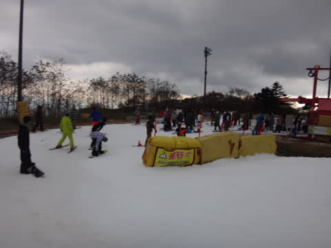
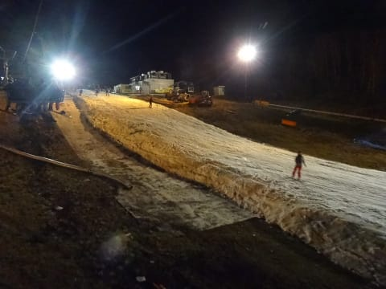

# 11月7日，土曜日のイエティ詳細レポートっ！

📅 投稿日時: 2015-11-09 00:25:22

はいはいはい．

お待たせしました←だから，誰も待ってないってば

土曜日のイエティ，詳細レポートです…

昨日の速報で書いたように．

土曜朝は，日が射す暖かいコンディションでのスタートとなりました！

気温も，朝から10℃越えと暖かく．

雪も，朝イチなのにそんなに固くなく，

積もらせたての比較的柔らかい感じでしたね～

でも，日が射しているとはいえ，富士山は

すっぽり雲に隠れており，だんだん雲が

増えていく感じ…

コース幅は，見ての通りの感じで．

先週よりはちょっと広がったかな？

まぁ，とりあえず．

朝は9時ごろまで，この程度の人口密度で．

リフト待ちも，ほぼ0！

快適朝イチグルグルが楽しめましたよ！

ただ…

10時ごろには，やはり．

…ゲレンデの人口密度が，上がってきましたよ…（涙）．

だけど．

なぜか．

ゲレンデの人口密度は高いのに，リフト待ちは

結構少なくて．

あれ？？

10時になっても，この程度の待ち時間？？

そして，昼ごろでも…

ゲレンデは，相変わらず混んではいるものの．

リフト待ちは，最大でもなぜかこの程度．

だもんで，この日はクワッドリフトのみの運転で，

並行してかかるペアリフトは動かずじまい…

それでも問題ないくらいのリフト待ち．

あー．

天気の方は．

昼からは，完全に太陽は隠れてしまい．

スキーウェアのジャケットを着ないと耐えられない

くらいの寒さになりましたね～．

で．

結局，コース上の混雑は，

「ああ，土曜日だなぁ…」

って感じでしたが．

リフト待ちはそれほど長くならずじまいで．

天気も雨にならず，かといってガンガン日差しで

雪が張り付くドボドボ雪になることもなく．

実にちょうどいい天気．

ってことで．

丁度いい天気で，リフト待ちも少ないイエティ．

夕方16:00からの，昼間営業終了時間まで

たっぷり楽しめたのでした～！

（昼間営業終了30分前くらいには，ちょっとガスが…）

…

…

で，ナイターです．

…はい．ナイターです…

ナイターなんです．

いや．

これだけしょっちゅうイエティに来ておきながら．

実は私にとって初めての，イエティでの

ナイターなんですね～．

…いや，

なんだか．

この時期の廊下状態のイエティで，

朝イチからナイターまで滑ってるって，

なんだか終わった人のようで…←何をいまさら言っているのだ？？

「自分はそこまで逝ってしまった人間じゃない！」という

強い思いから，ナイターは滑っていなかったん

ですが…←いや，もう確実に間違いなく逝ってる人間ですから

でも．

この日は，ナイターの雪がむちゃくちゃ滑って，

かなりいい感じでした．

すごいスピードに乗って滑れて，昼間と全然違う感じ！

今日は比較的滑る方だったのに，実際は

昼間の雪がいかに滑らなかったかってことが，

よく分かる…

ただ，欠点は…

なぜ？

なぜ，昼間よりリフトが混む？？？

昼間は1-2分，最大でも3分待ちのリフトが，

5分程度の待ちに…（涙）．

とはいえ．

これだけの緩斜面でも，これだけスピードが出るんだ！

って感じの，良く滑る雪で，チョー気持ちよかったです…

ヤバい…

これは，ヤバい．

一日券でナイター滑れるんですよね…イエティ．

マズいものを知ってしまった…

来週から，16時に帰れない気がする…

## 💬 コメント一覧

### 💬 コメント by (mae)
**タイトル**: Unknown
**投稿日**: 2015-11-09 23:51:25

あっ、ヤケビで良くみかけた方もいますね～

イエティには、未だに行ったことがないんですが、今度行ってみようかな～

### 💬 コメント by (Skier_S)
**タイトル**: maeさま
**投稿日**: 2015-11-10 00:40:12

ええええ！？

この写真だけで，よくヤケビで見かける方がいるって

分かりますね～…

私も，「いつも志賀で見かけてます」って

声を掛けられて，初めてヤケビにいつも

いらっしゃる人だと知ったのですが…

どうも，私は滑っているときに周りをよく

見てないようで，いつもゲレンデにいる人と

分からず，声を掛けられて驚くことが

多いです（^^;

イエティは，この時期であれば一度

来てみる価値はあるかと．

…決して，トップシーズンに来る

場所ではありません（笑）．

### 💬 コメント by (はなげ親分)
**タイトル**: むふふ・・・
**投稿日**: 2015-11-10 01:23:59

土日のナイター⇒ウィークデイのナイターへ（待ってます！）

### 💬 コメント by (Skier_S)
**タイトル**: はなげ親分さま
**投稿日**: 2015-11-10 01:34:27

いや…無理です．

平日は，無理ですよ～！！！

普段，日付変更線より前に帰宅できる

ことは無いので…（＾＾；

