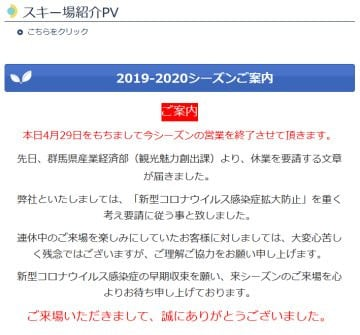
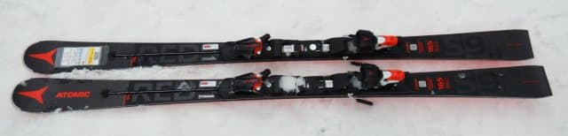
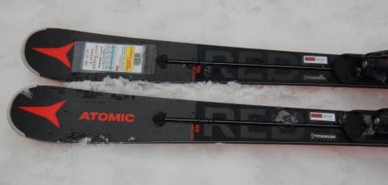
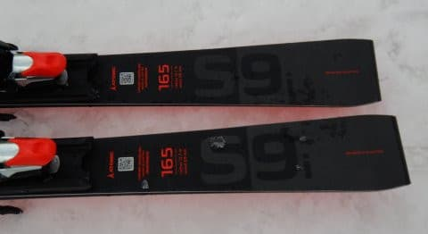
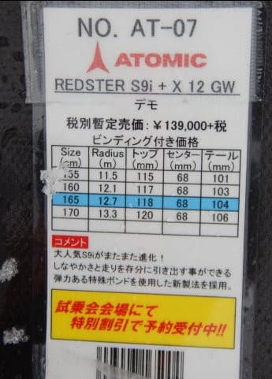
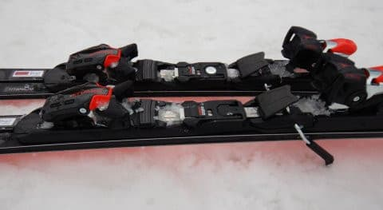

# 2021シーズンモデルのスキー板，試乗レポート…ATOMIC Redster S9i

📅 投稿日時: 2020-04-30 01:09:13

私にとっての8日ぶっ続け自宅滞在の

GWの第1日目が，うちでいろいろしている間に

終割ったわけですが．

…岩手県以外でまだ営業を継続していた数少ない

スキー場だった鹿沢スノーエリア．

群馬県からの要請に基づき，ついに本日で

営業終了したようですね…

（[鹿沢スノーエリアHP](http://www.kazawa.com/snow/)より）

…まぁ，さもありなんという感じですが…

むしろ今までよく営業していたというか…

雪の量自体は，さすが奇跡の4月だけあって，

5月6日までは十分営業できそうな雪の量が

あったようです…！

…雪があるだけもったいないけど．

まぁ，状況を考えると仕方ないですね（涙）

ってなことで．

基本的にStay homeのGW．

皆さんには，ちょっとだけスキー気分を味わえるように，

このBlogでは，まだまだスキーモードが続きます！！

本日は，来シーズンモデルのスキー板の試乗レポート．

アトミック編です．

では，どうぞ～！

○ATOMIC REDSTER S9i + X12 GW 165cm

基礎小回り用

以前，SL競技用トップモデルのS9 FISのコアを

カルバコアにして，基礎用にモディファイした

[S9i Proをレポートしました](e47e006967b1922aad0d6e82f807ade58.md)が．

こちらは，[SL競技用セカンドモデルのS9](e32527a543e652cf67baac3a1e6c2168e.md)のコアを

軽量カルバコアにした基礎モデル，S9iです．

ビンディングは，S9i Proがガッツリした金属バーで

足元のフレックスが強くなるVARビンディング

だったのに対し，こちらの板のビンディングは，

より軽量なX12 GWになります（来シーズンからはATOMICの

ビンディングはTLって言わないのかな？

SALOMONは2020モデルもTLって呼んでるけど）

履いてみたところ…

これは．

板も軽いし，ビンディングも軽いし．

履いた感じが異常に軽いっ！！

もう，ふわふわするほど軽い！

グリップも，S9i Proに比べると強くなく，

かなり優しい感じです…

試乗したコンディションが，雪が柔らか

かったからか．エッジの捉えはかなり

優しい感じ．

柔らかいザクザクした春雪では，

あまりグリップせず，板を動かし続けて

ずれの中で乗っていく感じ．

縦目に落としていくとグリップするけど，

板に圧を溜めていけるほどグリップせず，

それほど返りも強くないので，柔らかい雪では

積極的に板を動かして，ずらしていった方が

調子がいい感じ．

ただ，板がかなり軽いので，低速だろうが

重い雪だろうが，好きなように振り回せます．

動かしたい放題に動かせる軽快さが，この板の

最大の長所ですね．

…逆に重さが無いので，

雪が荒れていると板が叩かれて，

スピードを出していくとちょっと

板がキョロキョロするような動きに

なってしまうのが惜しいですが…

あまり硬い斜面をトップスピードで

ギンギンに切っていく感じの板ではありません．

何もしなくても板がオートマチックに回っていき，

板に任せていけば快楽の小回りができる

という板ではなく，むしろいろいろ動かしていく

自由度がある板なので，難しい斜面を，

コントローラブルなスピードで

いろんな技を使って，板を操作して

滑っていく感じの板．

そこそこのスピードでは，サイドカーブに

乗って回っていくこともできるけど，

ズラシのコントロール性がよく，

積極的に板を動かしていくと，たわみが出て

きれいにズレに乗って回ってきてくれる板で．

本気のトップスピードだとちょっと

安定感が不足する感じだけど，

そこそこのスピードで，いろんな技を

使って板をコントロールして，荒れた斜面や

人の多いゲレンデなんかの，普通のスキーでよくある

シチュエーションを気持ちよく滑っていくには

ちょうどいい板かな…

と思いました．
