# 12月23日，祭日の志賀高原スキー場は…悲惨（涙）．雪が減ったよ…

📅 投稿日時: 2016-12-23 23:08:05

ということで．

[いまから一週間以上前の段階](e239f4764f56d43406c70bc5fe31fb9fe.md)で．

今週末より来週3連休の方が，

滑れるエリアが減ることを覚悟してください．

と，予告してましたが．

…その予想通り．

本日は壊滅的ゲレンデ状況でした（涙）

そして．

昨日まで朝となく夜となく，必死に踊り続けた

冷え冷え踊りVer.2017シーズン

の効果もむなしく．

全く効果がなかったようで（落涙）．

昨晩までの高温で．

ゲレンデ状況はかなりのことに…（泣）

なぜ…なぜ，こんな予想は当たるのだ…

とりあえず．

この時期に全く道路に雪がない

という危険な状態で始まった朝．

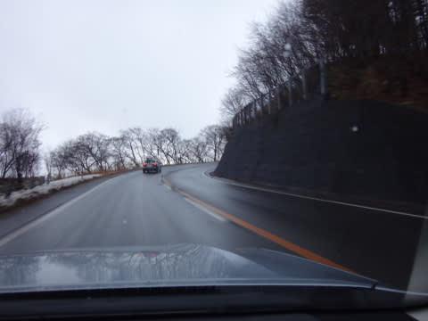

いつも通り，オープン前のヤケビ第1ゴンドラに

並ぶわけですが…

すでに，ゴンドラ前，やばくない！？？

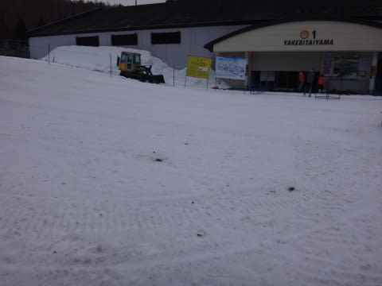

…そして．

ゴンドラからの景色も…

ヤバくない！！！？？

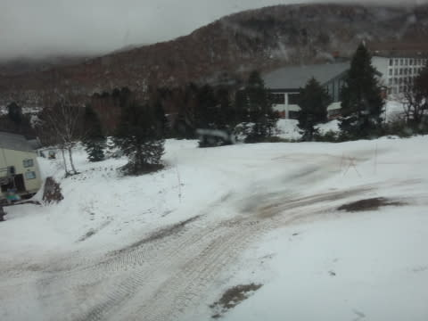

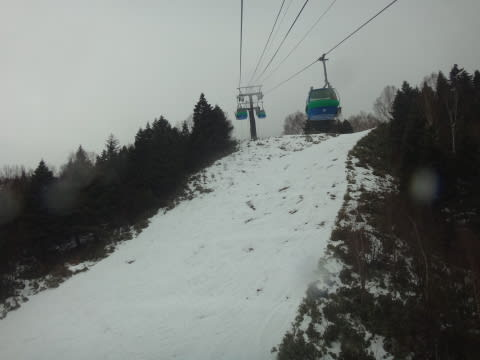

山頂の温度計は，かろうじてマイナスを指しているものの…

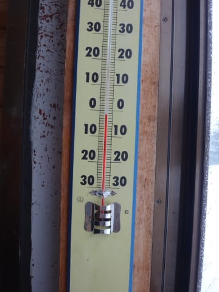

曇り空のゲレンデに出ると．

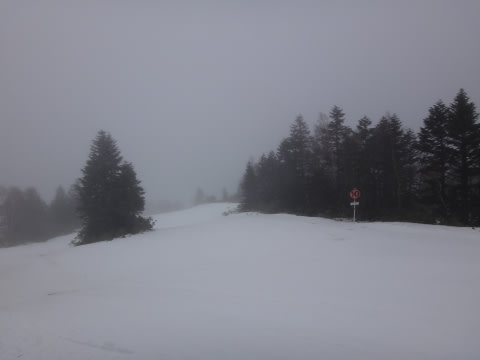

…そうですよね．ブッシュ，ありますよね．

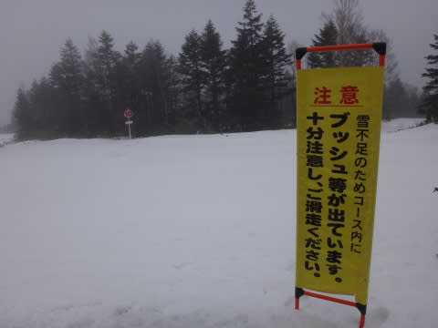

山頂のゲレンデを滑り始めると…

うーむ．

ちょっとアイスバーン気味で硬いんですが（泣）

そして，1ゴン沿いのジャイアントスラロームコース．

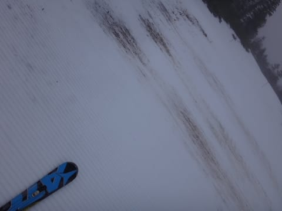

ところどころに…

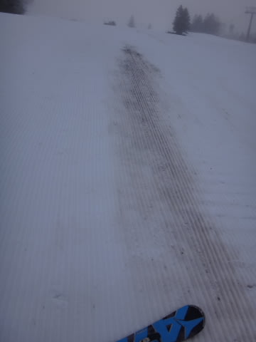

いたるところに…

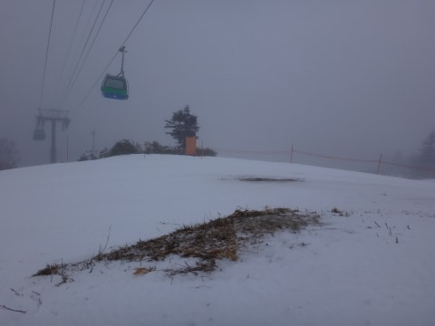

いろんなところにブッシュさんがいます．

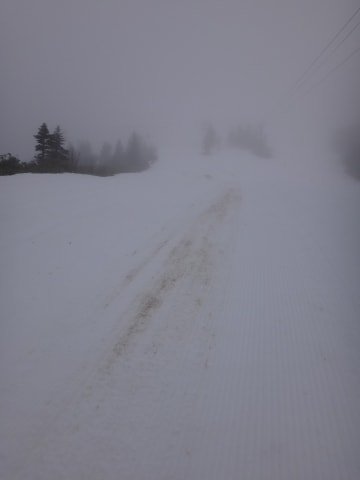

ってか，このレベルだと，もうブッシュといわないのでは…？？

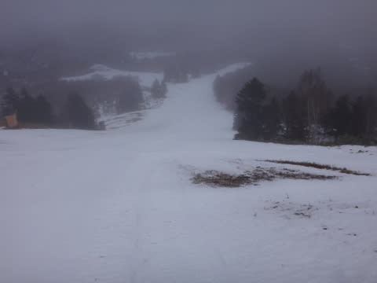

うがー！

なんてこった．

なぜ，こんなことに…

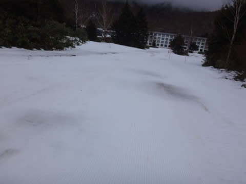

これで，コースの上半分はアイスバーン気味で，

滑りにくいときたもんだ…（泣）

第2ゴンドラ側，パノラマコースはもう少し

まともに違いないっ！！

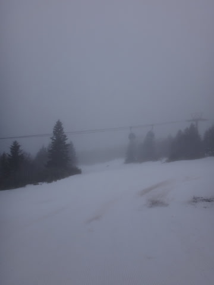

…え？

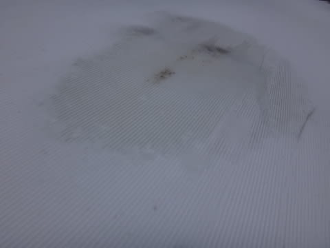

あれ？？

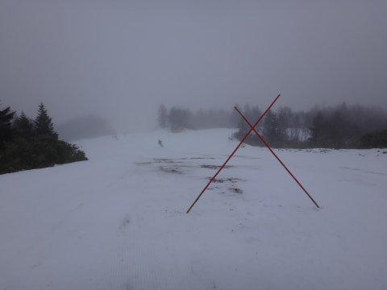

そして．

先日いったんオープンした白樺コースも，

「コース閉鎖」の看板が出ていて，

またクローズになったようです（涙）

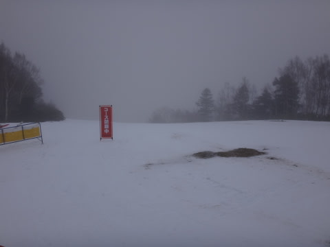

ただ．

第2ゴンドラ側のコース．

4ロマ降り場から下は，人工雪がつけてあるので．

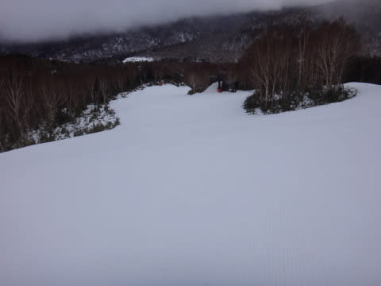

うむ．

途中から下は，ばっちりだよね～．

…1ゴン側より，やっぱりこっちのほうがまだ

コースとしてはマシかな？？

…でも．

みんなおんなじことを考えるわけで．

2ゴン側は，タイミングによっては結構

こんでました…

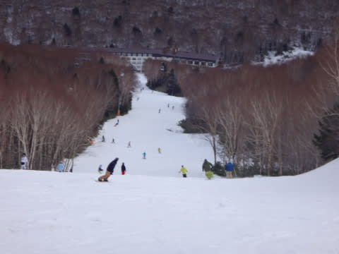

そして，ゴンドラも混み気味（涙）

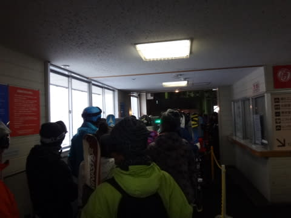

第2高速側，唐松コースも人工雪が

つけてあるので，ここもブッシュはなく．

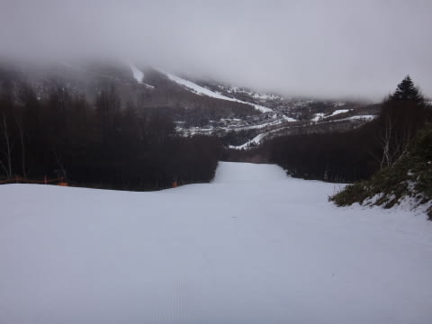

ところどころ硬かったけど，

比較的滑りよかったかな…

そのせいで，こちらもコース上，人が

増えてきました…

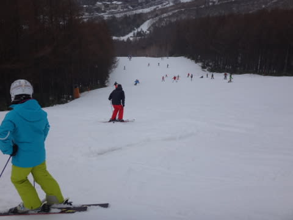

とはいえ，リフトはガラガラでしたが．

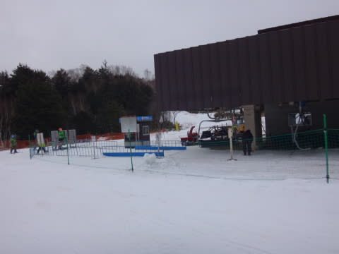

…でも．

リフト下の雪が，先週より明らかに

減っているのは，なぜ…（涙）

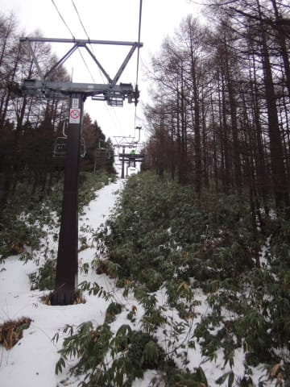

てな感じで．

一番コースコンディションが悪いのが

第1ゴンドラ側のGSコースでしたが…

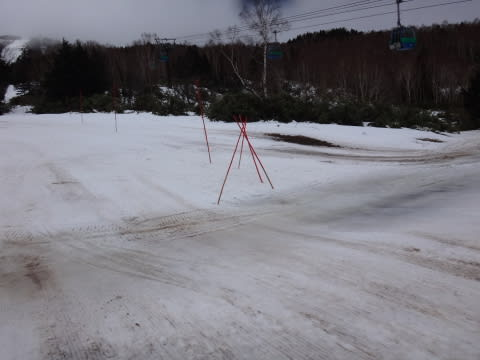

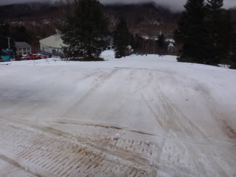

そのおかげで，コースはガラガラ！

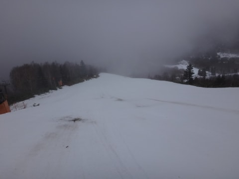

ゴンドラも飛び乗り状態で，良かったな～っ！！

…と，自分を何とかだまそうとしてみる（涙）

午後になると，ちょっと気温が落ちてきて…

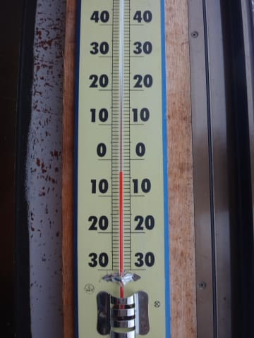

そして，積もるほどではなかったけど．

雪が降り始めてきました…

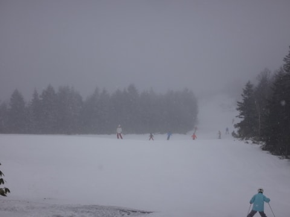

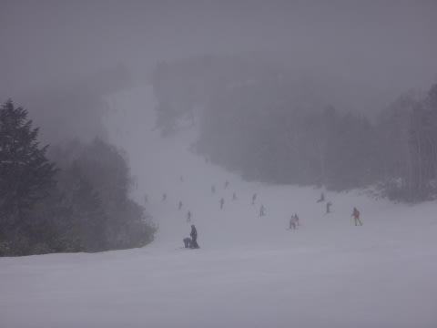

しかし．

気温が下がったおかげで．

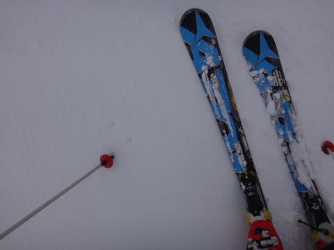

固い…

コースはかなり広い範囲で固まって，

ツルツルに…（涙）

あぁ…

どうして．

なぜ，こんなことになってしまったの？？？

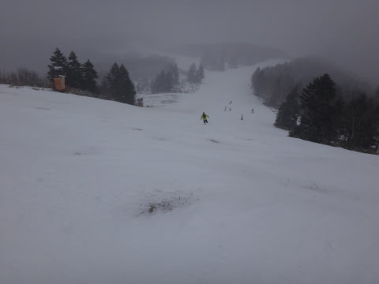

…と，嘆きながらも．

いつも通り，16時の焼額リフトストップまで滑り…

…はい．そうです．

その後，16:30まで営業の一の瀬へ移動っ！！

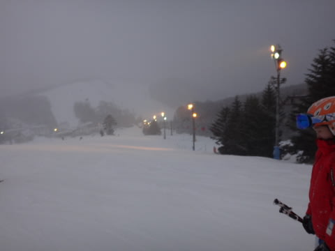

一の瀬も…

いや．

これはかなりのアイスバーン（涙）

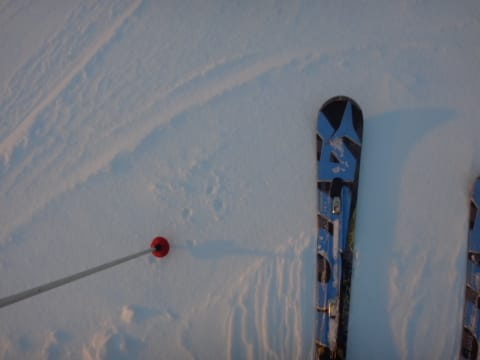

そして，ところどころブッシュさん登場（泣）

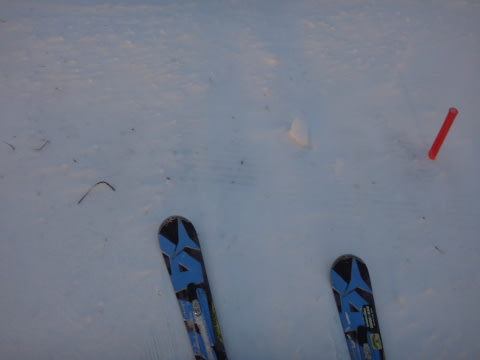

普通なら，毎週毎週コンディションがだんだん

良くなっていく，12月のこの時期．

なぜ…

なぜ，先週よりコンディションが悪いの？？？（涙）

そして．

一の瀬が終わった後も．

そうですよ．まだ終わらない．

こんなコンディションでは終われない！！

はい．

そうです．

焼額ナイターですっ！！！

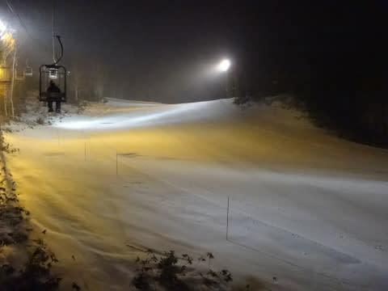

本日，ナイター営業するかどうかかなり悩んだらしく．

焼額や志賀高原のウェブページにも「16時で営業終了」

と書かれていましたが．

当初計画のナイター営業開始日の本日．

実はちゃんとナイター営業されました～！！

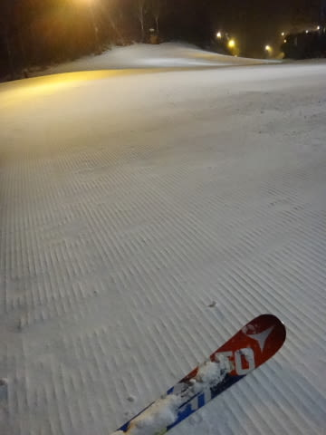

今シーズンの初ナイター！

そう，ナイター前に圧雪をかけなおす．

圧雪かけたてシマシマバーンナイターが，

今シーズンも始まります！

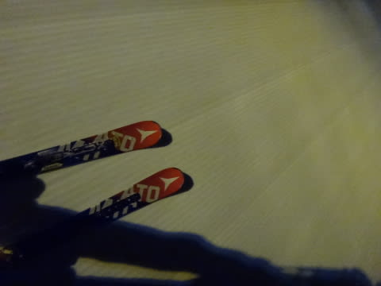

リフトは第4ロマンス1本だけでしたが．

こんな感じで，硬い雪の上にわずかながらも

新雪が積もってくれたので…

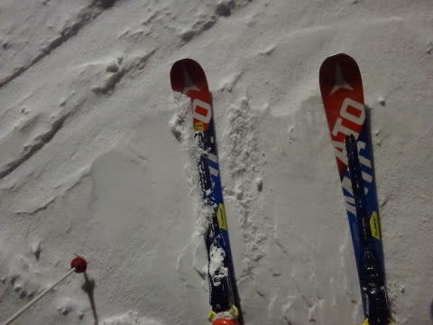

いやーーー．

今日一番良かったのは，このナイターだなっ！！

ナイターに行ってよかった…

＃リフトは低速だけど．

＃さらに人が少ないからか，減速運転してたけど

ナイターの間は雪が時折強く降り．

ナイター中，さらに3-4cm積もったかな？？？

とりあえず，人もいないし，うっすらとはいえ

新雪が積もり，アイスバーンを隠してくれたし．

ナイターがあって，良かった…

…ちなみに23時現在も，そんなに積もる感じでは

ないとはいえ．雪が降り続いてます…

明日，ゲレンデ状態が改善することを祈るばかり…

＃GSコース，人工雪打ってるっぽい…

明日の朝起きたら，どっさり2mくらい積もってて

くれないかな～．←リフトもゴンドラも営業できないから，それ

## 💬 コメント一覧

### 💬 コメント by (かず)
**タイトル**: 先週とは景色が違いますね
**投稿日**: 2016-12-24 00:37:37

更新待ってました　3連休パスしました　意外と良かったを期待してたのですが…年末いつからスタートするか難しくなりました

### 💬 コメント by (bamboo)
**タイトル**: いつもありがとうございます
**投稿日**: 2016-12-24 19:03:10

焼額大好き夫婦スキーヤーです。毎日楽しみにブログ拝見しています。いつもレポートご苦労さまです。

先週日曜日（12/18）焼額に日帰り初スキーしました。最高でしたね。

今週もコンディションGOODなら土日2日間車中泊を計画していましたが、

土曜日は避けて明日日曜日だけ行くか、やめるか、悩み中です。本日24日の状況はどんな感じでしょうか？

### 💬 コメント by (Goku)
**タイトル**: パウダーディ
**投稿日**: 2016-12-24 20:38:41

今日はパウダー供給ディで最高だったことでしょう!

私も明日はゲレンデに舞い戻ります！

### 💬 コメント by (Skier_S)
**タイトル**: 今日は良かったよ！！！
**投稿日**: 2016-12-24 21:06:26

＞かずさま

昨日はひどかったですが…

今日はいいほうに予想が当たって，

雪が20㎝積もり，ブッシュはほとんど

隠れました！

ゲレンデ状況は，かなり改善しましたよ～！！

＞bamboさま

焼額大好きスキーヤーですか！

…だとすると，もしかすると私のことを

すでにゲレンデで発見されているとか…

今日は積雪があり，先週並みのコンディション

まで回復しました！

ブッシュなど，ほとんど隠れましたよ！明日はいいコンディションだと思います～！！

ぜひお越しを．

明日は天気・コンディションともに

おススメの一日です！

＞Gokuさま

今日は，ゲレンデ状況は一気に回復しましたよ～！！

でも，ぼこぼこギャップで疲れましたが…

明日の朝イチは最高だと思います．

またゲレンデでお会いしましょう！

### 💬 コメント by (bamboo)
**タイトル**: Skier_Sさん　コメントありがとうございます。
**投稿日**: 2016-12-24 22:43:01

Skier_Sさん発見にはいたっておりません。板に貼られているステッカーを確認しないと分からないのかなと思います。

やはり明日は訳あって行くのはやめることにしました。

年末年始は志賀に宿を予約しているため必ず行くので冷え冷え予想を楽しみに拝見しながら、

年末を迎えたいと思います。

### 💬 コメント by (Skier_S)
**タイトル**: bambooさま
**投稿日**: 2016-12-26 02:50:12

あら．残念．

志賀にはいらっしゃらなかったのですね…

やはり，おススメの一日だったのですが…

焼額で滑っていれば，おそらくどこかで

お会いできると思います．

目印のステッカーを発見してやってください！

### 💬 コメント by (Unknown)
**タイトル**: Unknown
**投稿日**: 2016-12-27 21:24:42

はじめまして

へたれテレマークのレジャースキーヤーです。

いつもブログ楽しみにしています。

土曜日の午後、焼額山の寒暖計の写真を撮る前に、おそらく同じゴンドラに乗っていました。

もう1人ほかの方が居たこともあったのですが、睡眠不足の解消をしていたようなので、声をかけそびれました^^;

私めは、年末年始は残念ながらスキーができないのですが、次にお見かけしたら声をかけたいと思いますのでよろしくお願いします。

### 💬 コメント by (Skier_S)
**タイトル**: テレマークレジャースキーヤーさま
**投稿日**: 2016-12-27 23:11:40

あらら．

ぜひお声をかけていただければ，

喜んでお話しさせていただいたのですが…

…しかし．

良く私だとお分かりになりましたね…

よく志賀にお越しになるのですか？

またお越しの際は，またよろしくお願いします～！

