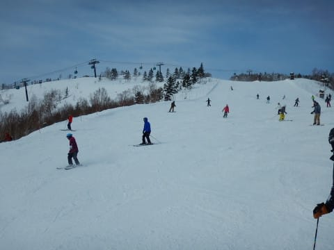
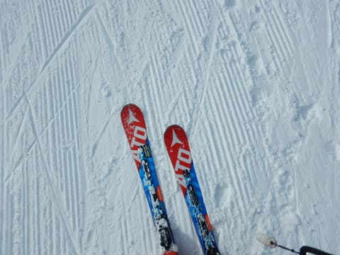
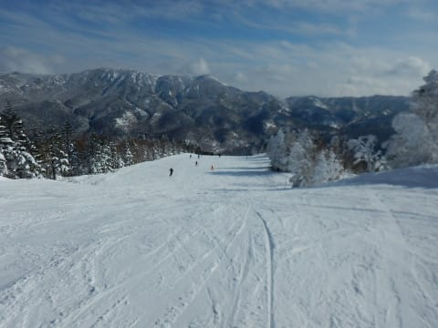

# 12月31日，大晦日の志賀高原は…晴れ時々曇り．朝イチ最高圧雪なれど，激混みだったよ（涙）

📅 投稿日時: 2017-12-31 23:10:22

🏷️ カテゴリ: [2018スキー滑走日記](c11b88dc181f34079ab41db74a3587646.md)

ということで．

早くも大晦日になってしまいましたね…

なんと．

2017年ももう終わってしまうのですね…

で．

大晦日の本日も，いつも通り

朝8:30分のゴンドラスタート待ちから

始まるわけですが…

うむ．

山頂の気温は-8℃と，

これまで数日に比べると高めの気温ですな．

朝イチの天気はうす曇りですか．

すっきり晴天ではないけど…

でも．

ゲレンデは．

そうです．

シマシマっ！！

この日もファーストトラックが開催

されていたので．

通常営業では完全ぴかぴかではなかったけど．

朝イチは人も少ないし…

シマシマを堪能っ！！

うはははは！

最高級のシマシマっ！

昨日みたいなパフパフも楽しいけど…

やっぱりシマシマ最高っ！！

そして，天気も良くなって来たし．

いや…

これ，いいんでないかい？？？？

…と，思っていたら．

うむ？？？？

なぬ？？

奥志賀ゴンドラが強風で運休！？？

…これはやばい．

これはまずい…

と，思っているうちに．

ゴンドラ運休の奥志賀から流れてきた人が

増えていき…

朝9時半過ぎという，早い段階からゲレンデが

混み始め…

まだ混雑タイムの10時半になっていないというのに．

9時50分ごろ…

なんだ～！！！

このゴンドラ待ちの列はっ！！！

この後，ゴンドラ待ちはさらにすごいことに

なったようですが．

とりあえず，第3高速リフト側，

サウスコースに逃げましょうか…

と，思ったら．

こちらも人口密度が上がって来たのですが？？

そして…

リフト待ちも，すごいことになってしまったのですが！？？（涙）

うーむ．

雪がいいだけに．

この混雑は残念…

ゴンドラ待ちは11時過ぎまでこんな状況が

続きましたが．

でも，昼過ぎに奥志賀ゴンドラが動き出すと…

ゴンドラ待ちはほぼなくなりました！！

そして，天気も良くなって来たし．

さすがに大晦日の午後は，早めに切り上げる

人が多いのか．

ゲレンデの混雑もなくなってきましたよ！？？？

昼間の気温は-3℃の予想に対し，-4℃と．

ほぼ予想通りの，高めの気温になったけど…

でも．

晴天なのに，午後まで雪質もいいし…

午後は，結構いいかも！

と，思ってたところ．

うーむ．

やはり，人が多かったから

午後は，ちょっとコースに軽い凸凹が…

夕方になると，ところどころ荒れたところも

あったけど．

午後まで雪質も良く．

人も午前中に比べれば，かなり少なめ

だったので．

午後は，夕方までたっぷり，

気持ちよく滑れましたよ～！

そして．

いつも通り，16:15の焼額リフト終了まで滑っちゃいました…

が．

でも．

そうです．

大晦日も．

圧雪かけたてピカピカの…

ナイター参戦っ！！

焼額第3高速の，シマシマナイターに

突撃っ！

人も少なく．

天気も良く．

最高でした～！

…そして．

2017年も，無事，怪我なく

過ごせたことに感謝しつつ．

2017年の締めくくり．

滑り納めイベントに参加して．

今年の滑り納めとしたのでした…

ということで．

…今年も，お世話になりました～！！

また来年も，よろしくお願いします～！！

PS.

明日の元旦は，日本海側はかなりの雪降り．

西風なので，志賀はそれほどつもらないかな～．

スキー場では，初日の出は拝めなさそうな感じですが

## 💬 コメント一覧

### 💬 コメント by (Goku)
**タイトル**: Unknown
**投稿日**: 2017-12-31 23:52:19

さすが大みそか、今年一番の混雑だったようですね。

でも天気も雪も良く、最高の締めくくりになったのでは。

今年一年、大変お世話になりました。

来年も宜しくお願いします。

では、良いお年を！

### 💬 コメント by (タカ)
**タイトル**: Unknown
**投稿日**: 2018-01-01 00:19:54

2017年もたくさん面白い記事で毎日楽しかったです。2018年も怪我無くスキーを満喫しましょう❗土日休めないからSさんといつ会えるのやら。いつかはご一緒したいです。

### 💬 コメント by (ほっぽ)
**タイトル**: 大晦日の志賀
**投稿日**: 2018-01-01 17:57:23

Ｓさん

昨日は最後の最後に１ゴン乗り場でご挨拶だけで失礼しました。

あの後、１本２高に乗って2017年のスキー終了となりました。

昨日は午前中奥ゴン運休の煽りで１ゴンの混雑が酷かったですね。

私は丁度yamaさんと合流したので奥志賀エキスパ側を滑って、昼前には一の瀬に移動しました。

今年は何度かお会いできるかなと楽しみにしています。よろしくお願いします。

昨日の滑走記録はＨＰにアップしておきました。

### 💬 コメント by (yumi)
**タイトル**: おこみん3兄弟？3姉妹？
**投稿日**: 2018-01-01 19:31:12

本日もどうもでした。

Ｒちゃんとおこみんがおそろだったとは。。。

（ちょっと、嬉しかったです。）←そこかぁ～

怪しい金のお札3枚乗り合わせよりも珍しかったのでは？

朝一の白樺くんは悲しいキャタピラ跡で、いまいちでした。

その後、オリンピック２～３本で帰っちゃいました。。。

明日は、降ったらいちゴン、降らなければおくゴン、スタート予定です。また、お会いできたら宜しくです。

### 💬 コメント by (やっさん)
**タイトル**: 明けましておめでとうございます。
**投稿日**: 2018-01-01 20:45:09

いつもブログ拝見させて頂いております。

毎年、年末年始は家族四人で志賀高原の一家です。

今回は30日から志賀高原でスキーしているのですが、（中央エリアですが☺）31日は天気が良かったんですが、それ以外はイマイチですね❗

リフトで上がってる時に小4の娘が言うのです！

晩にたくさん雪が降って～朝からは天気が良いよね～って。

なんかグッとくるもんがありました❗

3日には帰ってしまうので何とかお願いします🙇

晴れの予報でお願いします🙇

### 💬 コメント by (Skier_S)
**タイトル**: あけましておめでとうございます
**投稿日**: 2018-01-01 23:03:14

＞Gokuさま

あけましておめでとうございます！

31日は，すごい混雑でした．

今日はその反動か，結構空いてましたよ！

…天気は悪かったですが．

ことしもよろしくお願いします~！

＞タカさま

私は土日しか休みがないものですから，

なかなかお会いできませんね…

祝日とかもNGですか？

もし，土日が休める機会があれば

ぜひ志賀へお越しください！

＞ほっぽさま

31日の焼額の混雑はすごかったですね…

また昨日もゆっくりお話しできませんでしたが，

今年はいっぱいお会いする機会もありそうですね．

今年もよろしくお願いします！

＞Yumiさま

おこみん3兄弟もインパクトありましたが，

あのネイルはインパクト大でした…

明日は朝は天気が悪いと思います…

ですので，1ゴンスタートですね．

またよろしくお願いします~

＞やっさんさま

志賀にいらっしゃっているのですか？？

残念ながら，天気はこれから悪くなります…

2日は終日雪降り…というより，吹雪．

3日も吹雪きます．3日朝はかなり雪が

積もってそうです．終日雪降りです．寒いです．

…ちょっと残念な予想になってしまいます…

焼額はゴンドラがあるので，天気が悪くても

リフトの寒さが無い分マシですよ~！！

＃焼額なら私を発見できるかも（笑）

