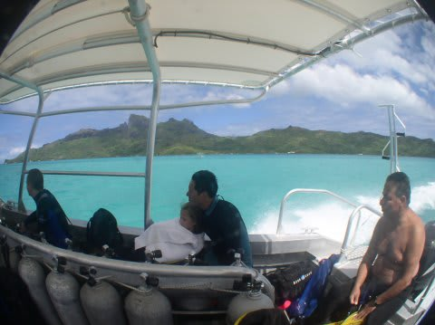

# 2009年　初の海外子連れダイビング旅行記　9　How is my daugter?

📅 投稿日時: 2012-09-05 00:29:41

🏷️ カテゴリ: [ダイビング日記](ce3a7a8d424d112fce83ee85c81a0e344.md)

んで．

2本のダイビングが終わったので，

ボートはショップに向かって帰っていくわけですが．

帰りのボートの中で．

「娘…3時間半，ずーーーーと泣いてたんじゃないか…」

「置いていかれて親のことが信じられなくなってたりしないか…」

「おいていかれたショックで，夜まで泣き続けるんじゃないか…」

とか．

悪いことばかり頭の中にぐるぐると浮かんできます．

…こーゆー時のボートは遅く感じるもの．

まだ着かないのか～っ！！

じりじりしていると，ショップへ到着っ１

　　娘は！？

　娘は泣いてないか？？？

砂浜に乗り上げたボートから跳び降りて，夫婦でショップへ走ると

「ママーっ！！！」

の声とともに．

娘が駆け寄ってきました．

…よ，良かった…泣いてたわけではないみたい…

でも，さっきまで泣いてたのかな…

ちょっとぶすっとした顔をして，しっかりと母親の

足元にしがみつく娘．

「ごめんねー．寂しかった？」

母親が抱き上げると，もう離さないって感じでしっかりと

つかまってます．

子供にしっかりホールドされてしまい，とても器材が片付けられる

状態じゃないので，妻の器材も私が洗ってあげて．

その間，ずーっと妻に抱かれていた娘は，落ち着いてきたのかニコニコとゴキゲンに

なってきました．

…よかった．

機嫌が戻ってきた…

シッターの人に話を聞いてみると…

やっぱり，預けられて1時間くらいは泣いてたみたいです．

おもちゃとかTVとか見せてもぜんぜんダメ．

日本語が分からないので，何を言ってるか分からず

あやすのも苦労したそうで…

ご迷惑をおかけしました．

…でも．とりあえず，初めて他人に預けられる，というイベントは

（多少は泣いたものの)無事乗り越えられたようで．

娘が初めて親元を離れた3時間半，どんなだったか見てみたかった…

ごめんよ，娘．

午後は罪滅ぼしに，いっぱい遊んであげるからね～

娘にも，私たちが見てきた船の上からのきれいな景色，

いっぱい見せてあげるからね～，

ということで．

午後はなんと．

娘に対する罪滅ぼしのため，ボートを1艘チャーターして，

娘と一緒にボラボラ島を一周することにしたのでした． 

