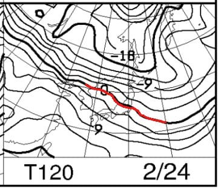
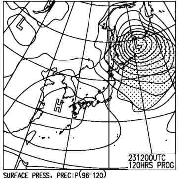

# 今週末は3連休だったか…改めて24日（月・祭）の志賀高原スキー場の天気！…晴れて朝は最高！でも気温が上がりそう．

📅 投稿日時: 2020-02-21 08:16:49

🏷️ カテゴリ: [スキー天気予想](c6554f5c3c106093b511a8daae23757e8.md)

ダメだ…

昨日も夜帰宅後死んだように寝てました．

家での滞在時間が8時間を切るようになると

いろいろ厳しい…

で．

今週末が3連休だってことをすっかり忘れてました～！

なので，24日（月）の予想を追加！

850hpa図は…

0℃線が志賀高原にかかってますので，

朝はそこそこ冷えていいシマシマだけど，

午後に向かって気温が上がりそう．

そして．

地上天気図は高気圧に覆われているので．

一日晴れ！

24日は，朝は晴れで，前日降った冷え冷え雪が

圧雪された，やわらか最高シマシマが滑れそう！！

…午後は気温が上がって，日が射すので．

南斜面や標高が低いところは，ちょっと雪が

緩むかな…

ちなみに，23日日曜の天気ですが．

昨日の予想と変わり．

一日雪降り

になりました！

昼間も冷え冷え雪が降り続け，

10～20cm積もるかも…

午後は雪が弱まるかな．

ってなことで．

すみません．

コメント回答は今晩に！

## 💬 コメント一覧

### 💬 コメント by (かず)
**タイトル**: Unknown
**投稿日**: 2020-02-21 09:50:10

Sさんすみませんこちらお借りします

レインボーさん前回教えていただいた天気の

風予報今まで信頼性高いですか？

### 💬 コメント by (いちと)
**タイトル**: Unknown
**投稿日**: 2020-02-21 12:02:32

そうでしょう　そうでしょう　踊り続け、飲み続けた甲斐がありました

少し喉が腫れてきたので先程病院に行きましたが、これ以上酷くなると緊急入院にもなるので、週末はおとなしくしておくように言われました

決して今晩からスキーなどとは言えませんでした

今から、早引きしますので、あとの踊りは御願い申し上げます🙏

### 💬 コメント by (レインボー)
**タイトル**: Unknown
**投稿日**: 2020-02-21 20:59:10

お借りします。かずさん、てんきとくらす焼額山の風予報ですが、かなり信頼が高いと思います。ゴンドラは横風に弱いので風向き次第ですが、この予報で15mが境界かとおもいます。このままですと、奥志賀は動く確率はかなり低いと思います。あ勧めは西館です。コースを選べは非圧雪を堪能できるかと。

### 💬 コメント by (レインボー)
**タイトル**: Unknown
**投稿日**: 2020-02-21 21:19:41

お借りします。加えて、日曜日も同程度の風予報ですが、日曜日は西風なので、わりと期待が持てるかも。

### 💬 コメント by (かず)
**タイトル**: Unknown
**投稿日**: 2020-02-21 22:21:39

レインボーさんありがとうございました  奥志賀が滑れるようになってから西館行ってないです  一ノ瀬でもシーズン1日位 笑  前回のヤケビ運休ってどの位の予報だったのか見ておけばよかった  今回パスで来週末にしたのでお会いしたらよろしくお願いします

### 💬 コメント by (Skier_S)
**タイトル**: 明日から3日連続志賀高原！
**投稿日**: 2020-02-21 23:49:37

＞かずさま

どうぞ，好きなだけ使ってやってください(笑)．

土曜の風はヤバそうです…

＞いちとさま

踊り続け，飲み続けたのですね(笑)．

とりあえず，私が踊っておいたのでこの土曜日はひどい雨にならず

済むことになりそうです．

＞レインボーさま

土曜は南風なので，焼額ゴンドラアウトっぽいです（涙）

日曜は西風なので，焼額は大丈夫かと．

### 💬 コメント by (あつし)
**タイトル**: Unknown
**投稿日**: 2020-02-21 23:50:55

Sさんこんばんは！大阪のS改めあつしです。

23日(日)、妻と子と３人でヤケビいきます！

予想は一日雪降りになったようですね。妻と子は今季初志賀なので、カチカチの日でなくて良かったです。

またゴンドラ乗り場でお見かけしたら声かけますね！

### 💬 コメント by (レインボー)
**タイトル**: Unknown
**投稿日**: 2020-02-22 05:27:03

かずさん、前回は確か14mだったかと。しかし体感は凄かったので、早めに他へ逃げて正解でした。

今朝発表のの予報を見て、今日は諦めました。夕方に妻と正月以来のご対面なので、接待の準備にします。全面運休を除いては初の休場です。でも日曜日も強風なので、妻がスキーを嫌いになられたらと、ためらっちゃいます。

週末だけが悪条件で、お気の毒です。

### 💬 コメント by (レインボー)
**タイトル**: Unknown
**投稿日**: 2020-02-22 06:55:02

かずさん、明日の強風予報の時間帯が、遅くなってきました。ひょっとして好条件だったら、どう謝ればよいのやら。

(吉田松陰は言ったとか。まずはやってみよ。

そんなことしたら忠実な優等生は死にますよね。)

私の予報をあてにするのは僅か10人たらずですが、1億人もの信者をかかえるエスさんのプレッシャーはいかばかりか。いつもありがとうございます。

### 💬 コメント by (レインボー)
**タイトル**: Unknown
**投稿日**: 2020-02-22 09:05:07

奥志賀ゴンドラは止まってるけど、ヤケビは動いてる。15mはあくまで境界線なので、吉田松陰が正しかったようですね。かずさんごめんなさい。

ちなみに、全山ストップの時は23mでした。

### 💬 コメント by (かず)
**タイトル**: Unknown
**投稿日**: 2020-02-22 15:35:14

レインボーさん 気にしないでください！結果論ですよ！ソロなのでリスク回避してるだけです！3連休で混むと思ってましたし 来週末のほうが良さそう！

### 💬 コメント by (かず)
**タイトル**: Unknown
**投稿日**: 2020-02-22 18:13:51

今ヤケビ運休したってきましたけど？？

### 💬 コメント by (Skier_S)
**タイトル**: 明日は冷え冷え雪降り
**投稿日**: 2020-02-22 23:58:22

＞あつしさま

23日も，ヤケビスタートの予定です…

コンディションが悪くならない限り，終日焼額にいると思います…

が，もしかしたら脱出するかも（笑）．

＞かずさま

本日は，午後3時に1ゴン，2ゴンともに討ち死にとなりました．

奥志賀ゴンドラは朝から即死です．

