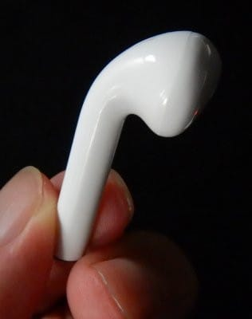

# AirPodsコピーの800円の激安Bluetooth TWSイヤホンを買ってみた その3…装着感，音質，マイク，タッチ操作方法など

📅 投稿日時: 2020-06-14 04:00:45

🏷️ カテゴリ: [PC,カメラ&小物](c0d8caed13e597efe97b661a8ae56bed0.md)

ってなことで．

AirPodsコピーの激安TWSイヤホン，

i11TWSの購入＆使用レポート．

[1回目　購入から到着まで](ee86b38be5f7cad4218e94f41a250cc53.md)

[2回目　外観・充電・Bluetooth接続](e82da2424447d2edf1e16e8f583884283.md)

と，2回にわたってお送りしてきたわけですが．

今回は最終回．

操作や音質についてのレポートです！

ってことで．

このi11．

イヤホンには一切ボタンが

無いのですが…

なんと．

このお値段というのに，タッチ操作が可能で．

イヤホンのこのあたりを軽くタッチする

ことで，いろいろ操作できるんです！

操作方法は…

　右・左のどちらでも1回たたくと，

　　一時停止・再生 または 電話着信・切断．

　右2回タップでボリュームダウン，

　左2回タップでボリュームアップ

　右3回タップで1曲戻し，

　左3回タップで1曲送り，

　右・左のどちらでも2秒タッチで

　　Googleアシスタント起動（iPhoneだとSiri起動）

　右・左の5秒タッチでイヤホンの電源On/Off

となっています．

…なんだか，ボリュームと曲送り，マニュアルの

記載と左右が逆になってるんだけどなぁ…

最初は2回や3回タップが上手く認識

されませんが．

慣れてくるとちゃんと操作できるように

なってきます．

…ただ．

何かの拍子にイヤホンを触ってしまったり

すると．

勝手にGoogleアシスタントが立ち上がっちゃいます…

さらに．

音声案内機能がついていて．

電源が入ると"Power on"，

Bluetooth機器に接続すると”Connected"，

電源を切ると”Power off"，

電池が切れそうになると"Please charge"

とか，いろいろしゃべってくれます…

うーむ．

ホントにこれで800円なのか…（ちょっと感動）

装着感は…

軽い！

軽いので，あまり着けてるのが気にならない感じ．

軽いので，頭を振ってもイヤホンが

動いちゃうことは無く．

普通に運動していてもイヤホンが耳から

外れちゃうことは無いです．

2-3時間着けていても，耳が痛くなったり

重く感じたりすることは無く，

着けているのを忘れる感じです…

解放型なので，外の音は普通に聞こえます．

で．

スマホとはBluetooth5.0で接続されるわけですが．

スマホとの接続がいきなり切れたり，

音がぶつぶつ途切れることは全く無し．

Bluetooth接続，思ったより安定してます！

さらに，意外と遠距離までつながり．

スマホを置いて隣の部屋に行っても，

途切れることなく音楽が聴けます…

音質は…

送料込み800円のイヤホンなので，

多くは期待していませんでしたが…

まぁ，高級なイヤホンと比べるとやはり

ちょっと劣りますか．

ボーカルの下あたり，ベースあたりの周波数帯と，

シンバル類の周波数帯で，わずかに抜けが

悪く，音の解像度が落ちている感じ…

このあたりの周波数で，ボディか何かの

妙なダンピングがあるのかな…

でも．

激安イヤホンで，どうせひどい音なんだろうな…

と予想していた私としては，驚くべき音質．

ボーカルはくぐもりもなくクリアに聞けるし．

周波数帯も広め．

かなり高音の「チン」という感じの金属を

叩く音なんかもきれいに聞こえます．

音楽だけを真剣に鑑賞する…

ってならもっといいイヤホンを勧めますが．

作業中のBGM用として聴くなら，

これで十分．

仕事や作業しながら聴くには

全く不満のない音質．

全然問題なし！

うーーーーむ．

800円と考えれば，驚きのクオリティ．

で．

このイヤホン，マイクもついているので，

電話もかけてみましたが…

電話相手の声は極めてクリアに聞こえます．

しかし…

やっぱり口元からマイクが遠いからか．

マイクの音はそんなに良くないですね…

声が小さいとマイクが自動でミュートに

なるみたいで．

小さめの声でしゃべるとブチブチと

ミュートされて，声がとぎれとぎれに

なっちゃいます…

大きい声でしゃべれば，結構きれいに

声が入るので，大きめの声でしゃべり

ましょう…

ひそひそ話には向かないイヤホンですね（笑）．

とはいえ．

イヤホンをしていれば，電話がかかってきても

イヤホンをタップすればそのまま電話に

出ることができるので，便利ですね～．

あ，あと．

このイヤホンは左右独立に電源On/Offできるので．

右単独・左単独でも使えます．

ケースから片側だけ取り出せば片側だけ

スマホに認識されて，片側だけで利用可能です．

だもんで．

バイクに乗るときとか，スキーの時とか．

ヘルメットの下に片耳だけこいつをつけておけば，

ヘルメットを外さなくても電話に出られそう…！

電池の持ちは，音楽を聴いていると

2時間ちょい欠けくらいかな～．

もう少しもってくれると嬉しいんだけど…

充電時間は，イヤホンの充電が1時間弱，

ケースの充電には1時間強…

ってところでしょうか．

マニュアルだと，イヤホンの充電時間は

70分ってあるけど，それより短い感じ．

ってな感じで．

いろいろ使ってみましたが．

電池がもう少しもてばいいなぁ…

とか，ちょっと不満はあるものの．

Bluetooth接続も安定していて，

ケースに入れて自動電源On/Offとか

使い勝手も悪くなくて．

作業用BGMとかに音楽を聴くには

いい感じだし．

これが800円で買えるなら，あと1-2セット

あってもいいかも？

とか思った，Skier_Sだったのでした…

## 💬 コメント一覧

### 💬 コメント by (西館)
**タイトル**: Unknown
**投稿日**: 2020-06-15 04:11:18

わ～凄いー良いですね！

ってそれ以上にやっぱSさんには月山にお出かけ頂いてシーズンお別れの儀式をして欲しい。

祈ります祈りますよ、頑張れ月山、頑張れSさん！( ੭˙꒳ ˙)੭ｶﾞﾝﾊﾞﾚｰ

### 💬 コメント by (Skier_S)
**タイトル**: ＞西館さま
**投稿日**: 2020-06-16 02:17:38

少なくとも，お値段以上の価値があると思いました…

ラーメン一杯分で買えるシアワセだと思います（笑）．

とりあえず，今週末，無事月山に行けることを祈っていてください…

### 💬 コメント by (カーテン 安い)
**タイトル**: Unknown
**投稿日**: 2020-06-16 10:55:51

中華AirPodsコピー、極まりすぎてiPhoneがAirPodsとして認識するの流石に笑っちゃうな

### 💬 コメント by (Skier_S)
**タイトル**: ＞カーテン安いさま
**投稿日**: 2020-06-17 03:05:28

最近の中華製品はすごいと思いました…

### 💬 コメント by (氷のシミター)
**タイトル**: 左右のチャネル
**投稿日**: 2020-07-11 15:13:07

はじめまして。

>…なんだか，ボリュームと曲送り，マニュアルの

>記載と左右が逆になってるんだけどなぁ…

手元に同じ TWS i11があるのですが、これ、左右のチャネルを入れ替える機能があります。

電源ON → Bluetooth接続、までの間に、「右チャネル」のイヤホンが赤青に点滅します。

その時に、点滅しているイヤホンの背中を「3回」タップしてみてください。点滅が反対側に移ったら成功です。

左右反転は何回でも遊べます。GOOD LUCK。

＃3回目を気持ち長めにすると成功しやすいような。。。ぜひうまくいくやり方を見つけて下さい。m(_ _)m

### 💬 コメント by (氷のシミター)
**タイトル**: 追伸です。
**投稿日**: 2020-07-11 16:03:23

左右チャネルの操作をやってみました。

https://photos.app.goo.gl/fcub3UCCFeXpGbjC7

### 💬 コメント by (Skier_S)
**タイトル**: ＞氷のシミターさま
**投稿日**: 2020-07-12 04:25:49

動画までわざわざ送っていただいてありがとうございます…！

ただ，どうも私のイヤホンと微妙に仕様が違うのか，送っていただいた動画とちょっと違う動きを

しています…

動画だと，片方のイヤホンのみ点滅，片方は消灯していますが，私のイヤホンは

片方は赤青交互点滅，もう片方はゆっくりと青点滅…

と，微妙に違う仕様のようです…

残念…（涙）

### 💬 コメント by (氷のシミター)
**タイトル**: Unknown
**投稿日**: 2020-07-12 13:24:23

なるほど、自分はamazon.co.jpから購入したのですが、モノが違うのですね。

購入履歴からすでに辿れなくなっているので、転売屋ーだったのかも。(;´･ω･)

### 💬 コメント by (Skier_S)
**タイトル**: ＞氷のシミターさま
**投稿日**: 2020-07-13 01:05:18

おそらくAirPodsコピー品は何種類かあるみたいなので，

その種類違いなのかもしれません…

相変わらず左右の操作が逆のままですが，不満は無いので

これで使います(笑)．

ありがとうございました．

