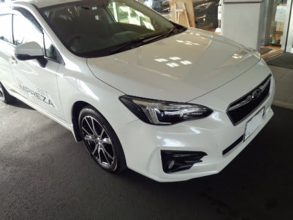

# スバル新型インプレッサ，試乗してきたよ…GTインプレッサスポーツ2.0i-L FFのインプレッション

📅 投稿日時: 2016-12-02 01:21:20

…今日の志賀高原．

明け方にちょっと雨っぽかったみたいだけど．

それ以降は雨は降らずにもってくれたようで．

ただ，予想降水量はそれほど多くないので．

ほとんど降らずに済みそうかな～．

壊滅的に雪が融ける，という悲惨な状態には

ならないかな～．

という昨日の予想通り，雪への影響はそれほどなく，

高温の本日を乗り切ったようです…（一安心）．

で．

30日の積雪のおかげで，本日から，

一の瀬ファミリーのペアと

高天ヶ原トリプルが，

今日から営業開始になった

ようですね～！

かぐらも，金曜からゴンドラコースの下山がOKになり．

みつまたゲレンデも，滑走用としてオープンのようです．

土曜からは，パノラマ・ジャイアント・テクニカルも

オープンのようで．

今週末からは，ぐっと滑走コースが広がるようです．

いやーーー．

12月1日の雨，ひどくならなくて良かった…

そして．

志賀高原．今晩から，雪になってます！

（[北信建設事務所道路気象情報ページ](http://www.q0.ws302.smilestart.ne.jp/index.htm)より）

雪はすぐに止んでしまい，

そんなに積もらなさそうですが．

…人工降雪機はフル稼働できるはず！

今週土曜に期待っ！

…というところで．

本題へ．

えー．

先日ですね．

オイル交換でディーラーへ寄ったとき．

新型インプレッサの試乗車が出ていたので．

ここは一発，試乗しておかねば…

と．

さっそく，乗ってきました～！

いや，メディアなどからかなり評判がいい

新型インプレッサ．

今回のインプレッサスポーツの形式名はGT，

G4の形式名はGKのようで．

今回は，GTのインプレッサスポーツ．

2.0i-L Eyesightに乗ってきました．

が．

なぜか，FFモデル（ちょっと残念）．

うーむ．

4WDに乗ってみたかったのだが…

ということで．

スバル初となる，FF車のアイサイト付きモデル．

これが今回の試乗車です．

内装などについては，[以前レポート](e16879083ede139b195051a7ec1e0bd8a.md)しましたが．

高級車に負けない質感，ってわけでは無いです．

この，ナビの上部．

サブディスプレイの前の部分とか，ちょいと

プラスチッキーかな…

でも．

ステアリングも本革だったり，各種スイッチのタッチ感とか．

このクラスの車としてはかなり頑張っている方でしょうか．

レヴォーグオーナーはちょっと悔しくなるくらい，

新型インプの方が高級に感じるかも…

＃でも，このボタンだらけのステアリングは何とかならんか

で．

走り出してみると…

あ，これは良くできてる．

エンジンノイズはかなり抑えられてます．

定常走行時はリニアトロニックとの組み合わせで，

かなりエンジンは低回転に抑えられるので．

エンジンは結構静かです．

むしろ，そのおかげでフロントタイヤのロードノイズが

目立つくらい…

街乗りレベルの定速走行時の走行音，

BRレガシィより静かです（涙）．

で．

初めて乗ったとき．

ブレーキサーボが強いのか．

いつもの感じでブレーキを踏むと，

かなり強烈に制動力が立ち上がりました（汗）．

しかし，これは単に慣れの問題．

慣れれば，ストロークでなく踏力で制動力を

思い通りにコントロールできるいいブレーキなので，

いい感じです．

そして，サスペンション．

段差・継ぎ目のいなし方が，かなり角が取れた感じ．

「あれ？かなりバネレート低い？」

と感じさせる，当たりの丸さ．

段差を乗り越える時も，ボディにビビりが伝わることなく．

柔らかい足がショックを吸収してくれる感じ．

段差を乗り越える時は，かなり足が柔らかく

感じます．

ただ，昔のアメ車みたいな，柔らかくて振動が

収束しないブヨブヨ感がある…って柔らかさでは

無いですが．

「あれ？このサス，共振周波数低くない？

　車の速い動きについて来れるの？」

と思ってしまうレベル．

今回の試乗は，左右にクイックに車を動かしたり，

大きな横Gをかけたりしてないので，攻めて行った

時の挙動は良くわかりませんが…

しかし．

いわゆる「乗り心地」については，かなり

良いレベルに行っていると思います．

ってか．

この車を試乗した後に．

BRレガシィに乗ると，

BRレガシィの方が，安っぽく感じるという

悲しさに襲われます．

BRレガシィ，段差突き上げでこんなにボディが

ブルブルするんだ…（涙）．

と，悲しくなります．

そして．

ステアリングフィールですが．

これはかなり良くできてます．

無駄に重めの反力を出す電動パワステが

あったりしますが．

そんな余計なトルクを入れなくても，すっと

自然に回っていくステアリング．

なのに，止めたいところでぴったり止まる．

ステアリング舵角を維持するとき，

妙に重いセンタリングトルクと戦うことなく．

かといって，軽すぎてステアリングが落ち着かず

ふらふらする，ということもなく．

すっと切り込めて，自分が保持したいころで

楽に保持し続けられる．

そーゆーステアリングフィール．

…これも．圧倒的にBRレガシィより高いレベルの

完成度（泣）．

おかしい…

レガシィの方が，クラスが上の車のはずなのに…

レガシィの電動パワステも，最初は

「よくできてるな～」

と思ったのに…

自分の車に戻った時に，如何に新型インプレッサの

ステアリングフィールが「しっとり」していたか，

痛感．

ただ…

この車の欲を言えば．

もう少し，全開時のトルク感が有ればいいかな．

街乗りでは十分なパワーがあるし．

普段使いには全く問題ないレベルですが．

いざ，全開！

…と言ったとき．

リニアトロニックのギア比が変わって，

エンジン回転が上がって，それで引っ張っていく…

という感じで．

あまりエンジン回転で頑張らず，トルクで

ぐぐぐっと引っ張ってくれれば，さらに

高級感が高まるかな～．

まぁ，それはちょっとこのクラスの車に

求めすぎかも…

でも．

新型インプレッサ．

やっぱり，かなりいい出来の車です．

これでアイサイト付きですから…

トランクがもう少し広ければ，

レヴォーグじゃなくて，これでもいいかも？？

…と，思ったSkier_Sなのでした…
