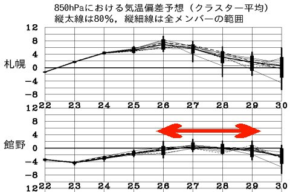
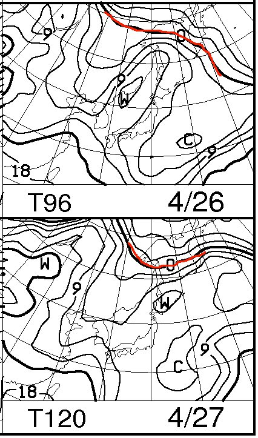
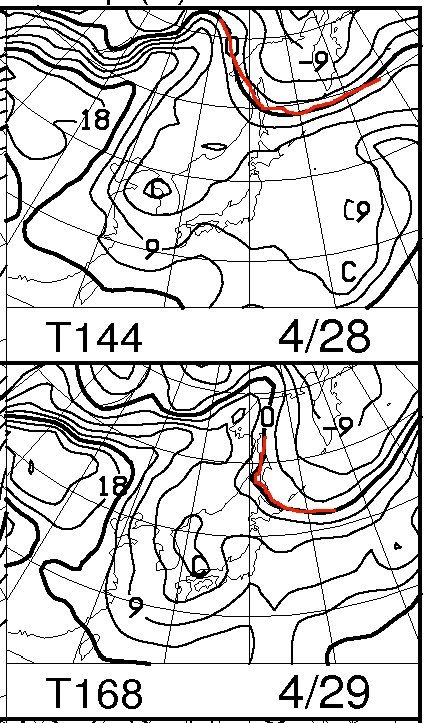
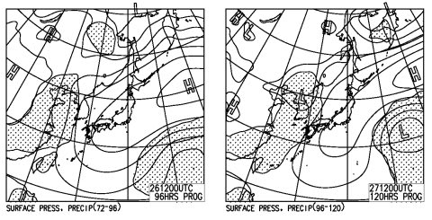
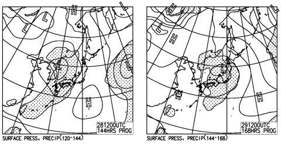

# GW前半の志賀高原の天気は…4月らしい暖かい晴天が続きそう

📅 投稿日時: 2014-04-24 01:33:01

🏷️ カテゴリ: [スキー天気予想](c6554f5c3c106093b511a8daae23757e8.md)

…「鬼のようにやさしい」という表現を聞いて，

優しいんだか優しくないんだか悩んでしまった

Skier_Sです．

さてさて．

今週末からゴールデンウィークなわけで．

26日から29日まで，4連休って人もいるんじゃないでしょうか．

で，4日間志賀高原にこもるって人も，いるんじゃ

ないでしょうか．

…

…はい．

そうです．

私がそうです．

ってことで．

この飛び石4連休の，志賀高原の天気をば…

…

うーむ．

（天気図を読み込み中）

ふむふむ．

…

…

とりあえず，いまのところ．

平年並みの気温で．

天気がいい日が続きそうですね．

850hpaの気温はこんな感じで…

飛び石4連休の期間，ほぼ平年並み．

…まー，この時期．

平年並みってことは．

志賀高原でも，朝から気温はプラス．

昼間はプラス10℃ちかく，かなり暑いくらいに

なっちゃいますが…

いつもの，850hpa0度線が，こんな感じで…

0度線は北海道よりはーーるか北へ行っちゃって，

志賀高原は6～9℃．

…うーむ．

春だねぇ…

って感じですか．

で．地上天気図を見ると．

こんな感じで，土日は高気圧に覆われるので．

おおむね晴れ．

で，月・火の地上天気図は…

…

うーむ．

月曜は午後から雲が多くなり．

火曜は．なんだか．

降水量が予測される網掛けが，志賀にかかってますので．

…雨，かも…

降り始めが早朝からなのか，昼からなのか．

そこはまだ正確に予想できませんが．

うーむ．

昼過ぎまで降らないでいてくれるとうれしいんだけどな～．

ってことで．

まとめると．

土曜～月曜：早朝から雪は柔らかめ．がちがちアイスバーンには

　ならないかな．朝から日が射すので，朝8時頃にはもうザブザブに

　板が潜る雪になりはじめ．昼頃にはドボドボの，板に張り付く雪に

　なってくるかな～．

　早朝がねらい目でしょう．

火曜(祭日)：朝から雲が多め．ヘタすると，朝から雨(涙)．

　運が良ければ，昼頃まで降らずにもつ．

　朝から柔らかい雪で，午前からザブザブ雪になるのは

　前日までと同じ．ただ，雨が降るとストップスノーに

　ならずに，そこそこ滑る雪になる…

って感じで．

残念ながら．

[去年のGWのような奇跡](ed87ecc584671a2c396ada52e71fdf5a5.md)は起きなさそうですね～（悲）．

このGW.

焼額はこれまでより30分早い，朝6時から8時まで，

第2ゴンドラが早朝営業．

(通常営業も，いつもより30分早い8時から)

早朝がねらい目かな～．

## 💬 コメント一覧

### 💬 コメント by (れお)
**タイトル**: 奇跡を祈ります！
**投稿日**: 2014-04-24 09:40:08

先日は、ブーツのアドバイスありがとうございました。

今度、110試し履きに行ってきます～。

私は、GW後半に、志賀に出撃予定です。

去年のような雪が降って欲しいですね～。

コブとかも嫌いじゃ無いんですが、また、かる～い雪の上を滑りたいです‥‥。

### 💬 コメント by (Skier_S)
**タイトル**: れおさま
**投稿日**: 2014-04-25 03:54:22

ぜひ，ATOMICの板とATOMICのブーツの

組み合わせを試してみてください～

＃足型がATOMICに合っていることが大前提ですが…

私はGW前半も後半も，焼額滑っていると思いますので，

またお会いするかもですね～！

私も軽～い雪の上を，また滑りたいです…

奇跡が起こるように，一緒に祈りましょう（笑）．

