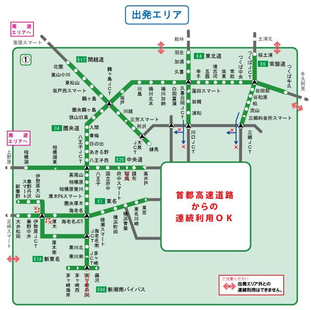
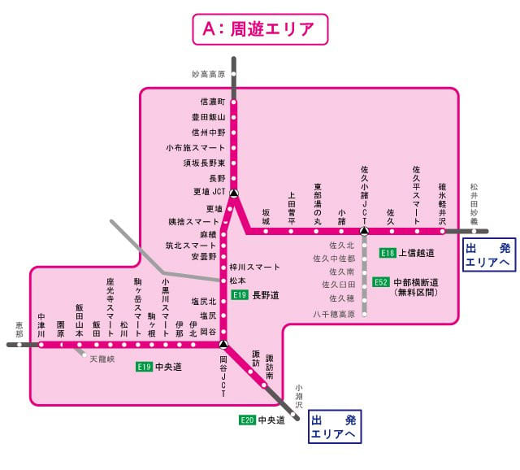
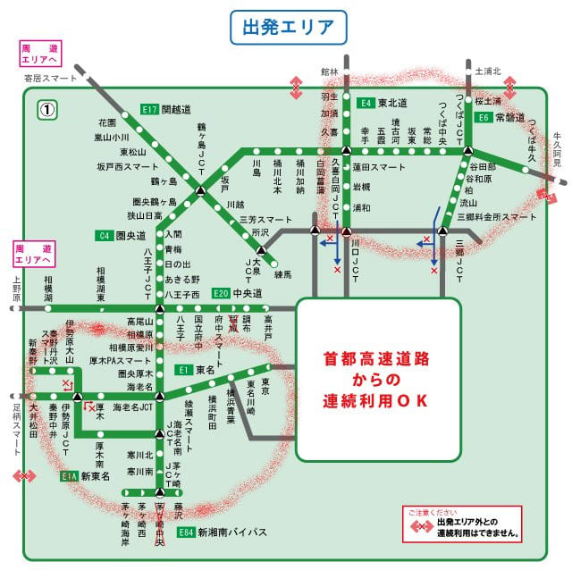
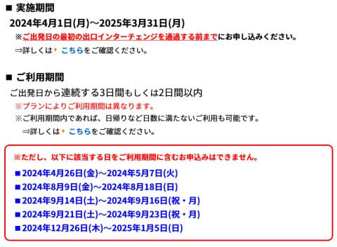

# 首都圏の人が志賀高原や野沢・妙高方面にお得な高速料金でスキーへ行く方法…来シーズンの2025年3月31日まで，信州めぐりフリーパス2024ってのが使えるよ！

📅 投稿日時: 2024-06-27 01:30:20

2024シーズンが終わったばかりで，

2025シーズンはまだまだ先ですが…

早くも来シーズンを見据えた（？）話題．

来シーズン，首都圏の人が志賀高原や

野沢・妙高方面に行こうと思ったときに．

高速料金がお安くなる方法．

信州巡りフリーパス2024

の紹介です～！！

この信州巡りフリーパス．

ETCを持っている人が事前申し込みすれば，

首都圏のこのエリアから乗り降りする人が…

（[NEXCO中日本，信州めぐりフリーパス2024案内ページ](https://hayatabi.c-nexco.co.jp/drive/detail.html?id=154)より．以下同）

2日間，または3日間，このピンクのエリアの

高速のインターで何度乗り降りしても，

一定金額という割引です！

信濃町まで行けるので，志賀高原や野沢は

範囲内．

妙高も，杉ノ原や黒姫など，信濃町ICで

降りたほうが良いスキー場や，赤倉も

一つ手前の信濃町ICで降りれば使えますね．

長野ICから白馬方面に使うのも有りかな？

ちなみに，金額は以下の表のとおりで．

1泊2日なら8700円です！

…ただ，この金額，結構微妙で．

練馬-信州中野なら土日割引で片道4220円．

往復8440円なので…

この場合は，普通に土日割引で乗ったほうが

安いです．

ただ，平日なら練馬-信州中野は

片道5550円なので…

金・土とか，日・月の1泊2日の，

往復のどちらかが平日の昼間になる

パターンだと往復8770円となるため，

ごくわずかに安くなります…

往復どちらとも平日昼間なら，

練馬-信州中野の平日通常往復11100円と

比べると，1泊2日の8700円でも

2泊3日の9700円でも，結構お得に

志賀高原まで往復できます…！

でも．

おそらくこの割引でお得なのは，

この，赤いエリアで囲った，

藤沢とか茅ケ崎，東名の横浜や伊勢原，

さらにはつくばや柏方面から

志賀高原に行く人です！！

例えば藤沢から乗る人は，

土日でも片道5470円，

深夜でも片道5050円で．

往復1万円越えるので…

往復8700円のこの割引は結構おトク！

厚木やつくばからでも，土日割引で

片道5000円くらいになっちゃうので，

往復1000円くらい安くなります！！

さらに平日だと，かなりおトク感！

そのうえ，期間中はこのピンクのところは

乗り降り自由なので…

帰りに長野や軽井沢に寄っていこうとか，

宿がスキー場から遠くて高速を使った場合も，

高速道路代の割り増しは無し！！

ってな感じで．

神奈川の南側や，千葉・茨城あたりに住んで

いる人はかなりお得になるだろう，

この信州めぐりフリーパス2024．

利用できるのは，来年の3月31日まで！！

…ただ，お盆期間や9月の3連休，年末年始は

利用不可なのでご注意を．

申し込みは，[このページ](https://hayatabi.c-nexco.co.jp/drive/detail.html?id=154)の一番下の「申し込み」

ボタンから申し込めます．

…速旅会員というものに登録が必要ですが，

メールアドレスを登録すればOKで．

あとは，ETCカード番号や利用開始日を

投入すれば，申し込み完了！

申し込んでも当日使わなければ，

料金は引き落とされないので．

使うか使わないかわからない…

というときでも，とりあえず申し込んで

おけばOK!

とりあえず．

来シーズン，志賀や妙高に行く人で，

関越練馬や中央道八王子に行くまでに

首都圏の一般高速（首都高はダメですが）

をかなり使わないといけない人は，

お得になる可能性が高いので，

ぜひチェックしてください～！！
