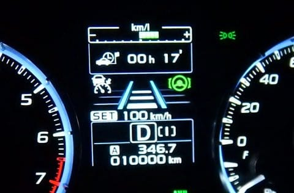

# VMGレヴォーグ君，10000km突破！

📅 投稿日時: 2018-12-26 08:20:50

えー．

本日は，3連休最終日の志賀高原詳細レポートを

するはずですが．

…どうやら最近，ちょいと疲れ気味だったようで．

昨日帰宅後，倒れたように寝てました…

だもんで．今日は短めレポート．

コメントも今晩回答します．

すみません…

ってことで．

7月中旬に納車された，VRMレヴォーグ君ですが．

約5か月で，走行距離10000km突破しました～！

…年3万～3万5000km走る我が家としては．

5か月で1万kmって，ちょいと遅めのペースですね…

まぁ，プロジェクトZがらみで，

9，10月の2か月ほど，週末に遠出ができなかった

というのが効いているようですが…

とりあえず．

無事1万kmを突破して，快調に走ってます．

本格雪道でいろいろ攻めたりもしてみたので，

またどんなだったか，機会があればレポートします～！

## 💬 コメント一覧

### 💬 コメント by (サトシ父)
**タイトル**: バレてました
**投稿日**: 2018-12-26 11:48:05

先週末はボーダーの娘と奥志賀、一ノ瀬で滑ってました。1ゴンにも行きましたがＳさん奥志賀だった様ですね…

ごっそり娘に車買ったと言ったら「みんな知ってるよ」？？？Ｄラーから電話があったらしいです。このまま納車まで黙ってようかと…

明日から年末まで行ってます、またお会いできるのを楽しみにしています。

### 💬 コメント by (Unknown)
**タイトル**: Unknown
**投稿日**: 2018-12-26 15:54:37

Sさんに憧れてレガシィに今年からしたら、レボーグとは(^^)

レガシィってスキーヤーの為にある車ですね(^^)v

4万未満の走行距離ですが、目指せ20万キロ😊

### 💬 コメント by (こじろう)
**タイトル**: 雪道
**投稿日**: 2018-12-26 19:32:21

Sさんは雪道、志賀のくだりでタイヤが滑ったことはありませんか？私、12/15にタイヤが行きたい方向と逆方向に滑りだして超冷や汗ものでした。場所はほぼくだりきる少し手前でした。次回カーブ番号チェックします。再び走り出した先に2台停車していたので同じように滑ってしまった車だったのかもしれません。レヴォーグ、タイヤはBSですが。

### 💬 コメント by (ノムノム)
**タイトル**: 使い倒してますね！
**投稿日**: 2018-12-26 21:43:20

ご無沙汰しております。

レヴォーグ、調子良さそうで何よりです。

当方も1/2～1/5まで志賀高原行きます！焼額中心に滑りますので、今年はお会いできたらいいですね～。板にアルクマのステッカー貼ってる夫婦です^^;

こちらもお見かけしたらお声掛けしますね。

倶楽部ステッカー欲しいです…(笑)

### 💬 コメント by (Skier_S)
**タイトル**: 年末は冷えるけど…ドサドサとは降ってくれなさそう
**投稿日**: 2018-12-27 03:13:13

＞サトシ父さま

ありゃ．

今週もいらしてたんですね．

全然お会いできませんでしたね…（残念）．

しかし，車購入ばれてましたか．

ってか，普通はばれますよね（笑）．

27日から年末まで，また志賀にいらしているんですか？

こちらは29日から参戦なので，またお会いしましょう！

娘がいるので，基本的に焼額から外にはあんまり

出ないと思います…

＞Unknownさま

コメントありがとうございます～！

レガシィ買われたんですね…

スバル車の4WDは，やっぱり雪道で安定して

