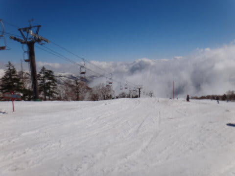
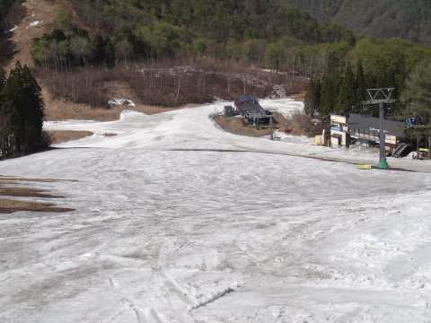

# 5月12日のかぐらスキー場は…本日は晴天なり．雪も例年よりたっぷり！…人もたっぷり(泣)．

📅 投稿日時: 2013-05-13 00:12:45

🏷️ カテゴリ: [2013スキー滑走日記](c91dbe557f9a69230b1600e48622fdd61.md)

…ってことで．

焼額の営業が終了したので．

…今週からはかぐら通いが続くのですが…

本日日帰りで行ってきたかぐらは…

なんだこれは！？例年より雪が多いぞ！

…って感じで．

まだまだシーズンが続きそうな感じですよっ！

さてさて．

とりあえず，土日は朝7半からロープウェー運転開始なので…私は7時20分に並びましたが．

この時点ですでにそこそこの人が待っており…

ロープウェー第4便．営業開始から15分ほど待っての搭乗です．

ロープウェーの山頂に着くと…

をを！みつまたにも，まだ雪が結構残ってるじゃないですか…

みつまたクワッドまでも，ぜんぜん雪の心配が無い感じ．

みつまたクワッドから降りて，ゴンドラへ向かいます．

ここも雪はまだ大丈夫そうですね～．

うむ．今シーズンも，最終日までバスを使わず，リフトでゲレンデまで移動できそうな

予感．

そして，ゴンドラに乗って…

やってきました．かぐらゲレンデ．

…ここまで，遠いよ…ロープウェーに並んでからここに着くのに1時間(涙)．

とりあえず．

朝イチのメインバーンは…

うむ．

うむ．

うひょ～！

…これは，とても，GWを過ぎたとは思えない雪の量なんですが．

コースいっぱい，きれいなフラットバーン．

大回りし放題だっ！

…と，ゲレンデに飛び込んだけど．

朝イチからちょっとネットリと板に粘りつく雪(泣)．

…ちと滑りにくいよ…(涙)

で．

人が少なかった朝の数本を滑ると…

人がどんどん増えていき…

9時半ごろにはかなりのリフト待ちが(涙)

9時半ごろから12時前まで，クワッドリフトは最長15分，平均10分近く待ちました…(泣）．

おかげで，ゲレンデも…

なかなかステキな感じの人口密度です(悲）．

この人口密度で，この雪ですから…

10時にはもうかなり荒れ始め．

昼前には，結構ボコボコになってきます．

昼を過ぎると，メインバーンはもう完全なコブ祭り会場と化してます．

かなり盛大なお祭り状態です．

朝の整地状態が夢だったのでは…？と，思わずにいられません．

ってことで．

気温が10度近くと，軽く汗ばむようなぽかぽか陽気の中．

(スキー場にはこの時期になっても成仏できないスキーヤーの妖気が漂ってますが)

皆さん，コブ活動にいそしまれております．

あー．

そうそう．

この時期にしては．

テクニカルコースも，まったく土が出てません(驚）！

ジャイアントコースも…

なんだか…

まだ全然，土が出てきてません．

GW過ぎにここまで雪があるのは，珍しい…

ジャイアントコース，まだ全面OKです！

そして，下山コースも…

ゴンドラコースは…

ゴンドラ乗り場まで，まだかなりの幅のコースがあります．

みつまたスキー場も…

まだ余裕でロープウェーまで滑って降りることができますね～！

ってことで．

午前中は粘つく雪で，リフト待ちも長く，混雑した本日でしたが．

全面コブになった午後は，リフト待ちが3-4分まで短縮しましたし．

雪もまだいっぱいあったし．

…コブ活動狙いと捉えれば，結構楽しめるゲレンデ状況でしたよ～っ！！！

