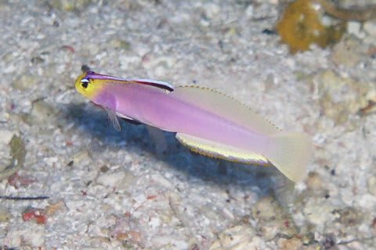

# 水中カメラ買い替え計画，3種のプランを計画してみたが…

📅 投稿日時: 2015-08-01 01:37:17

🏷️ カテゴリ: [PC,カメラ&小物](c0d8caed13e597efe97b661a8ae56bed0.md)

って感じで．

水中カメラ買い替え計画は発動したものの．

計画を実施するにあたって．

考えられる選択肢は，以下の三つ．

プランA．中古のIXY210ISを探して購入

　ハウジングは今までのモノが使えるので，一番安く上がる，

　「最低コストソリューション」

プランB．30m防水カメラ，NikonのCoolpix AW130を購入

　ハウジングを買わなくて済むので，ちょっと安く上がるかも…

　名付けて，「妥協プラン」

プランC．新しいカメラ＆水中ハウジングを購入

　…何か，安いカメラ＆ハウジングを見つけて，

　一式すべて購入する，「リッチプラン」

の3択，だ．

とりあえず，スキーに行き過ぎて貧乏金なしの我が家．

当然狙うは，「最低コストソリューション」なわけで．

…IXY210ISの中古を探し，通販サイトをひたすらめぐり．

それ以外にも，秋葉原と新宿の中古カメラ屋，

私の知っている限りのお店を，丸一日かけて，

必死に10件以上巡ってみたけど．

…やはり，古いカメラなだけあって．

残念ながら同じモデルはなかった…

＃5年経ったデジカメって，中古すら出ないのね

ということで．

プランA「最低コストソリューション」は撃沈（涙）．

うーむ．

ならば．プランBを実施だ…っ！

と，妻に聞いてみたところ．

妻「え？なに？30m防水？

　…それって，パラオのマクロ穴（水深35m近く）にカメラ

　持っていけないってこと？？

　ヘルフリッチ見に行っても，写真撮れないってことよね…」

（これが妻の好きなヘルフリッチ…和名シコンハタタテハゼ）

と，多少不満の様子．

うーむ．

水深30m以上なんて，そうそう行くことないと思うんだけど…

と，思いつつ．

AW130の実物を見に行ってみたところ．

意外とお値段が高いし．

防水は，しっかりしたOリングじゃなく，ナイフエッジのパッキンだし．

さらに，透明ハウジングのように，Oリングが外から見えるような

構造ではないので，このパッキンになんか異物が挟まっても

気づかず，うっかり水没させてしまうリスクが高そう…

少なくとも，ハウジング＋カメラより．

間違いなく寿命は短い！

＃…と，SONYのTX20とTX30の2台を水没させてしまった経験を

＃もつ，某スキーヤー（匿名希望）は思った．

…ここは，意外と．

プランBよりプランCの方が，安くつくかも…

ということで．

プランC，「リッチプラン」についても，調査開始だっ！

…しかし．どんなカメラがあるんだ？

なんか，安いカメラないかな～

（続く）

＃単発ネタのつもりだったのに，書き始めると

＃ボリュームが大きく，想定外の連載化…

## 💬 コメント一覧

### 💬 コメント by (KENKEN)
**タイトル**: プランＢ実証済み
**投稿日**: 2015-08-02 22:38:12

先ほど西表から帰ってきました。

天候＆海況にも恵まれ今回も楽しい時間を過ごすことができました。

実は今回我が家はプランBを実行しました。

結論としては年数回利用のリゾートダイバー用カメラとしては充分合格点です。

注意点として、30m防水と引き換えなのかボタン類が硬く、グローブをしての操作はかなり困難と予想されます。

来週フィリピンの天候が恵まれることを祈ってます。

(Coolpix AW130は無事デビューできましたが、浅瀬用にハウジングなしで使っていたTG-2を水没させてしましました・・・・・涙。）

### 💬 コメント by (Skier_S)
**タイトル**: KENKENさま
**投稿日**: 2015-08-02 23:54:26

お帰りなさい！

台風が来なくてよかったですね～！

しかし…

AW130，買いましたか！！

我が家も，これで十分かな…

と，一瞬思いましたが．

たぶん，使い方が激しい我が家では．

早々に水没させる気がして，

やっぱりしっかりしたハウジングを買うことに

しました…

何を買ったかは，またおいおいの

お楽しみに！

西表，こちらも今のところ，10月に行く予定ですので，

また，今回がどんなだったかいろいろ教えてください～

