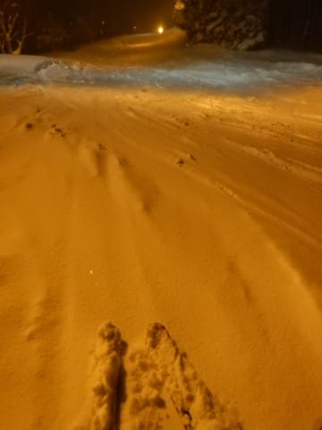

# 2018/12/30(日)の志賀高原スキー場は…今日も一日激寒吹雪．朝イチ膝パフ！昼間も降り続き，人もそこそこ多かったなあ…

📅 投稿日時: 2018-12-30 22:59:49

ということで．

早くも志賀高原滞在2日目が終わってしまった

Skier_Sです．

…楽しい時間が過ぎるのは，なぜこんなに

早いのでしょう…（涙）

ってなことで．

本日の志賀高原ですが．

相変わらず寒いです．

相変わらず雪が降り続いてます．

相変わらず積もってます．

ある意味，昨日のリプレイのような

感じの天気でした…

まず．

朝イチは．

いつも通り，焼額第1ゴンドラの8:30営業開始に

並ぶわけで．

…そして，山頂へ行くと…

うむ．

朝の気温は-14℃ですか．

今日も冷え冷えですな．

山頂は…

吹雪とまではいかないけど，寒い風が

吹き付ける，雪降りの天気．

…で．

積もってます．

もう，そこらじゅうパフパフです．

昨晩からひたすら降り続けた雪が，

30cm以上積もった本日．

当然，こいつを出さねばなるまい！！！

そうです．

昨シーズン購入したものの．

1月以降，ほとんど出番がなかった太い板の

今シーズン初出動です！

新雪が積もった日は，当然，

オリンピックコースを目指さねば

ならぬのだ！

オリンピックコースは…

ちょいと重めではありますが．

うはーーーー！

これは…膝パフ！

ところによっては太ももパフじゃないですか！！

ファーストトラックをやっていた本日．

残念ながら朝イチゴンドラで上がっても，

すでに何本か滑った跡がありましたが．

でも，滑った人が少なかったのか．

1本目は…

パフパフ！

天国！

ザ，パウダーっ！！

太い板を履いてないと，埋もれてしまうこと

必至のちょいと重めの雪だったのが

残念でしたが．

重めの雪に恐れをなしたのか．

あまり新雪が得意じゃない人がそれほど

入らなかったので…

ゴンドラ2本目も3本目も，まだそれほど

ひどく踏まれてないパウダー継続！

もう，滑ってる人が見えないほどの

パウダー！

…でも，ひどい雪でコースの凸凹が

見にくい状況のため．

4本ほど滑ったあと，かなり蹴散らされて．

新雪と踏まれたところが混ざってくると，

かなり難しめの状況になってきました…(涙）

でも．

膝パフとはいえ．

今シーズン初のパフパフを堪能！！

良かった…（感動）

ってことで．

新雪を満期した後は．

圧雪コースで滑ろうか…

と，普通のコースに戻りましたが．

…さすが，年末年始休みに入っただけの

ことはあり．

コース上の人が多いんですが(涙）

で．

昨日と同じく，激しい北風が吹き付けた

本日．

やはり，奥志賀第2，第3ペアは昼過ぎ，

奥志賀ゴンドラも，午後1時半過ぎに

息絶えてしまい…

そのせいか．

焼額のコース上は，さらに人がすごいことに

なってしまいました…

第2高速リフトもかなり列がついてますし…

わが居住地，第1ゴンドラも．←だから，住んでないってば

ゲートの外まで列が伸びて，最大3分弱の

待ちになりましたが…

どうやら，2ゴンは10分待ちまで行ったようです．

とはいえ．

午後は，わが居住地の←だから，住んでないってば

1ゴンはそれほど混みませんでしたね～．

とはいえ．

コース上の人は，夕方までちと多めだったかな～．

終日雪が降り続けていた本日．

気温は最高でも-11度と激冷えで，

こんな寒い中，ゴンドラならまだしも，

とてもリフトになんか乗ってられるか！

という，吹雪と言っていいほどの

悪天候ながら．

いつもならガラガラになる

ゴンドラ営業終了の4時近くでも，

コース上の人は多めだったのが，

さすが年末年始休みですね…

だけど．

コース脇のパフパフは，夕方まで

残ってたし．

もう，コース上の雪は

「これで十分．もういい」

っていうくらいに積もった

一日でした…

で．

まだ終わらない．

そうです．当然のごとく．

夜はナイターに繰り出しました～！

本日の焼額ナイター．

夜になっても雪が降り続けていたので．

今日もナイター前に圧雪がかかっているにも

関わらず．

うっすらパウダーのナイターです！

ってなことで．

昼間とうって変わって，誰も滑ってない

ガラガラの貸し切りナイターを，

営業終了までたっぷり滑りました～！

いやー．

しかし．

ホントに良く降るなぁ…

どうやら，明日も降り続けそうな感じで．

明日の朝も，ブーツ～脛パフかな？？

さらに，この冷えはまだまだ正月明け，

少なくとも1月5日までは続きます．

1月2日あたり，またかなり積もりそうな感じ…

とりあえず．

完全に雪不足は解消されましたが．

きっとこれは．

12月ごろに，狂ったように踊った冷え冷え踊りが．

今になって効いているに違いない…

## 💬 コメント一覧

### 💬 コメント by (Goku)
**タイトル**: 今日で滑り収め
**投稿日**: 2018-12-30 23:49:42

今日もお世話様でした～

それにしても、あの極寒のなかナイターまで行くとは流石です。

わたしはお昼で温まったら、もう復活できませんでした(笑)

わたしは今日で滑り収めなので、また新年ヤケビでお会いしましょう。

### 💬 コメント by (ほっぽ)
**タイトル**: 今日は板だけ
**投稿日**: 2018-12-31 00:08:52

Ｓさん

今日はヤケビでついにお姿見かけず。

スキー板だけはしっかりと確認しました。

明日もヤケビに行きますので探してみます。

### 💬 コメント by (もりや)
**タイトル**: 今日も寒かったですね
**投稿日**: 2018-12-31 01:47:45

昨日は1日お世話になりました！いつもスキーを一日中滑っていた子供達が、１時間位ロビーでオセロゲームをしたり、将棋をしたりといつもと違う遊びが楽しかったようです。今日も朝一よりヤケビ入りしますので宜しくお願いします。また、元日の新春ファーストトラックも子供達と一緒に参加します！

### 💬 コメント by (地元民)
**タイトル**: 山は大雪、里は
**投稿日**: 2018-12-31 08:14:19

今回の大雪、山はすごいみたいだけど、中野市街地～長野市にかけては、ほとんど降ってないので、下山後、高速とかも楽々ですよ～

### 💬 コメント by (Skier_S)
**タイトル**: 今年もお世話になりました
**投稿日**: 2018-12-31 23:42:54

＞Gokuさま

昨日はお疲れさまでした．

今日も朝はぱふぱふ，そして天気も回復して．

結構良かったですよ．

今年もお世話になりました．

また年明けにお会いしましょう～！

＞ほっぽさま

今日は無事お会いできて良かったです…

午後は天気も回復して，いい感じでしたね！

では，また来年お会いしましょう～！

＞もりやさま

きょうもおせわになりました…

そして，娘に一日付き合っていただきありがとうございました．

また来年…というより，明日もよろしくお願いします(笑)．

＞地元民さま

長野市はそんな降らないのですね…

スキー場が近くて，そんなに雪が積もらないって，

理想の土地ですね．

うらやましい…

＞

