# 2017年8月，小学生の子連れでパラオ再訪！その25…午後のカヤックツアー

📅 投稿日時: 2018-11-01 03:25:16

🏷️ カテゴリ: [ダイビング日記](ce3a7a8d424d112fce83ee85c81a0e344.md)

…今週末．

3日，4日は，天気が良さそうですね．

Yetiも軽井沢も，土日とも基本的に晴れそうですね．

気温も上がりすぎず，絶好のスキー日和になりそう…

あぁ…

でも，今週末はスキーに行けないんですよね…（涙）

ってなわけなので．（どうゆうわけだ？）

今日もダイビング旅行記へ，Go！

----

ってな感じで．

カヤックツアーに出発しましたが．

まずは，ショップ前のマングローブ林に漕ぎ入って…

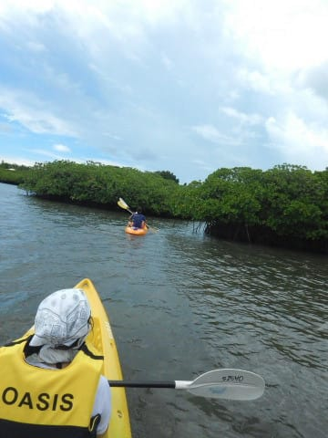

マングローブの種類や生態などの話を聞きつつ．

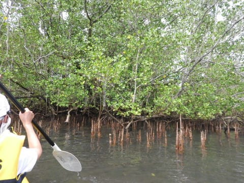

マングローブ林の中を，ゆったりと

漕ぎ進んで行きます…

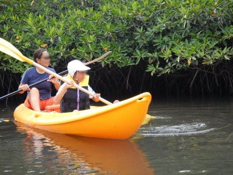

このマングローブ林．

旧日本軍の船が放置されていたようで．

船体が破壊され，エンジンだけが寂しく

残っていました…

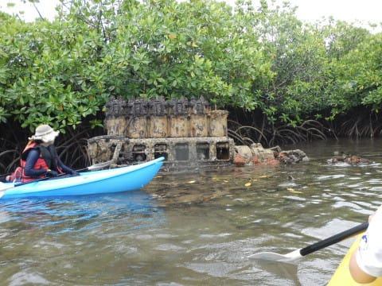

マングローブ林を抜けた後は．

こんな岩場の壁が出てきましたが…

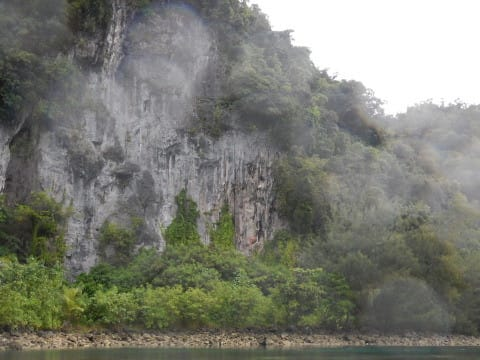

この壁．

昔の壁画が残っているようで．

この，赤いやつですね．なんかの動物が

描いてありますが…

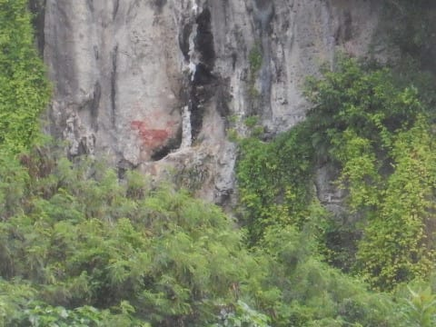

…昔の人，足場もないこんなところに，

どうやって絵を描いたんだろう？？？

そして．

この岩場にいる鳥の説明などを受けながら…

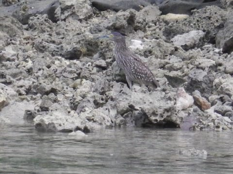

パラオ特有の，海面近辺が浸食でえぐれた

岩場のそばを進みます…

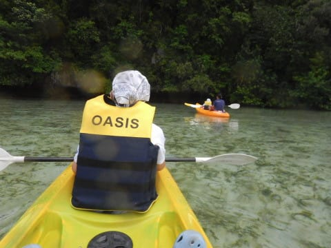

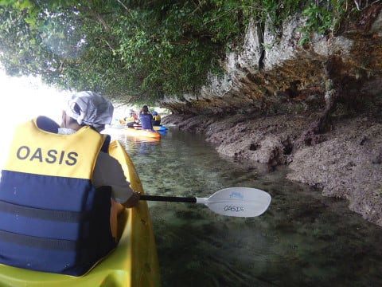

…しかしこれ，浸食が進んでヤバすぎでしょ…

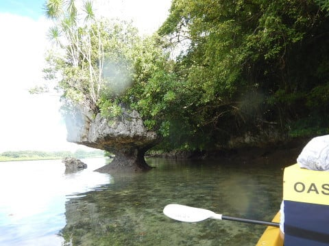

もう，いつポッキリ行っても不思議じゃ

無いですね（笑）．

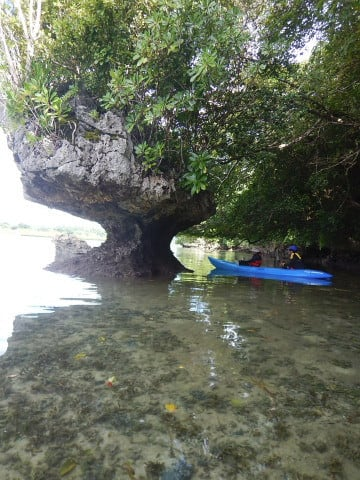

そして．

透明度の高い，きれいな海をさらに

進んで行きますが…

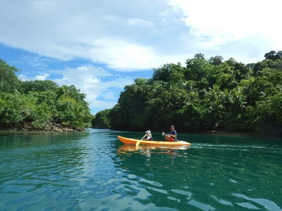

娘は，また一人で漕がせてもらっている

みたいですね…

これは，旧日本軍の海軍施設がこのそばにあったようで．

資材運搬用のレールが残っているようです．

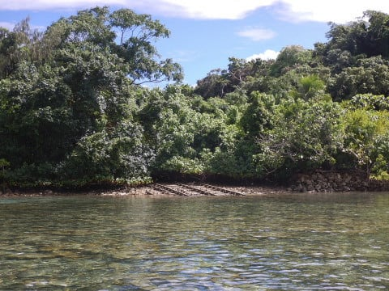

こんな感じのモノを眺めながら．

カヤックを漕ぎ進み…

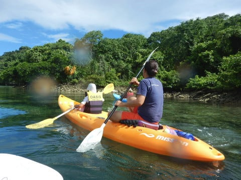

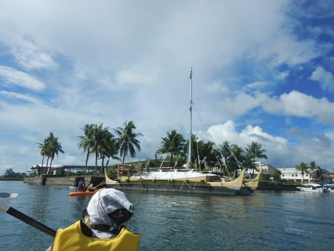

漕ぐこと2時間ほど．

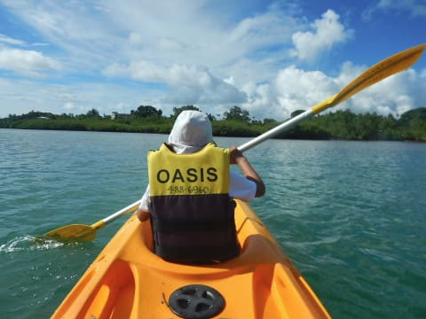

出発した場所に戻ってきました…

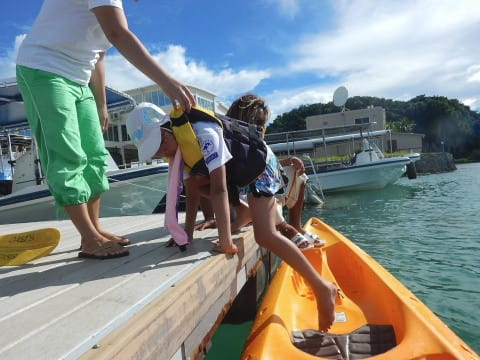

午後だけのツアーだったので．

時間はちょいと短めでしたけど．

娘としては，

カヤックをいっぱい漕げて嬉しかったようです…

…良かったね．娘．

午後4時ごろには，ショップの車でホテルまで

送ってもらい．

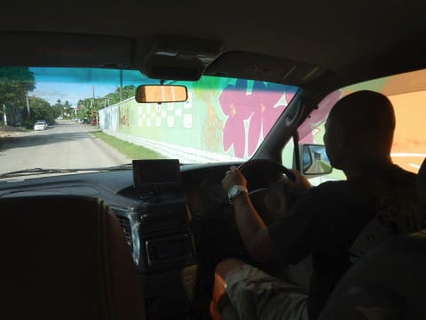

午後のカヤックツアーを終えたのでした…

しかし，寂しいことに．

これで，パラオでのイベントは終わりです．

後は夕食を食べて，軽く休んだら，

深夜に帰国の飛行機に乗るだけです…
