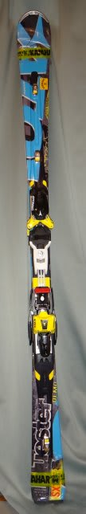
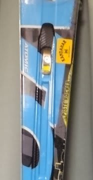

# あたらしいなかまが増えたよ…'14 ATOMIC Bluester DEMO SX到着！

📅 投稿日時: 2013-11-04 01:51:31

🏷️ カテゴリ: [スキー雑談](c1f9d2cb7478308da16419928ea3945e9.md)

えー．

この3連休．

Skier_Sはスキーに行ってるだろうなぁ…

と，お思いでしょうが．

期待を裏切ってですねー．

…なぜか，この3連休は．

スキーに行ってないんですね～．

スキーシーズンに入ったというのに，←まだ普通の人はシーズンに入ってないから(自己突っ込み)

ダイビングネタばかり続くと．

「ちっ．徒然ダイバー日記かよ」

…って，思う人もいそうなので．

ちょいとスキーネタを…．

ってことで．

この7月．

全く予期せず，[スキー板を買ってしまった](e9a16d9757c2d52b7254fe8a802071c63.md)わけですが．

＃自分以外の人は十分予期していたようですが…

先日，板が届いたということで．

受け取りに行ってきました．

去年と同じ，ATOMIC BLUESTER DEMO SXの165cmです…

だって．

だって．

すっごく良かったんだもん．

昨シーズンのSX．

昨シーズンは，シーズンの8割をこの板で過ごした状態なので．

…私がこれだけ酷使する板が，絶対ぜったいゼッターイ，

2シーズン持つわけがないのだ．

これまでの経験から，確実に2シーズン目の途中でヘタるのだ．

ということで．

自制心リミッターが外れて，ついつい買ってしまったのですが．

この板．

私にしては珍しく，プレチューン済み．

板のフラット出しして，サイド88度，ベースビベル1度で仕上げてます．

…昨シーズンは，購入状態ではかなりコンケーブな板をそのまま履いたけど．

今回の板は，このチューンがどう効いてくるかな？？

楽しみ…

あー．

でも．

昨シーズンは，早い店では7月ごろには売り切れていたBLUESTER SX165cm．

今シーズンは，まだ神田にいっぱい残ってましたね～．

…今シーズンは，あんまり売れてないのかな？？？

PS.この板も，いつものお店で買ったので．

　やっぱりいつものシールがついてます…

　…ゲレンデでSkier_Sを発見するための

　目印に使われるんだろうなぁ…

## 💬 コメント一覧

### 💬 コメント by (いか)
**タイトル**: Unknown
**投稿日**: 2013-11-04 02:20:08

新しい仲間はいいですね！

私もはやくVolkl Codeに乗ってみたいのですが、さすがに狭山では乗る気にならないので…

(金曜夕方の狭山はガラガラでした！)

### 💬 コメント by (Skier_S)
**タイトル**: コメント遅れました…
**投稿日**: 2013-11-05 10:25:30

現在，旅先でして．

某国空港にて帰国のための乗り継ぎ待ち中です．

ってことで，回答遅くなりましてすいません…

いやー．

新しい仲間ですが，私の場合は良く知っている板

なので，わくわく感や新鮮な感じはないのですが…

でも，やっぱり新しい板は良いですよね．

平日狭山，うらやましいです…

ニュー板，どこでデビューさせる予定ですか？？

### 💬 コメント by (いか)
**タイトル**: Unknown
**投稿日**: 2013-11-06 02:34:28

平日狭山、学校のあとのナイターができてちょうどいいです^ - ^

ニュー板は、ホームの八方でデビュー戦を予定しています！

雪次第ですね…

### 💬 コメント by (Skier_S)
**タイトル**: いかさま
**投稿日**: 2013-11-06 23:45:36

平日に滑れるのはうらやましい限りです…

ニュー板デビューしたら，またどんなだったか

報告してください！

