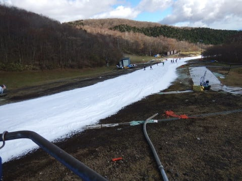

# 11月19日（日）のイエティ滑走レポート…天気は曇り時々晴れ．コース幅は広がったけど，混み気味

📅 投稿日時: 2017-11-21 02:34:46

🏷️ カテゴリ: [2018スキー滑走日記](c11b88dc181f34079ab41db74a3587646.md)

ということで．

確か先週の11日も，Yetiから帰ってきてそのまますぐ

空港に向かい，出張に旅立った気がするのですが．

今回も．

米国ホテル金曜早朝4:30発（睡眠3時間…）

空港出発：7:45（予定）⇒機体故障で10:30（涙）

　　フライト時間3時間半

サンフランシスコ着：金曜昼12時過ぎ

…乗継便チケット発券待ち行列1時間…

　12:30ボーディング開始の飛行機のチケットを

　受け取ったのがなぜか13時，隣のターミナルへ

　全力疾走（涙）

サンフランシスコ発：金曜13:45

　フライト14時間半…人生最長（涙）

香港着:土曜21:00

香港発:日曜00:40

　　フライト約4時間

日本着:日曜05:30

帰宅：日曜朝07:20

　（40分でシャワー＆スキー準備）

自宅出発：日曜朝8時

Yeti着：朝10時前

という感じで．

ホテルを出てから約36時間後に，Yetiに到着という，

すごい長い旅路でした～！！！←何かが違う

こんな感じの長旅を終えて．

やってきたYetiですが…

うむ？

駐車場やら通路やらに何かが撒いてありますよ…？

こ，これは…

凍結防止剤？？

確かに，朝9時過ぎに，Yetiに登ってくる道路で，

気温は2℃程度だったので．

朝はガチガチに凍り付くほどに冷えたん

でしょうね…

ってことで．

飛行機搭乗時間計20時間の旅をしてまで

やってきたYetiだ．

日曜スキーしないつもりなら，航空会社にサンフランシスコの

ホテル取ってもらい，次の日の便で10時間のフライト一発で帰れた

楽しくなかったら，許さん！！

と，ゲレンデに出ると…

うむ．

天気はすっきり晴れ！

そして…

気温が低いので，雪もいい感じ！

コース両脇は柔らかめだけど，

コース中央部は硫安が効いて，

結構しっかり硬いよ！

…ゲレンデに出たのが朝10時と，

いろいろやむを得ない理由によりちと出遅れたので．

コースの人は多めでしたが…（ちょっと涙）

ただ，ここしばらくの気温の冷え込みで，

雪が解ける量が減ったため．

造雪スピードが勝って，コース幅は

かなり広がった感じ！！

うむ．

これだけ幅があれば，大回りとは言わないまでも

そこそこ楽しめるかな…

幅が広がった分，コース上の人口密度も

薄まった感じ…

でも．

リフト待ちは朝10時ごろはまだ短かったものの…

11時ごろには結構伸び始め…

昼近くには，もう結構な列が…（涙）．

これで3分待ちくらいかな．

まぁ，この時期のYetiと考えれば，

まだ空いてる方ですけどね…

で．

今週のYetiから，こんなものができてました！

…ふむ．

一人用レーンとな！

やっとYetiも，こういうシステムを採用

したか…！！

Yetiのお客さんは，あんまりリフトを詰めて

乗らないので．

これで乗車率が上がって，待ち時間が減るぞ！

Yeti，よくやった！！

と，内心絶賛したところ．

4人ピッタリじゃないから，一人レーンから

人を入れてあげる…という風習が無いYeti.

係員も一人レーンからの割込みを誘導

しなかったので，一人レーンの人は

なかなか入れてもらえず．

あまり有効に機能していなかったという…

あぁ…かなり残念な感じ…（涙）．

そして．

朝は晴天すっきりだったゲレンデは．

なぜか私が到着した直後から，雲が増え始め…

うーむ．

ここ数日，すっきり晴れなのに．

私が到着したら，曇り出すという

パターンが続く気が…

で．

そのあとは基本的に曇り．

時折晴れ間も射すかな～，

という感じ．

まぁ．

でも．

基本的のほとんど太陽が射さず曇っていて，

さらに気温が低かったので，

ゲレンデの雪は融けることなく．

終日固めをキープして．

午後3時近くになっても，それほど荒れることなく

フラットなままだったので，

良かったかな～．

ただ．

夕方になってくると，リフト待ちがかなりすごい感じに…

で．

私もさすがに人間なので．

…大事なところなので繰り返しておくと．

私もマシーンやサイボーグじゃない，

普通の人間なので．

もう，40時間以上横になって寝ていないのが

効いて，かなり眠たく．

長いリフト待ちで寝てしまいそうだったので…

16時のゲレンデ整備タイムを待つことなく．

15時前に切り上げる

という，

自分史上に残るような，大人の判断をして

帰路に就いたのでした…

ということで．

17時頃に帰宅したのですが．

帰宅途中に．

「ん？

　23日以降行くスキー場は，スタッドレス履いてないと

　行けないところじゃないか…」

ということに気づいてしまい．

「タイヤ履き替えてないからスキーに行けないって

　ことになると，大変だ！！」

と．

17時過ぎの帰宅後．

真っ暗な中，

なぜかタイヤ交換をしている自分がいたのでした…

…それも．

いつも通り，足回りを磨き上げてるし…

ってなわけで．

夜にタイヤ交換を仕上げ．

その後，久しぶりの日本食の夜ご飯を堪能した後．

…約50時間ぶりに横になって寝ることができた，

Skier_Sだったのでした…

＃スキー場レポートではなく，Skier_Sの

＃ご無体レポートになってる気がするけど…

＃今回．帰りの飛行機で仕事するのは放棄して．

＃飛行機の中ではひたすらひたすら寝続けていたので．

＃皆さんが思うほどきつくなかったですよ…
