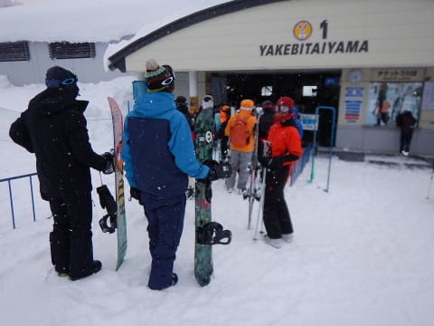
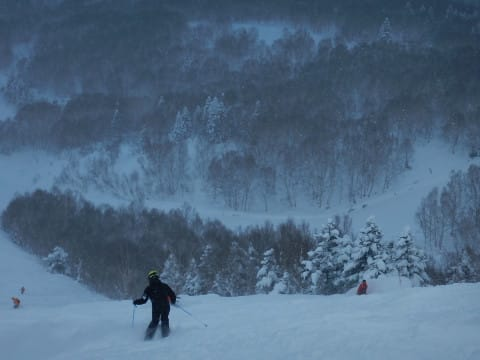
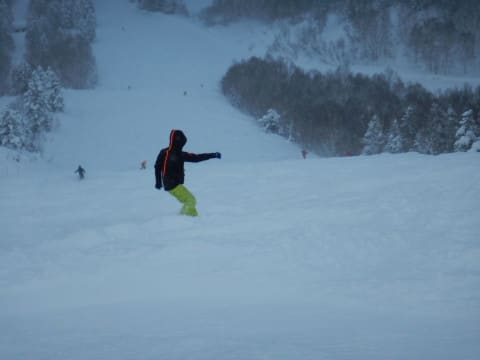
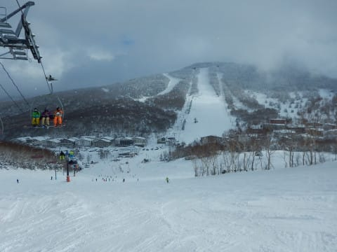

# 2019/1/2，正月休みの志賀高原スキー場は…朝の積雪はブーツパフ．また天気が崩れて，寒い一日

📅 投稿日時: 2019-01-02 23:42:03

🏷️ カテゴリ: [2019スキー滑走日記](c3e4496fc0fb7f9c17ff21214a35b1ace.md)

ということで．

まだまだ続く，志賀高原滞在．

…そろそろ読者も飽きてきたころだと

思うのですが．

そんな思いは気づかぬふりをして．

今日も行きます，志賀高原レポート！

そして．

今日も相変わらず，焼額第1ゴンドラの

オープン前から並ぶわけですね．

…ホントに毎日同じような写真が並ぶので．

読者の皆さんも飽きてきてるよな…絶対．

で．

これももう見飽きたと思う，山頂温度計です．

今朝は-10℃．

相変わらず冷え冷えの日々が続きます．

山頂の天気は…

この5日間で4回目の，雪降りの天気．

…晴れたのは，昨日だけか…（残念）

圧雪コースも5cmほど新雪が乗っているので．

これは，新雪が楽しめるかもしれないのだ！

…と，太い板を出動させて．

ウハウハ新雪，いただき～！

と，オリンピックコースへ飛び込む！

けど．

うーむ．

せいぜいブーツ上パフか…

とりあえず，滑ってみるけど…

思ったほど深くないね…

せいぜい，ブーツが隠れる程度で，

完全底付き．

新雪の下は，ちょいと硬めの，エッジが

流され気味の斜面で．

軽い雪煙が上がるので，一見よさげに見えるけど．

あんまり新雪斜面を滑っている感じはなくて．

ちょっと残念な感じ…

だもんで．

太い板から，メインマシンのSXへ切り替え．

圧雪斜面へ，Go！

けど．

残念ながら，意外とコース上の人は多めで…

積もった新雪が蹴散らされて凸凹になっていて．

あんまり気持ちよくない感じ…（残念）

うーむ．

あんまりテンションが上がらない天気＆

バーンコンディション（涙）←連続滑走5日目に突入して，疲れているというのもあるのでは？

とはいえ．

今日もゴンドラはガラガラだったし．

リフトもほぼ待ちなし！

…しかし．

このガス＆雪で，視界があんまりよくないのは

何とかならんか…

と，思っていた午後1時ごろ．

をを！

晴れ間が！

なぜかお昼ごろは，

焼額の呪いが解けて，一の瀬方面へ

お昼ご飯を食べに脱出していましたが．

なぜかこの一瞬，数10分間だけ．

晴れ間が顔をのぞかせました…

一の瀬正面バーンは，

コブコブ＆コブ溝はカリカリバーンで

体に優しくない（楽しくない）という

噂を聞いたので，滑りません

でした…←一の瀬正面バーンを住み家としていて，他のバーンでの目撃情報がほぼ存在しない，

某著名20000mな方が，本日焼額で滑ってたくらいだから

かなり信憑性の高い情報かと(笑)

でも…結構人がいますね．

一の瀬の下半分は，新雪が蹴散らされた凸凹が

多少あったけど．

雪質も良く．

まぁ，トップシーズンらしい感じになってきましたね…

そして．

午後はまた焼額に戻ってきましたが．

その時間帯には，また雪降り天気に戻ってしまい…

山頂付近はガスで視界が良くない状況に（涙）

コース上は新雪が踏み散らかされた不整地なので．

コース状況が見えにくいと，かなり滑りにくい感じ…(泣）

などと．

文句をいいながらも．

今日もしっかり，16:10の最終リフトまで滑り続け…

さらにその後．

圧雪作業の後に．

圧雪かけたてのシマシマバーンを

いただくのだ！

今日の昼間はちょっと残念な感じのゲレンデ

状況だったけど．

ナイターはピカピカ圧雪で，

視界も良くて，最高！！！！

ってな感じで．

今日も夜遅くまで

滑り続けたのでした…

…ちなみに．

今日は夜から，結構雪が降り始めています．

…もしかすると．

明日こそ，脛パフくらいに行くか…？

いや，ぜひ胸パフ，

…いや，頭がうまるほどの

パウダーが積もってほしいな！←それ，滑れないから．

## 💬 コメント一覧

### 💬 コメント by (つーちゃん)
**タイトル**: おや？
**投稿日**: 2019-01-03 00:44:27

ナイターまで行っちゃおうなんて邪悪な誘惑がよぎりましたが、

やめておいて正解でした。2度ほど仮眠してなんとか帰宅です。

日帰りでナイターまでやっていい人は日頃から特殊な訓練を積んでいる方限定ですね←

そして。。。また圧雪車内の画像が写ってますね。。。いーなー

### 💬 コメント by (こんばん)
**タイトル**: 圧雪車内
**投稿日**: 2019-01-03 07:26:15

圧雪車内からの写真があるのは何故ですか？

### 💬 コメント by (バンブータケ)
**タイトル**: 明けましておめでとうございます。
**投稿日**: 2019-01-03 10:16:13

志賀高原好きのバンブータケと申します。明けましておめでとうございます。

ブログ毎日楽しみにしています。

年末年始は私も焼額で過ごし1/2に帰宅しました。

大晦日は、東館のメインダイニングから「お、あのウエアーは徒然さんか！」とお見受けし、

松明滑走の雄姿を食事しながら拝見いたしました。

お忙しいと思いますが、本当にブログを見るのが楽しみですので、

今後とも情報発信よろしくお願いいたします。

### 💬 コメント by (Skier_S)
**タイトル**: さすがに疲れた…
**投稿日**: 2019-01-04 05:21:46

＞つーちゃんさま

日帰り志賀お疲れ様でした．

日帰りナイターは…

行動時間24時間近くになるので，死にます（笑）．

圧雪車は楽しかったですよ～！

またレポートする予定です（記事を書く根性があれば）

＞こんばんさま

焼額では，小学校の子連れだと圧雪車に同乗できる

「圧雪車乗車体験」

があるんです…

http://www2.princehotels.co.jp/page.jsp?id=108331

これに参加してきました！

でも．

このイベント．

小学生の娘はダシで，私が楽しむために参加している感じです（笑）．

＞バンブータケさま

明けましておめでとうございます～！

コメントありがとうございます．

あ，正月は焼額にいらしたのですね．

…そして，松明滑走ご覧になってましたか…

志賀高原好きでしたら，またお会いするチャンスも

ありそうですね．

もしゲレンデで見かけましたら，また声を

かけてやってください～！

