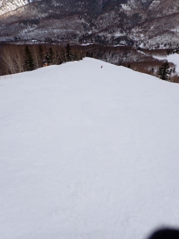

# 2024/3/23(土)の志賀高原焼額山スキー場は…午前激しい雪降り，午後はかなり湿った雪だったけど，焼額は雨にならず！夕方から晴れ

📅 投稿日時: 2024-03-24 00:19:04

ということで．

本日も志賀高原で滑ってきましたが…

空から液体が降ってくる危機が迫っていた

本日．

焼額山はぎりぎり雪で持ちこたえました！！

大事なことなので繰り返します．

本日の焼額，ふもとまでぎりぎり雪で

一日持ちこたえました…！！

いや．

かなりきわどい感じで，

西舘やブナ，ジャイアントは完全に雨に

なっていたみたいですが…

焼額は，ふもとはかなり湿っぽいきわどい

雪ながらも，雪のまま持ちこたえて

くれました！！

だもんで．

今日も雪は何とか持ちこたえ，そこまでひどい

雪質にならなかったので…

明日もそこまで壊滅的な雪にはならなさそうです！

明日のあさイチはかなりいい感じのバーンで

滑れると思います…！！！

といういいニュースをまずは伝えた後，

今日の詳細レポートをば…

まず．

いつも通り，朝8:30の通常営業開始前の

焼額第1ゴンドラに並びますが…

まぁまぁ並んでいるけど，そこまで長い

列じゃないかな．

3月も下旬に入って，お客さんが減ってきた

感じ…

でも，今シーズンは季節がちょっとずれていて，

3月の今が一番雪があって，雪がいい気が

するんですが…

朝の気温も，高めといいながらも-5℃と，

雪が緩むほどではない，ぼちぼちの冷え込みで．

雪質も，あさイチは昨日の最高雪質を

キープしてくれてますよ…！！

とは言いながら．

昨日の悪い予感…というか，悪い予想が

当たって．

ゴンドラが動き出す前まではほとんど

雪が降ってなかったのに．

ゴンドラ運転開始のころにちょうど雪が

降り始め．

さらに雲が厚く，視界がそんなに良くない

状態（泣）

朝8時前までは，薄日も差すほどだったのに…

営業開始とともに天気が崩れるって，

なんの嫌がらせ？（涙）

だけども．

昨晩からの積雪は0で，

朝のうちはまだ雪の降り始めで積もっておらず．

昨日の最高雪質のシマシマバーンを楽しめ

ますよ！

うはーーー！

昨日のトップシーズン雪が圧雪された，

柔らか雪が適度に固められた，

優しめながらもかなり気持ちいい，

トップシーズンのシマシマです…！！

春雪じゃなく，ホントに2月のシマシマ！！

ただ…

営業開始直後から降り始めた雪は，

ホントに嫌がらせのように営業開始直後

からかなり強い降りになり…

視界が悪くなってくるとともに．

シマシマバーンをあっという間に覆ってしまい，

シマシマじゃないうっすら新雪バーンに

なっていきました…

まぁ，うっすら新雪バーンも悪くないんだけど．

やはりこんな感じの気温が高めの湿った雪なので，

ゴーグルにはりつく感じで，前が見にくい…（涙）

降雪で視界が悪く，さらにゴーグルに雪がついて

前が見にくいので，ちょいと滑りにくい感じ（泣）

焼額だから見えなくてもそこそこ飛ばせるけど…

バーン状況は悪くないだけに，惜しい．

いや，バーン状況は悪くないんですよ…

雨じゃないので，雪も緩まずいい感じなんですよ．

で，

朝のうちはちょいと風も強めで．

ゴンドラも減速運転したり，

奥志賀ゴンドラは10:40ごろから運休したり

しちゃいましたけど…

なんと．

焼額第1ゴンドラも，11:40ごろに運休（泣）

こっちは風じゃなく，機械整備とのこと…

第1ゴンドラが止まったら，第2ゴンドラが

激込みかも…？？

と心配したけど．

お客さんも少なく，かつお昼時でもあったので，

第1ゴンドラ運休後も2ゴンドラはそれほど

混まずに乗車でき．

そして，運休からわずか20分ほどで，機器点検が

終わり，第1ゴンドラ運転再開！！

午後に運転再開してからは，第1ゴンドラは

それほど混まず，結構ガラガラでしたね…

天気が悪いせいか，ゲレンデも人は少なく，

ガラガラのやりたい放題飛ばしたい放題

バーン！！

ただ．

バーンはガラガラだったけど．

朝より降りは弱くなったというものの，

昼になっても湿り気味の雪は降り続け，

雲も厚く薄暗いのでバーン状況は見にく

かったのが残念…

でも，湿った雪とはいえ，雨になってないので

ゲレンデの雪質は表面に重い雪が乗ってきた

だけで，下地の雪が水を吸うとか，

日差しで雪が緩むとかで雪が悪くなることはなく．

昼頃になっても雪質は悪化しなかったので．

果たして．

一体いつ，この雪が雨に変わるんだ…？？

と，ドキドキひやひやしながら滑って

ましたが…

午後になると，雪が弱まってきて．

それだけじゃなく，雲も薄くなり

薄日が射すようになってきましたよ…！！？？

そのまま，雨が降らないまま午後3時

過ぎになり．

…これは，もう今日は雨が降ることはない！！

と確信！

結局，雨が降らなかったので．

雪が解けて減ってしまうとか，

雨の水を吸って雪質が激烈に悪化する

とかいうことがなく，本日を無事

乗り越えることができ…

朝からの湿った雪が積もったために

こんな感じの雪だるまがきれいに作れそうな

雪がゲレンデを覆ったけど．

バーンは水を吸った重い雪や，ざぶざぶの

春の雪になることなく．

夕方はわずかに凸凹したところもあったけど．

重めの雪が積もったやつが踏み固められた，

しっかりした感じのエッジがよく効く

雪質のまま，夕方を迎えて．

わずかなバンプがところどころにあったことを

除けば，最後まで大回り板で気持ちよく

ロングターンをかますことができる雪質と，

経営が心配になるレベルのガラガラ具合！！

さらに夕方4時近くからは，完全に

青空も広がり始めましたよ…！！

しかし．

なんでリフト営業開始と同時に降り始め，

リフト営業終了のころになって晴れるかなぁ…

嫌がらせとしか思えない…（泣）

まぁ，でも．

今日は最高気温0度くらいまで上がったので．

この気温で昼間にこの青空が広がってたら，

日差しで雪が思いっきりやられて，雪質は

激烈に悪化していただろうな…

と，ポジティブに捉えて．

今日も，夕方まで比較的フラットだったバーンを，

リフト営業終了ラストまで，また昼休みも取らず

ひたすら滑りたおしてきたのでした…

ってなことで．

西舘・ブナ平・ジャイアント・丸池サンバレー方面は

雨だったけど．

標高の高い一ノ瀬・寺子屋・焼額・奥志賀は

雨になることなく，危険な土曜日を

乗り越えられたので．

明日日曜は，朝はいい感じのバーン

状況だと思います！！

日曜の天気は曇り，時折晴れ間もという

感じだけど．

昼間の気温がかなり上がりそうなので．

晴れないで曇っていたほうが雪質はキープ

されるということで，曇り空がちょうど

いい感じなんじゃないかな…

気温は高めだけど，曇り空で雪はそこまで

悪化せず，明日も一日，焼額はそこそこ

いい雪で滑れると思います…！！

あ，雨が降った西舘・ブナ・丸池サンバレー

方面は雪がちょっと硬いかも…

ってなことで．

明日は予想より楽しめそうな感じ．

明日も焼額で滑ってます～！！

## 💬 コメント一覧

### 💬 コメント by (Unknown)
**タイトル**: Unknown
**投稿日**: 2024-03-23 23:47:10

ゴンドラ動いてよかったです！

素人が口出してすみませんでした。

### 💬 コメント by (地元民)
**タイトル**: Unknown
**投稿日**: 2024-03-24 00:58:03

郷も11時くらいまで雪だねだったので、山は雪なんじゃないかなぁと思ってました。

晴れると同時に、一気にあたたかくなりましたよ。

### 💬 コメント by (アツシ)
**タイトル**: Unknown
**投稿日**: 2024-03-24 06:31:26

土日月と滑る予定でしたが、金曜日の仕事が遅くなったので土曜日は滑走を諦めました。そしたら土曜日は雨にならなかったようで、ホッとすると同時に、雨男説が浮上しました💦日月も天気もちますように！

### 💬 コメント by (ケンイチ)
**タイトル**: Unknown
**投稿日**: 2024-03-25 00:43:47

私も土曜は焼額でした。期待どおりに雨にならずに良かったです。整備で止まるまでと2時以降最後まで1ゴンをグルグルしていたのでどこかですれ違って（追い抜かれて）いたかもしれません。雨じゃない期待の人で混むかとも思ったのですが、天気予報見て来なかった人が多かったのか空いてましたね。奥志賀ゴンドラが止まっても変わらず、1ゴンが止まっても2ゴン全く混まず2高もガラガラだったのは、1ゴンが止まったあたりで諦めて帰った人が多かったのか…。

### 💬 コメント by (Skier_S)
**タイトル**: 3月下旬になっていいコンディションになってきた
**投稿日**: 2024-03-25 03:19:20

＞Unknownさま

いや…奥志賀ゴンドラは午前中強風で止まったし，

午前中は焼額第1，第2ゴンドラとも減速だったので，

強風予想は当たっていたと思いますよ…！

＞地元民さま

意外と，焼額は雪のままでもってくれました…

おかげで今日も雪はいい感じでしたよ！

＞アツシさま

月曜は雨にならずにもちそうです…

運が悪ければ，ぽつぽつと液体が落ちてくるかもしれませんが…

でも，降ってもせいぜいポツポツ程度です！

＞ケンイチさま

土曜日，意外と混まなかったですね…

私も奥志賀ゴンドラ止まったら混むと思ったけどそれほど混まず，

1ゴンが止まった時に2ゴンが激込みになると思ったけどそれもなく，

拍子抜けでした．

でも，おかげで予想以上にいい感じで楽しめた週末でした~！！

