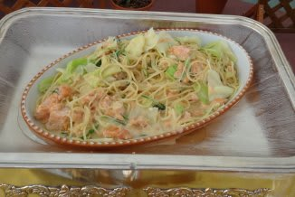

# 3月11日の志賀高原は…

📅 投稿日時: 2012-03-14 01:18:27

で．

明けて日曜は朝から焼額へ．

この日は晴天！！！

朝は結構冷えましたね～

山頂ではマイナス10度を切ってます．

雪質は最高のシマシマ！

もう．よだれじゅるじゅるもの．

んもう，冷えて雪質最高，天気は最高…

これ以上何を求めるものがあるだろうかっ！

昨日の八方とはえらい違い．

快感っ！！

朝の人がいないうちは，ひたすら自由落下だっ！

でも…

天気が良いからか．

9時半ごろには結構混んできました（涙)．

でも，焼額リフトは最高で3分待たなかったな～．

平均1-2分待ちかな．

気温は昼ごろには0度近くまで上がりましたが…

まぁ，この時期としてはまぁまぁかな．

日が当たる斜面は，さすがにちょっと重い感じの

雪質になってきましたね～．

急斜面はちょっとコブになってきましたが，

まぁそれでも昨日の八方に比べれば100万倍ましです．

シアワセです．

楽しいです．

午後になると，人が減ってきたなぁ…

と思ったところ．

2時過ぎからいきなり気温が落ちてきました．

なんだか，斜面が固くなってきたぞ…

と思ったら．

3時ごろからにわかに掻き曇り，天候が急変．風が強まり，雪が降ってきました…

気温もマイナス10度近くまで下がっちゃったよ～．

3月と思えない寒さ．

昼間の暖かさとは急変．

急斜面のオリンピックコースは，溶けた雪が凍り，

下地もアイスバーンで滑れたものじゃなかったけど．

そこ以外はちょいと固めの所もあったものの，相変わらず快適に飛ばせました．

という感じで．

この日もリフトストップまでしっかり志賀を堪能したのでした…

しかし．

焼額プリンス西館のレストラン．

3月の土日限定で，昼間にスイーツブッフェをやってるんですが．

スイーツだけじゃなく…

パスタとかピザとかサンドイッチとかもあって，

たらふく食えて1600円．

結構お勧めかも

