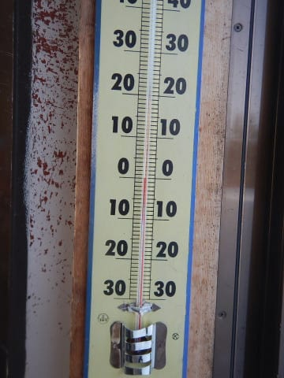
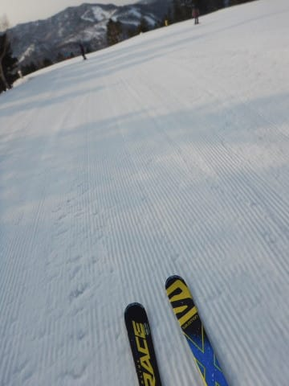
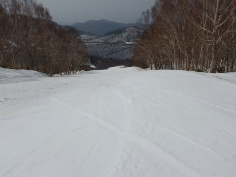

# 4月1日（日）の志賀高原，詳細モード！…志賀全面オープン最終日，いろいろ遠征してきたけど…雪が減ったなぁ（涙）

📅 投稿日時: 2018-04-03 03:08:03

えー．

なんだか．

冷えるタイミングが土曜から日曜にずれつつあり．

土曜の降り始めは雨かも…

という，微妙な天気図を見て．

久しぶりに，全力で冷え冷え踊りを踊らねば

ならないのか…っ！？？

と，心配になっているSkier_Sです．

ってことで．

本日は，昨日速報モードでお届けした，

日曜の志賀高原の詳細レポートです！←昨日のレポートで十分詳細じゃなかったか？？

まずは．

昨日レポートした通りで．

土曜は，前日ほぼ徹夜にも関わらず．

早朝からラストまで滑ってしまい…

さらに夜10時近くまで飲みに行っていた

という．

お前はアホかっ！！！

というツッコミを全力で受けること覚悟の

一日だったのですが．

それでも次の，日曜朝．

もう，2日連続で早朝に出かける，

この素晴らしさ！！！←素晴らしくないから．どこか基準がおかしくなってるから

また営業開始から3分出遅れてるけど…（涙）

かなり眠い目をこすりつつ，

朝日が昇る早朝ゲレンデに出ますが…

うぎゃーー！！

早朝から気温は0℃近く！？？？

今日は気温が上がりそうな気配…

気温は高いけど，朝イチのバーンは…

いや，しっかり固めのシマシマ！

最初の2-3本はちょいと固すぎるくらいだったけど．

気温が高めだったので．

その後は硬めながらもエッジが効く，

かなりいい感じのハイスピードバーンに！

天気は晴天ピカピカで，気持ちいいし．

やっぱり，この時期は早朝に限りますね～！！！

いや．もう．

雪がザブザブになる昼間は寝てていいから，

人がいなくてバーンが締まっている

この時間に滑り倒すべし！！←私は昼間も滑るけど

で．

8:30の通常営業開始タイムになると…

もう，太陽は高く上り，強い日差しが照り付け

始めてます…

だもんで．

このころには，早くも雪の表面がしっとり

し始めてます…（涙）

9時になると．

もうGSコースの雪はかなり緩み始め…

そして，

オリンピックコースは．

この写真では分かりにくいけど…

コースをほぼふさぐようにロープが

張られてますよ！？？

近づくとこんな感じで．

コースの端，わずかだけが通れるようになってます…

斜面変化の下に，ちょっとブッシュが

出ているようで．

ここに突っ込まないようにロープが張られているようですが…

ロープを超えて数m下りれば，

そこから下は，幅いっぱいに雪があるので

普通に滑れます．

…ただ，この写真では分かりにくいですけど．

この写真のコース幅の右側1/4程は，圧雪車が

入ってませんでしたが…

そのほか，ブナコースも．

昨日レポートしたように，かなり土が出始めてますし…

ブナは今週末までぎりぎりもつかどうか…

オリンピックコースも，今週末は行けるだろうけど，

来週はヤバいかも…

で．

春休みの土日というのに．

ゴンドラはがら空きで．

コースもそれほどの人出は無くて．

ピークでもこの程度の人数と，

結構空いてたけど．

でも…

昼間には気温も+10℃近くまで上がってしまい，

かなり雪がゆるんでしまったので…

そうです．

私の焼額の呪いが，今日も解けてしまったようです！！

西側斜面で朝の雪のゆるみが遅い，一の瀬へ

やってきました～！！

一の瀬正面バーンは，昼近くというのに

固い下地の表面が緩み始めた程度の，

ちょうど滑りいいバーン！

やっぱり，朝日が直撃する東向きの焼額より，

ファミリーのゲレンデは，2-3時間ほど雪が

緩むのが遅いなぁ…

パーフェクターコースも，フラットでいい感じ！！

ってな感じで．

しばしコンディションがいい一の瀬を回してましたが…

なんということか．

志賀高原が全山滑れるのも，今日で終わりではないですか！

…だもんで．

今日がラストの，西館～ジャイアント方面へ遠征してみようじゃ

ありませんか…！！

ってことでやってきたのは，西館山．

西館上部に出てみると…

うほーーーー！

全く誰も滑ってないよ．

雪はもうかなり緩いけど．

誰も滑ってなくて，ところどころシマシマすら

残っている，超フラットバーンなんですけど！？？

なんで？

なんで誰も滑ってないの？？？

と，西館中級コースの落ち込み部分に

出てみると…

あら．

ここ，滑れないのね…

迂回コース滑らないとダメなのね…

で．

迂回コースもちょっと雪が微妙な感じだし．

…これは確かに，このコース誰も滑ってない

わけだわ…

ってな感じで．

西館下部も降りてみますが…

…雪，減ったね（涙）．

これは，今日で営業終了でちょうどいい感じ…（泣）．

ジャイアントから眺めた西館＆ブナは

もうこんな感じです…

で．

この日は意外とジャイアントが良かったかも．

人が少なくて，雪も荒れておらず．

結構滑り良かった気がするんだけど…

いかんせん，ここのリフトが遅すぎるのが，

惜しい．←リフトが遅すぎて誰も来ないから雪が荒ないんで…リフトが速かったらコースは荒れると思う

しかし．

コース1本滑るのに，ペアリフトリフト乗車10分以上ってのは，

耐え難い…

昔の高速トリプルだったころなら，

ここを何本かグルグルしたかったところ…

そして．

帰りは東館経由で帰りますが…

うむ！？？

東館ゴンドラ乗り場も，雪が切れてるよ…（涙）

ヤバい．

やばいよ…これ．

この春，ちょっと雪解けが早いんですけど…っ！！

ゴンドラ乗り場の橋も，雪が無いよ…（泣）

そして，東館ゴンドラから眺めた東館スキー場は…

穴，開いてるね…（激涙）

もう，終わってますね…

…東館も，今日で営業終了でよかったね，

という感じ…

うーむ．

いつもより2週間ほど雪解けが早い気が…（涙）

そして，夕方の一の瀬ファミリーに戻ってくると．

さすがの一の瀬ファミリーも，午後はかなり

しっとりと重い，粘つくようなクリーミーな雪…

パーフェクターは雪が一部薄くなりつつあるので，

今週末は穴が開いてそう…

そして，ラストの終礼は．

やはり焼額に戻ってこないと！！

…ってことで，焼額に戻ってきたけど．

うーん．

雪に汚れが浮いてるよ…

4月下旬並みのコンディションですね（涙）．

そして．

1ゴン降り場にも，土が出てきてます…

これは…ヤバいよ…

とか思いながらも．

本日も定番．鉄板．

16:30ラストの第2高速リフトに乗って．

いつもの終礼タイムとしたのでした…

いやーーー．

しかし．

東館，西館はぎりぎり最終日まで営業できたけど．

やっぱり雪解けがいつもより2週間程度早い感じ…（涙）．

ダメだ．

このままではGWが…

…

…いや．

そんなことはない．

そんなことは，私が許さないっ！！

これから，スキーヤーの熱い願いを込めた寒いギャグ（？）を

ひたすら休まず言い続ければ．

日本は冷え冷え．

GWまで雪がもつはず…

…

…

…

だといいなぁ…

## 💬 コメント一覧

### 💬 コメント by (Seeker_N.T)
**タイトル**: やはり
**投稿日**: 2018-04-03 12:55:32

あのタイミングで一の瀬ファミリーでお会いするとは、ちゃんと会話させて頂いたのがとても久しぶりだった様に感じました。

リフト上での「もうヘトヘトで、そろそろ上がろうかと・・・」とのコメントも、いつもながらのハリのあるお声からは「・・・まさかね」と思っていましたが、やはりリフト終了＆終礼までだったんですね。

まぁ、あの滑りを見れば全然余裕じゃん。。と見ていました。

私は宣言通りあの後上がって野球観戦でした。

月曜は夜に少し雨が降り、薄曇りで放射冷却も無かったので朝からシットリした雪でした。早めに上がってワックシングしてから帰路に着きました。。

ところで、この頃になると滑走面が汚れてクリーニングする分だけワックシングに時間がかかる様になりますね。

### 💬 コメント by (Skier_S)
**タイトル**: Seeker_N.Tさま
**投稿日**: 2018-04-04 03:39:28

日曜はお世話になりました～！

いや，あの日は2連続の早朝からだったので，

ホントにかなりヘロヘロで，ついて行くのに

精一杯でした…

でも，やっぱりリフトが動いていると滑り続けなくては

ならない呪いがかかっているので，最後までいっちゃい

ましたが…（笑）．

月曜は夜に雨だったんですか．

雪がそれほど解けてなければいいんですが…

焼額＆奥志賀も，これからあと1か月．

雪が残ってくれるのを祈るばかり．

残りシーズンもよろしくお願いします～！

### 💬 コメント by (むし)
**タイトル**: Unknown
**投稿日**: 2018-04-04 15:09:22

冷え冷え踊りお疲れ様です。あの少雪の16年の3月末でも

金曜日に一降りあって奇跡のコンディションなんて、週末もありました。

踊りましょう、祈りましょう。

前回、通りすがりの書込みに丁寧なコメント頂き

有難うございました。「むし」です。この4年？ぐらい

年の1/3以上はSさんの滑り倒しを静かに楽しく読んで

きたので、ついつい書き込んでしまいました。

つい2週間前に滑ったゲレンデにブッシュが

出たりと、悲しい季節の変わり目ですね。

我が家はここ3シーズン位は奥志賀メインで滑ってました。

子供のリフトデビューは、焼額第二高速で、夫婦二人で

何とか、教えてみようと試みたのですが、西館へ戻る緩斜面で

親子三人で板がからまって、起き上がれなくなり、

こりゃプロに頼もうと、奥志賀で個人レッスンから始めたのが

きっかけです。

今シーズンは小学生になったしそろそろ耐寒性能も備わったか？と

早めに始動・熊の湯のスキー開きから始め、野沢、アルツ磐梯、八方

尾根を混ぜつつ、志賀は合計4回滑り改めて良さを再認識したシーズン

でした。アルツの頂上での吹雪に寒い！、八方尾根ではコースが難し

い！！と怒られましたが・・色んな雪面を長い距離滑る事で先生に習う

のとは違う上達が見られました。

早朝気持ちよさそうだなぁ～、もう一度ぐらい志賀行ってSさんを探して

みようかなという気持ちが湧くのですが、悪雪面の影響を子供の方が受け

やすい事もあり、少しでも楽しく滑れそうな、場所を求めて奥只見の情報

をリサーチしたりしてます。

何れにせよ「通常の人」のシーズン終盤ですね、今週も良いスキーを！！

### 💬 コメント by (Skir_S)
**タイトル**: むしさま
**投稿日**: 2018-04-05 04:47:55

コメントありがとうございます～！

いや，もう春ですよ（涙）．

ゲレンデの雪はかなりの勢いで解けてます…．

今シーズンはお子さんが小学生に

なられたのですね…

我が娘も，小学校に上がったばっかりのころは

「寒い」と言って，天気の悪い日は滑らなかった

ものです…

スキーが嫌いにならないように，天気が悪い日は

あえて無理に滑らせないようにしていたのですが，

今は朝イチからラストまで滑りたがって

困ってます（笑）．

このBlogを読んでらっしゃるならご存知かと

思いますが，小学校1年生でもこんな滑りを

する子も…

https://www.youtube.com/watch?v=rd-Z7c79J-E

年長さんでこんな子もいらっしゃいます．

https://www.youtube.com/channel/UC4h8jCqOLdiJoA09G5q3F5g

回数を滑れば，子供は上達が早いので，

親より早く上手くなっていきます…

最近，焼額の朝礼組はお子さん連れも多いのですが，

みんな爆走チルドレンです（笑）．

ぜひ，一度焼額にいらして爆走チルドレンたちと

ご一緒に滑ってみて下さい．

子供同士で刺激しあって，早く上手くなりますし，

かなり楽しいみたいです．

ちなみに，春は奥只見より志賀の方が雪質は

いいかと思います…

標高が圧倒的に違いますので．

特に焼額の早朝は朝イチはちょいと固めですが，

固い雪が緩み始めたころが最高に気持ちいいです．

これから雪は悪くなっていきますが，

まだ滑られるのであればぜひ志賀高原に

お越しください～！

