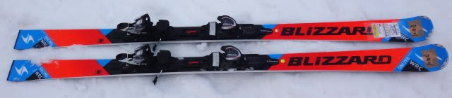
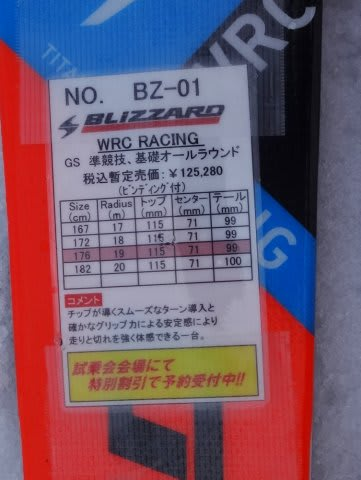
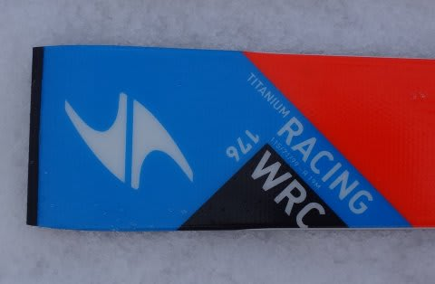

# これで一区切り！2016シーズンモデル，スキー試乗レポート第10回…BLIZZARD編

📅 投稿日時: 2015-04-08 00:46:24

…どうやら．

この日曜で，今シーズン滑走50日に達したようですが．

…今シーズンまだ一度も転んでないSkier_Sです．

シーズン転倒回数0っていう，驚異の記録を達成できるか！？？

ってことで．

まだ続く，2016シーズンモデルのスキー板，試乗インプレッション．

3月の五竜での試乗会の板は，これが最後．

本日は，ブリザード編です．

では，どうぞ～！

○BLIZZARD WRC RACING 176cm

GS,基礎大回り

176cmでR=19mと，FIS非対応の大回り板で，

大回りベースのゲレンデ板としても使えるモデルです．

履いた感じ，素直なサンドイッチ板のGS板っぽい感じ．

きれいにたわみ，トップだけ・テールだけではなく，

素直にトップからテールまで板全体が均一にグリップします．

ただ，荷重ポイントは母指球より．トゥピース下あたりに

たわみの中心がある感じで，ちょっとクラシカル．

でも，R=27以上のGS板のように，自分で動かして迎え角を

つくりに行かなくても，谷回りで母指球を抑えて行けば，

トップがたわんですっと谷回りに入っていきます．

ただ，ロッカー板のように，トップを抑えなくても自然に

トップがターンに入っていく感じはなく，トップ側のたわみが

出てから板が谷回りに入っていく，いわゆる従来のスキー板の

乗り心地ですね～．

とはいえ，適度にたわみの出しやすいフレックスと，適度な

心地よい板の返りがあり，

むしろ，こういう昔ながらの（っていったら失礼か…）

板の乗り心地に安心感を感じる人も多いのでは…

で．

グリップ力はナチュラルですが，スピード耐性は高く，

板のばたつきも少ないです．

ただ，谷回りでトップ側をたわませに行かなくては

ならないので，踏み外すと谷回りでまっすぐ走ります．

…お気楽オートマチックロッカー板に慣れた私は，

踏み外すこと数回…（汗）．

でも．

よくできたサンドイッチの板っぽい感じで，

エッジではなく，面で捉える感じがあり，

ずらしもきれいに回ります．

…過激さや新味はないですが．

すごく素直なサンドイッチ板としてよくできた板なので．

最新ロッカースキーではなく，昔からある

板の乗り心地が好きな人は，気にいるかも…

## 💬 コメント一覧

### 💬 コメント by (マルハバ)
**タイトル**: アサマ2000で乗ってきました・・
**投稿日**: 2015-04-08 10:18:12

う～ん・・

すご～く納得ですね！

今回、ロッカーとキャンバーのフィーリングの違いが

とても良く分かったんですが、

トップが噛んでターンが始動するっていう感じがなくて

それでも曲がっていくロッカー板に

「なんかキモチワル～イ」・・でした(汗）

やっぱり私はピュアな昔の人間だったんですね（笑）

それにしても、試乗会って楽しいですね。

来週のシャルマン火打にも日帰り弾丸ツアーです。

祝・北陸新幹線開業！

### 💬 コメント by (Skier_S)
**タイトル**: マルハバさま
**投稿日**: 2015-04-08 23:33:17

あ，この板，乗ってきましたか…

私にとっては

「キャンバー・サンドイッチ・ウッドコアのコンベンショナルな

正統派のスキー」

って感じでした．

ただ，来年度モデルは，

あまり強烈なロッカー感を感じる板は減ってきたかな～．

VolklのCD，SALOMONやATOMICは相変わらず

ロッカーっぽいですが．

ATOMICも，荷重ポイントが心持ちセンター寄りに

戻ってきた気がします…

でも，やっぱり試乗会楽しいですよね！

