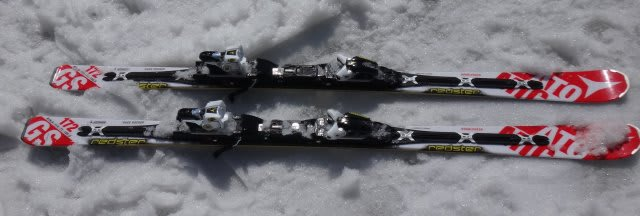
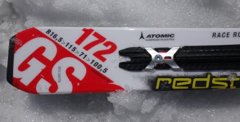

# 2015シーズンモデルのスキー試乗レポートファイナル…ATOMIC編

📅 投稿日時: 2014-06-07 03:56:39

えー．

今日も夜遅いんですが…（涙）．

ってことで．

…長らく続いていました，2015シーズンのスキー板の

試乗インプレッション．

今回で最終回になりました～．

今回の板は，ATOMICのGS板ですが．

この板は，試乗会ではなく．

4月下旬の焼額で，たまたま履く機会が

あったものです…

ということで．

アトミックのGSスキーのレポート，どうぞ～！

----

ATOMIC REDSTER DOUBLEDECK 3.0 GS 172cm

GS競技用エントリーモデル

GS用って言ってますが…

長さは172cmと短く．

Rも16.5mと小さめで．

ビンディングも，プレートがそれほど強くない

X12TLが付いたモデルです．

…GSモデルっていうか．

中身は，BLUESTER LXと全く同じという話なので．

要するに，BLUESTER LXの172cmです．

履いてみた感じ．

GSモデルとは思えないフレックスの柔らかさ．

張りもかなり優しい感じで．返りもそんなに感じない，

優しい板ですね～．

とても，GS板とは思えない…

板のトップのグリップ力が弱い感じで，

トップを抑えても何も起こりません．

これでもかってくらい後傾して，テールを

押していくと，テールがすごい粘る感じで

たわんで，そのたわみに乗って回っていきます．

切り替えも，板のたわみが返ってきて切り替わる，

というより．

テールに荷重した板がそのまま抜けていって，

切り替わる感じ．

板がそんなに強くないので，低速からある程度

優しく曲がっていけますけど．

がんがんトップスピードを出していっても

縦に落とせるほどの，超高速大回りが

できる板ではなく．

トップスピードを出すと，結構板がたわんでいき，

大回りというより，ちょっとターン弧が小さくなって

行く感じ…

GS板と思うとちょっと物足りなさはあるけど．

そこそこのゲレンデを大回り～中回りベースで

ゆったり目のペースで滑るのにいい感じなので．

ATOMICの乗り味が好きな人には，大回りベースの

オールラウンドとしてもいけるかも…

ただ，私としては．

ロングの板としては，もう少し張りが強い

高速耐性がありそうなやつがいいかな～．

…しかし．

来シーズンのATOMICの板．

どの板も，むちゃくちゃテールを使って

コントロールする板になってますね…
