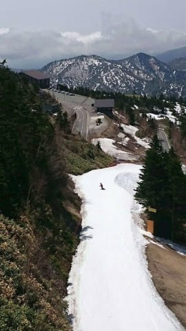

# 過去の物欲選手権記事一覧…今さらながら，過去の記事を見返してみたけど．面白いじゃないか（笑）

📅 投稿日時: 2020-05-19 01:23:31

🏷️ カテゴリ: [スキー雑談](c1f9d2cb7478308da16419928ea3945e9.md)

ってなことで．

昨日からなぜか徹夜で仕事をしていたSkier_Sです…（涙）

昨晩はとてもBlogを更新している暇がなく．

一日記事をスキップしちゃいましたが．

で，

日曜は，さすがに横手山・渋峠は結構混雑した

みたいですね…！

横手第2乗り場，ラフォーレ横の駐車場も，

スカイレータ―前の「のぞき展望駐車場」も

一杯になり，リフトもかなり待った

みたいです…

土曜は，朝にパラパラ降った以外，

午後には結構強く降ったみたいで（涙）

おかげで，渋峠の雪も薄くなりましたね…

日曜は，天気が良かったおかげで

早朝の1時間は良かったけど，それ以降は

雪もザクザクになってしまったようで…

横手山もそろそろ薄くなって

来ています…

そして，月曜の本日は．

横手第3は動かず，横手第2と渋峠ペアのみの

運転だったのですが．

関東が雨だったにも関わらず，

志賀高原は意外と天気が悪くなかった

ようです…！

うーむ．

でも．この日差しのおかげで．

横手第2ゲレンデは，日曜よりさらに

雪が減ったかな…？

今晩から明日19日にかけての雨で，

ちょっと雪がやられちゃいそうですが…

今週までは何とかもってくれるかな…？

そうそう，

5月末までの営業休止を宣言していた月山ですが．

5月16，17日の週末は，県内在住者向け営業を

していたみたいですね…！

（[西川町観光情報ページ](https://www.gassan-info.com/news/677)より）

滑るには，山形県民だと示す身分証明書が

必要になるようですが…

ってことで，本題へ．

スキーに行ってない，この4月以降．

ずっと家に籠っているわけで．

で，時間があった時に，過去の自分の記事を

読み返してみたことがあったのですが…

…

…自分で書いておきながら．

これ，面白いじゃないか←自画自賛？

…いや．ホントに．

自分で書いたから覚えてるはずなのに…

特に．

物欲選手権の記事．

自分のことながら，読んでて

「アホだな～…」

と思っちゃいました．

なので．

ちょっと今さらながら感がありますが．

物欲選手権の記事のもくじを作ってみました．

暇な折に読み返してみてください．←新しい記事を書くネタが無かったから，今日は過去記事に頼ったか…？

振り返ればこれがスタート…[第1回　その1](ebea1e9e359cc665d9cc2929e08045177.md)，[その2](e9a16d9757c2d52b7254fe8a802071c63.md)

まさか，2度目もあるとは思わなかった…[第2回](e4eb8b62d644e240a6080cac72ad69416.md)

まだこの頃は負け方がかわいらしい…[第3回](efb7a35a863f49c11192814a01ff642c2.md)

そろそろ負け方に貫禄が着いてきた…[第5回　その1](e676591ac0d87f01c70ad0ad2ceae84f6.md)，[その2](e6df9bc89d9cb79e5826db6aa2c3425a4.md)，[その3](e6abe5073a6309ba96beb83bbb4b9aa25.md)

名勝負？…[第6回　その1](e7e02015f03823884a3522a56c651a398.md)，[その2](eaaeda9e3778e907e346756df54a64c29.md)，[その3](e5d8b773d9ba5b4a2d3ba8195a6c26613.md)

　　[第6回の舞台裏（？）](e7378ec99e998c0f40d82c79a72156ed4.md)

通販をやってみた…[番外編　その1](eda7898d5cb5580b1871f3cbef83241ac.md)，[その2](e0d8b47cf3b1e8a2c5b9480fc0167c580.md)

　　[番外編追記1](e922ef4eede2bd4d2b900bd4bf1b03156.md)

　　[番外編追記2](e27e2a7149d362e76794896614d0f18f3.md)

スキーパンツを買いに行ったけど…[第7回　その1](e38b4d4ca6ea3af24cebf3838ab8c791d.md)，[その2](efc5f894d3d04c4c90abdf5ac3a2a0535.md)，[その3](e1964ba91aa7855224b31d139e5419962.md)

　　[番外編後日談1](e56c11ebadfa98e86c1f0cbe36198f076.md)

　　[番外編後日談2](ed868696918a40419c43706429d5d8193.md)

神田じゃないスキー屋さんで…[番外編2 その1](e08f88a704470a5656ebc84fecc72aa08.md)，[その2](edcaba43061d969c15802f9c095f6dd32.md)

　　[番外編2の後日談　1](e8f6f10c51443780808e48b1f54c3ed5b.md)

　　[番外編2の後日談2](e8a53c5e38b2ebcf1a084dc391aaad69d.md)

海外出張の帰りに神田へ寄っただけのはずが…[第8回　その1](ea2109ba25f451ea3cb1d5d935d899b91.md)，[その2](e0191fb936cdf7d9e150b75a80adc5860.md)，[その3](eb4bda6045599e99f977e557f6cd2763c.md)

長岡まで行って何も買わないわけがないよね…え？それだけじゃない？[長岡・エキップ編　その1](ec30d65ecf2d67ea374cb89930ce53a9e.md)，[その2](e80370307311c1508a87da92680e1fcb6.md)，[その3](e629a5b8d8ab33bf005e36358f17ce6e4.md)，[その4](e1d88adddba28d0a22ed46ad7d01acde9.md)

ブーツ調整に長岡へ行っただけのはずが…？　[第2回長岡・エキップ編　その1](ed9f378aafcc4eb8620e941a8c06dd4a7.md)，[その2](ee790cb2b0ca4fdca01e0834b2b94ee5a.md)，[その3](ee0c0be054da1716df71f5c336e24b04a.md)，[その4](e2f7f076faaf353202e84952b50279be7.md)

今回も，ブーツ調整と板のチューン出しに長岡へ行っただけなのに…　[第3回長岡・エキップ編　その1](e107181925fb3cf130e75fb7a164207e7.md)，[その2](e271f39a44aeb633d01e3a769cba23b1e.md)，[その3](ece68838b53dfc37b212fc4ba5af4733c.md)，[その4](e6e52bf2d58aa3fd22476534f6a6705e6.md)，[その5](e544fa9792496d5c0cd0b646e401fcd62.md)

今度は焼額山スキー場で開催！？鈴木社長との対決に完敗　[第1回焼額スキー場編　その1](e05737a8e31c770fa09305653a9f0b66c.md)，[その2](e6de5809ea7fb10f1da1039545df17a42.md)，[その3](e86184c188b21f43fe0f4d568138c1e77.md)

いや～．

バカですね～（笑）

## 💬 コメント一覧

### 💬 コメント by (ほっぽ)
**タイトル**: 今年の物欲選手権は、、、
**投稿日**: 2020-05-19 07:06:23

Ｓさん

素晴らしい文才をお持ちだと思います。

小説家としてデビューできるのでは？

さて、ＳＸのストックも厳しくなってきて、次の板がどうなるか？

気になっています。

個人的にはATOMICのS9かS9i　PROをビンディング無しで買って移植、

が良いのではないかと思っていますが、コロナ影響で

来シーズンモデルは入荷が怪しいので、今のうちに19-20モデルをGETされることをおススメしておきます。(^^;

### 💬 コメント by (Northfox)
**タイトル**: Unknown
**投稿日**: 2020-05-19 16:37:11

私がこちらのブログを読み始めたきっかけが物欲選手権シリーズでした。

板尾買蔵さん、良いですね〜

自分の中にも板尾買蔵さんが居るようなw

自粛が明けて神田の街に行ったら何をしでかすか自分でも心配です。。。

### 💬 コメント by (Skier_S)
**タイトル**: Unknown
**投稿日**: 2020-05-20 07:17:40

＞ほっぽさま

うーん．

まだ19-20モデルのS9iPro，残ってるんでしょうか…？

この板，寿命が短いという噂があり，

KonSukeさんが履いたら40日もたなかったという実績もあるので，

ちょっと悩み中です…

＞Northfoxさま

あ，最初に読んだのが物欲選手権ですか！！！

それはまた，濃いぃ記事から読み始めたんですね…

読者の間からは，なぜか板尾買蔵さんの人気が高いです（笑）

私も今，自粛フラストレーションがたまっているので，

神田に行ったらヤバそうです…

### 💬 コメント by (ほっぽ)
**タイトル**: Unknown
**投稿日**: 2020-05-20 23:42:05

＞Ｓさん

Ｓ９ｉ　ＰＲＯは寿命短いのですか。

４０日だと毎年買わねばなりませんね。(^^;

神田もすっかりご無沙汰なので、残っているのか、

誰か都内在住の人が調査してくれると良いのですが。

VARビンディングを使いまわすことを考えるとATOMICかSALOMONになっちゃいますが、

ビンディングありきで選ぶのは多分間違ってますよね。(^^;

### 💬 コメント by (Skier_S)
**タイトル**: ＞ほっぽさま
**投稿日**: 2020-05-21 08:18:29

寿命，短いっぽいです…

しかし，ビンディングありきで板を選べば数万円違いますから，

結構大きいです…（笑）

