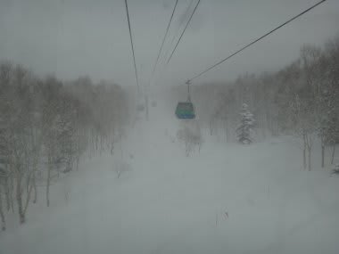
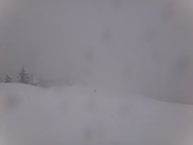
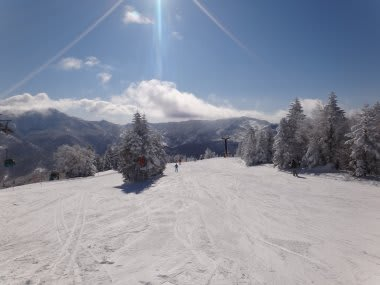

# 2月18，19日の志賀高原の速報

📅 投稿日時: 2012-02-20 00:57:40

先週はいろいろハードな一週間で．

睡眠時間を削ってむりくりスキーにいったので．

土曜日はレポートする気力もなく寝てしまいましたが．

今日もですねぇ．

やっと帰ってきたところなんですよ．

つい先ほど，

志賀高原から…

帰りの関越道，むちゃくちゃ渋滞してたんですねぇ…（涙)．

帰宅は日付が変わってからになっちゃったので．

詳しくは明日レポートすることにしてですね．

今日はあっさりレポート．

土曜は…

強烈な吹雪＆ガス（泣）．

前も見えないし，寒いし．

圧雪コースも雪ががんがん積もって荒れてくるし．

さらに，吹雪で奥志賀は全リフトが止まってしまい．

焼額も第2ゴンドラは運休．

開いている第1ゴンドラに人が集中し，

コンディションが悪いうえにゴンドラ待ちがあるという…

非常に気力が萎える一日でした…

それに対し，日曜は最高の晴天！

気温も低く雪もよし!

最高のスキー日和！

こんな日のために生まれてきたんだ！！

と思うほどの最高のコンディション…

…ただし，ベストコンディションだったので，さすがに混んでたけど…

ゴンドラ待ちは正月より長かったなあ…

とりあえず．

天気予報の通り，むちゃくちゃ冷えた週末で．

大雪の土曜と晴天の日曜になりました．

詳細レポートはまた明日書きます．

お楽しみに！

＃いったいどこに楽しみにしてる人がいるんだろう…

## 💬 コメント一覧

### 💬 コメント by (雪上の翁)
**タイトル**: はじめまして
**投稿日**: 2012-02-21 09:01:30

志賀高原の検索からお邪魔してはや一年以上経ちますが、

いつも楽しく読ませていただいている隠れ隠れファンのひとりです。

私も神奈川在住で冬は志賀高原をメインに滑っています。

これからも有意義な志賀情報をよろしくお願いいたします^^;

### 💬 コメント by (Skier_S)
**タイトル**: 雪上の翁さま
**投稿日**: 2012-02-22 01:10:36

はじめまして！

おなじ神奈川在住ですか…

志賀高原まで遠いと思うんですが，

志賀がメインってすごいですね．

このブログ，天気予想などは

「志賀高原補正」をかけていて，

かなり志賀高原に特化した情報を

提供している気がしますが…

今後ともよろしくお願いします．

