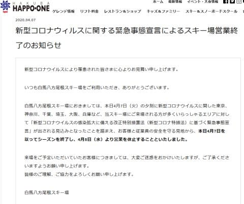
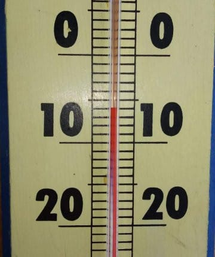
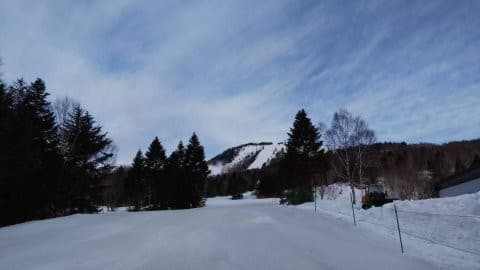
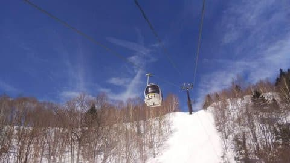
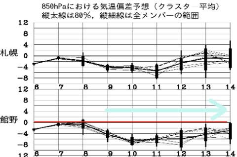

# 緊急事態宣言，GW終了まで継続（涙）…八方尾根は終了宣言．他のスキー場も八方に続くのか？？

📅 投稿日時: 2020-04-08 00:31:44

🏷️ カテゴリ: [日記](cc4b5682fb7b8b144980957a978653fb0.md)

えー．

本日，緊急事態宣言が出されたわけですが．

…これを受けて，

早くも八方尾根は営業中止を宣言

しましたね…（超激烈涙）

（[白馬八方尾根スキー場ホームページ](https://www.happo-one.jp/news/16664/)より）

宣言が出されたばかりだし，

営業自粛を検討されている業種に

スキー場が入っていないというのもあり，

営業中止宣言をしているスキー場は

まだほとんどありませんが…

もしかすると，他のスキー場も八方の

動きに続くところが続出するのかも…（泣）

そして．

7都府県では，5月6日までの移動自粛と

なってしまったので．

…GWまでに復活を願ってましたが．

これで，GWも自宅軟禁が決まりましたね…（泣）

…感染拡大防止のためなら，止む無しです…（あふれる涙）

さらに．

私の給料を払ってくれている某組織．←だから，普通に勤務先って言おうよ

どうやら，GW期間中の4/25～5/6までの

谷間を埋めて12連休となりそうな予感…

皆さんご存知のように，わずかでも休みが

あれば，どこかへ出かけてしまうこの私．

どこにも出かけず，仕事もせずに自宅で12日間を過ごす

ということを，人生これまで一度も

全く全然経験したことが無いので．

12日間家で過ごしたら，一体何が起こるのか．

自分のことながら，全く想像がつきません…

果たして，私の精神の平安が保たれているのか．

おそらく3日目あたりに，出かけたさのあまりに

家の中でゴロゴロ転がり回って暴れてるんじゃ

ないかと，今から心配です…

まぁ．

それ以外にも心配事はいっぱいありますが．

心配事や真面目な話は他にお任せすることにして．

このBlogは，引き続き，楽しい癒しの空間（？）を

提供していこうと思います…！！

ってなことで．

本日6日(月)の志賀高原ですが．

なんと．朝は-6℃といい感じの冷え冷え！！

あさイチは，かなりガリガリの硬めの

バーンだったみたいですが…

昼ごろには，日が射すバーンは

緩み始めたものの．

一日中晴天で，いい感じのゲレンデ

状況だったようです…！

いやー．

この4月，結構いい感じで冷えてますね…

そして．

すばらしいことに．

一週間予想を見てみると，これから先，

来週月曜まで，ひたすら冷え冷え期間が

続くじゃないですか！！！

水色矢印の9～14日までの6日間にわたり，

平年比4～6℃ほど低い日が続き．

雪はほとんど解けなさそう！！

…そして．

9日夜～10日にかけて，雪が降りそうな感じです…

また明日，この週末の詳細な天気予想をしますが．

この週末も，この時期としてはコンディション

良さそう…っ！！

…もう，GWまでの事態収束はなさそうなので．

今さら冷えても意味がないんじゃないかと

思うかもしれませんが．

そうです．

GW後のかぐらや月山があります！！

まだ期待を捨ててはいけません！！

これから冷えてくれれば，5月のかぐらで

たっぷりの雪で滑れるのです！

ってなことで．

緊急事態宣言は出ましたが．

GW後に解除されることを願って．

その後のかぐらや月山で滑れることを

信じて．

まだまだ冷え冷えでいてくれることを

祈りましょう…！

## 💬 コメント一覧

### 💬 コメント by ()
**タイトル**: Unknown
**投稿日**: 2020-04-08 07:27:41

スキー場、ゴンドラ&休憩時以外は感染リスクほぼ0だと思うのですが…

### 💬 コメント by (markun)
**タイトル**: Unknown
**投稿日**: 2020-04-08 16:31:23

https://yokoteyama2307.com/news/7924/

### 💬 コメント by (いちと)
**タイトル**: Unknown
**投稿日**: 2020-04-08 21:56:34

こんばんわ

この前の連休参戦出来て、結果良かったです

私も軟禁されてますが、仕事もないので、GWは志賀高原にいきたい所ですが、株のナンピンで金欠で身動きとれませーん

### 💬 コメント by (しんちゃん)
**タイトル**: 癒しの空間
**投稿日**: 2020-04-09 00:55:08

癒しの空間の提供をこれからもよろしくお願いします。

車の記事、板の試乗記、登山の記事など盛りだくさんかと思います(笑)噱

### 💬 コメント by (Skier_S)
**タイトル**: 今週は冷え冷えウィーク！
**投稿日**: 2020-04-09 00:55:21

＞無名さま

自然の中で，他の人と近づかないので，スキー自体は感染リスクが低いのは

間違いないと思います…

問題は，食事やリフト待ち（今はほとんどないけど），

あるいはスキー場に行くまでの移動でしょうか…．

＞marakunさま

横手は早朝やるんですね…！

＞いちとさま

そちらも軟禁状態ですか…

私は緊急事態を受けて，明日以降の職場封鎖の準備に今日は出社しましたが，

明日以降は在宅の日々です…（涙）

### 💬 コメント by (Skier_S)
**タイトル**: ＞しんちゃんさま
**投稿日**: 2020-04-09 00:57:25

このBlogは引き続き，ゆるーーい感じでやっていこうと思います．

ネタは多数あるんですが，さすがにスキーレポートをやらないと

あっという間に使い尽くしてしまいます…（涙）

### 💬 コメント by (yama)
**タイトル**: Unknown
**投稿日**: 2020-04-09 07:11:26

数年前からブログを拝見しております。

投稿失敗したので二重投稿になってたらすみません。

いつも天気予想を参考にさせていただいてます。ありがとうございます。

毎年志賀高原のシーズンパスを購入してますが、今シーズンは野沢も滑れるBIG2を買ったのに

滑走日数20日で滑り納めとなってしまいました…

他スキー場も突然の営業終了で残念ですが、今の状況だと仕方ないですね…

この場をお借りして。

＞お名前無記入さまへ

日帰りだとそうなんですが、宿泊となると、食堂やお風呂で感染リスクがありますので難しい問題です。

車中泊でもお風呂やトイレが問題です。(排泄物でも感染)

不特定多数の入るお風呂は感染リスクが高いです。

そもそも移動がNGですし、移動中にコンビニやサービスエリアに立ち寄ったりもありますね。

やはり今は家にいるのが一番だと思います。

Sさま、この投稿が不適切でしたら削除していただいて構いません。

### 💬 コメント by (Skier_S)
**タイトル**: ＞yamaさま
**投稿日**: 2020-04-10 00:55:51

なんだか，某20000mゴールドのyamaさんかとおもいましたが…

違う方ですよね．

コメントありがとうございます~！

まぁ，スキーは感染の他にも怪我のリスクやら，移動に伴う事故の

リスクやら，リスクが高いスポーツではありますが(笑)．

とりあえず，感染する・させるを避けるなら，家にじっとしているのが

正解なのは，悲しいですがご指摘の通りの事実です…（涙）

早くこの騒動が収まることを願うばかり…

こんな形でスキーができなくなるとは，自分の人生でこれっぽっちも

考えてませんでした（泣）．

