# 2009年　初の海外子連れダイビング旅行記　13　Moving to Rangiｒoa

📅 投稿日時: 2012-09-10 00:11:31

🏷️ カテゴリ: [ダイビング日記](ce3a7a8d424d112fce83ee85c81a0e344.md)

ボラボラ3日目の朝…

っつっても，丸一日ボラボラに滞在したのは昨日だけですが．

娘は，もう時差もまったく感じさせず，いつもどおりに夜寝て朝ちゃんと

起きてくれます．

こんなにあっさり海外に適応するなんて．

なんて旅行連れて行くのに楽な娘なんだろう…

で．

早くも今朝，ボラボラを後にします．

向かうは飛行機で約1時間離れたランギロア．

今日の午後は，ランギロアでダイビングです．

（なんと落ち着きの無い日程だ…）

ということで．

朝9時過ぎにホテルピックアップ．ル・トラックで港へ移動し，

行きの時と同じ船で空港島へ向かいます．

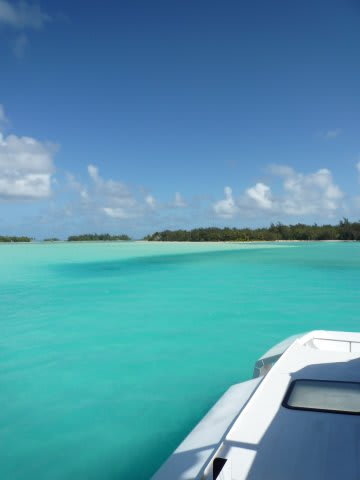

相変わらずのすばらしい海を眺めながら20分．

…行きは良かったけど，帰りは同じ海を眺めてもちょっと寂しいなぁ…

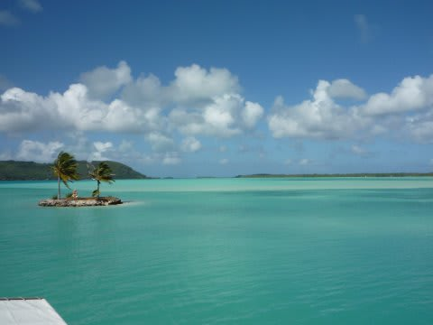

乗り物が好きな娘は，また船に乗れて喜んでます．

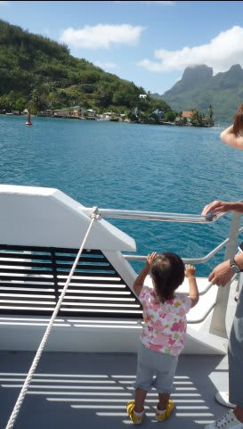

なんて旅行連れて行くのに楽な娘なんだろう…

で．空港についたらランギロア行きの国内線へ．

ランギロア行きの飛行機はATR42．これまで，ATR72は乗ったことがあるけど，

この機体は初めてだな～．

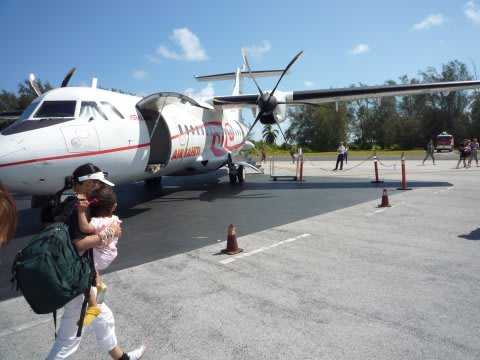

この機体，一番前の席は，キャビンクルー向けジャンプシートよろしく，後ろ向きなんですね～．

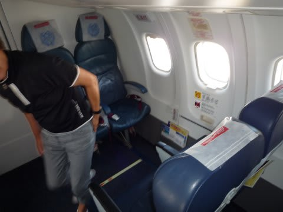

なぜか私がその席に座ることに．

たぶん，後ろ向きで飛行機に座ったことがある人は少ないと思うんだけど．

珍しい体験だと思うんだけど．

貴重な経験なのに，なんか，電車のボックスシートみたいに

向かいに人が座ってるので落ち着かない…

＃席がリクライニングしないのも，イタい．

とりあえず．

11時前に離陸．

…後ろ向きに離陸していくのはちと気持ち悪い．

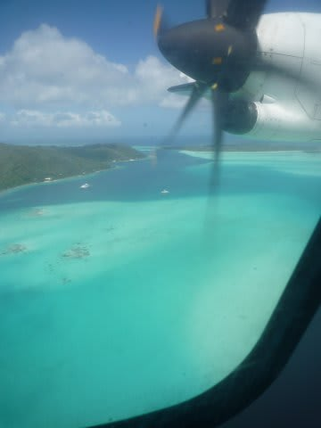

さらばボラボラよ！

ランギロアまでの飛行時間はわずか1時間．

物分かりのいい娘は，飛行機に乗ったとたんにコテンと熟睡しちゃいました．

着陸まで1時間，完全にぐっすり．

お昼寝時間と重なったとはいえ，なんと手のかからない子なんだ…

なんて旅行連れて行くのに楽な娘なんだろう…

ランギロアに近づくと，細長い環礁が続くランギロア独特の景色が眼下に広がります．

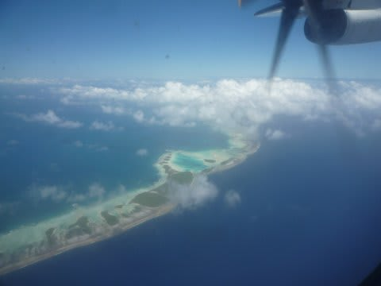

12時前にランギロア到着．

うーん．空港の前からすでに海がきれいだぞっ！

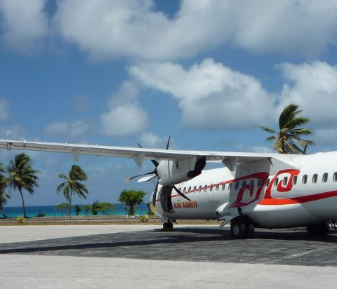

空港から，ホテルお迎えのバスで何も無い道を5分ほど走ってホテルへ．

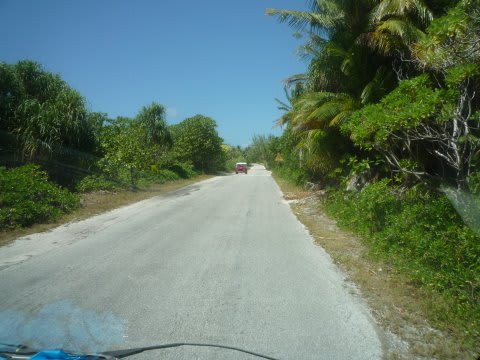

…娘は．空港について目が覚めて，今度はバスに乗ってゴキゲン．

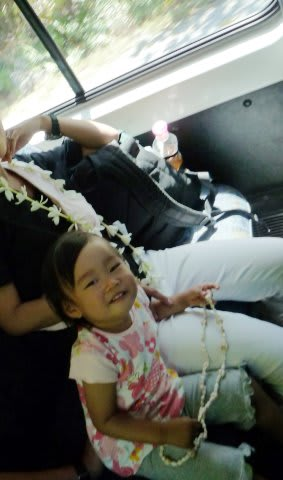

…乗り物ならどんな乗り物でも乗せておけば，ゴキゲンな娘って…

なんて旅行連れて行くのに楽な娘なんだろう…

んで．

着きましたるは，ランギロアのホテル・キアオラ．

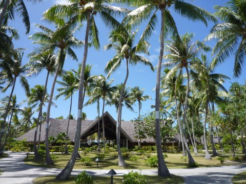

こういう，うっそうとした椰子の木の中にゆったりとしたコテージが並ぶ，

雰囲気バツグンのホテルに到着です．
