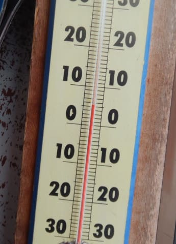
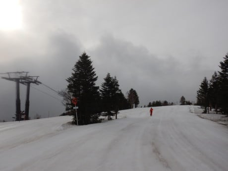
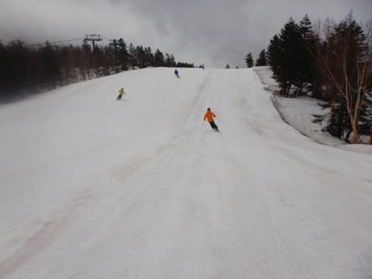
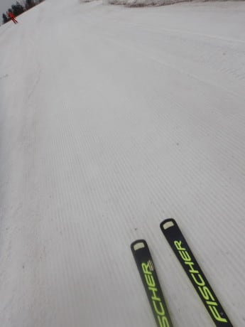
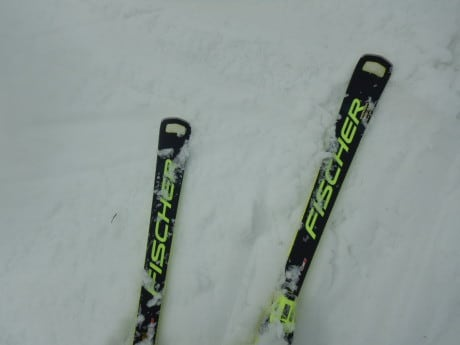
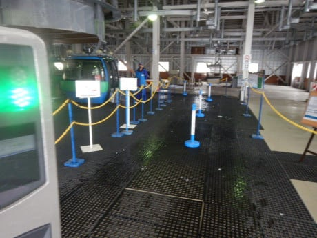
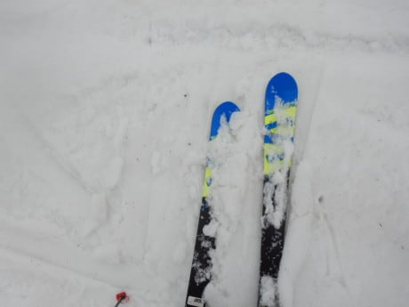
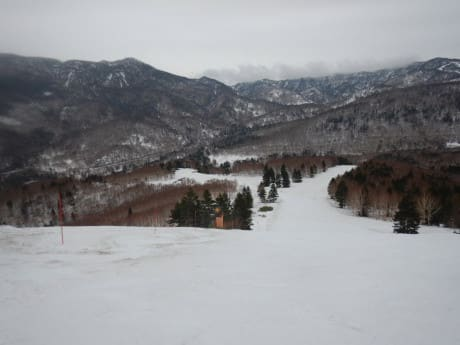
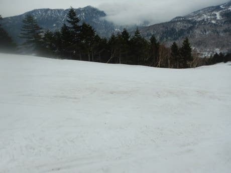

# 2022/4/24(日)の志賀高原スキー場速報レポート…終日曇り，気温は高めで午前から板の滑りが悪い雪に(涙)

📅 投稿日時: 2022-04-25 02:04:00

ってなことで．

お約束通り，今日もラストまで滑り，

今日も帰宅は夜遅く（涙）

さらに帰宅後仕事を一つやっつけて，

こんな時間になってしまったので…

今日の志賀高原レポート，速報モードにて！

まず．

このために焼額の2ndシーズン券を買ったわけなので．

今朝も6:30の早朝営業スタートから参戦！！

…しかし．

6:30の段階で，山頂の気温が+5℃って

なにごと…っ！！（涙）

今シーズン，4月の気温が高すぎるん

ですが(泣）

早朝営業の時間は一瞬ガスが出るタイミングも

あったけど．

あさイチの天気は曇り空．

結局この日は一日中曇り空でした…

この時期は，通常営業より早朝の方が

人が多いですね～…

早朝1本目はわずかに締まり気味な

雪だったけど．

気温が高かったので，早朝2本目からは

もう雪が緩んでしまい．

終日曇り空で日差しが無かったにも

関わらず，朝8時にはゲレンデは完全に

緩んでしまいました…(泣）

気温が高すぎる…(涙）

早朝営業の時間が終わると，もうゲレンデは

ガラガラ．

ゴンドラも，終日ほとんど飛び乗り状態！

…でも．

ゲレンデの雪はあさから完全に緩みきった

重い雪で．

かつ，粘りつくような滑りの悪い雪(泣）

残念．

残念だよ…

滑っていても楽しくないからか…

ゲレンデは昼前にはもうほとんど人が

いないようなゴーストタウン状態です…

でも．

人が少ないおかげで，今日もゲレンデは

一部急斜面以外，ラストまでそこまでひどく

荒れずに終わりました…

うーん．

今日は板の滑りが悪かったので，

ちょっと悲しい感じでしたが←それでも最後まで滑るんだ…

まだゲレンデの雪はたっぷりあるのが救いかな～．

これからGWにかけて．

「梅雨か？」

と思うような天気図なので．

すっきり晴れる日は少なく．

5月1日までの天気図を見ると…

4/27，4/29，5/1あたりは雨に

祟られそうです(涙)

気温もそれほど下がらず，雨が

続くと…

まだまだ雪がある今シーズンとはいえ．

GW最後まで雪がもつか，ちょっと心配…

晴れなくていいから，雨は降らないで

欲しいな～…

## 💬 コメント一覧

### 💬 コメント by (you160)
**タイトル**: Unknown
**投稿日**: 2022-04-26 19:50:10

Sさま

日曜は、貴重な滑走の時間を割いて頂いた感じで恐縮です… 私も色々なお話し聞けて楽しかったですし、なによりヤケビキッズのレベルの高さに驚愕しました。

さらに、うちの娘たちもよほど楽しかったのか、帰ってきてSさま大好きを連呼していましたよ！

予定では、4/29は渋峠濃厚ですが、4/30,5/1は今のところ焼額山です！

### 💬 コメント by (Skier_S)
**タイトル**: ＞you160さま
**投稿日**: 2022-04-27 04:46:08

日曜はお世話になりました～！

こちらもかわいい二人と一緒に滑れて，楽しませてもらいました…

うちの娘もこんな時代があったよなぁ…とか思いながら滑ってました．

お子さんたちに気に入ってもらえたなら何よりうれしいです(笑)．

私は29日は志賀に行けなさそうなので，30，1日にヤケビにいらっしゃるならちょうどいい感じです．

またヤケビでお会いしましょう…！！

