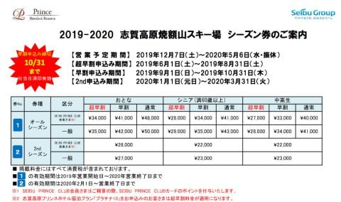

# 焼額山スキー場，来シーズン(2021シーズン)のシーズン券情報が出たよ！…昨シーズンと条件は変わらず

📅 投稿日時: 2020-07-01 01:28:08

🏷️ カテゴリ: [スキー雑談](c1f9d2cb7478308da16419928ea3945e9.md)

えー．

どうやら，2020年に暮らす我々は．

そうと気づかぬうちに，すでに7月へ

突入させられていたようです…！！

なんと．

私が許可していないというのに，

早くも2020年の半分が終わってしまって

いたようです！！←なぜあなたの許可を取らねばならない？

…なんということだっ！！！

うーむ．

なんだか今年，時間が経つのが早くないかい？？←毎年同じことを言ってる気がするんだけど？

ってなことで．

私が許可していないのに，勝手に7月になってしまった

2020年ですが．←だから，なぜあなたの許可を取らねばならない？

昨シーズンは5月中に出ていた，焼額山スキー場の

次シーズンリフト券の情報．

今シーズンは7月に入るこの時期になり，やっと

2021シーズンのシーズン券情報が出てきました…！！

例年より情報が出てくるのが遅かったので，

今シーズンはもう超早割が無くなるのかと

心配してましたが…

案内を詳しく見てみると．

（[焼額山ホームページ　シーズン券の案内ページ](https://www.princehotels.co.jp/ski/shiga/files/seasonpass.pdf)より．以下同）

をを！

来シーズンのシーズン券も超早割があり，

お値段は昨シーズンと全く同じ．

プリンスクラブの会員は，超早割が大人34000円です！！！

ちなみにこの下が昨シーズンの料金表なので．

全ての項目で，来シーズンと同じ料金ですね…

来シーズンは，リフト券の値上げが無いようです！

ただ，子供用のシーズン券．

昨シーズンまでは，小学生までリフト券代は無料だけど，

シーズン券作成手数料3000円がかかっていたところ．

次のシーズンは，

子供用シーズン券は手数料含め，完全無料

になるようです…！！

この部分は，値下げ方向に変わってますね…！！

すばらしい！！

そして．

気になる来シーズンの営業期間ですが…

ををを！

ちゃんと，5月5日のGWまでやってくれるようです…！！

2016，2017シーズンの2シーズンの間，

GW営業をやめ，4月第1週に営業終了していた焼額．

2018シーズンから，GWまでの春営業＆早朝営業を

再開してくれて．

大勢の志賀好きが大いに喜んだわけですが…

2018シーズンは雪不足でGWまで雪がもたず．

2019シーズンにようやくGWまで営業できたけど…

2020シーズンはコロナ騒ぎでGWまで営業できず…

と．

復活後の3シーズンは3戦2敗の春営業．

これに懲りて，また春営業をやめちゃうのでは…？？

と，心配しましたが．

さすが焼額．

来シーズンも，GWまでの営業を予定してくれている

ようです！！！

…何が起きるのか分からないので，あくまで予定ですが…

あ，営業開始は例年通り，12月第1週の週末からですね．

今年は12月5日ですか…

で．

気になる他の特典ですが…

ふむ．

(1)のナイター営業利用可能は，昨シーズンと同じですね．

早朝営業は利用可能と書かれていませんが…

また，来シーズンも，焼額限定一日券で早朝を

滑れるようにするという意思表示でしょうか…

…早朝営業をやらない

という意思表示ではないことを祈るばかり…

(2)，(3)，(4)の特典も，昨シーズンと全く同じですね．

他のプリンス系列スキー場の500円割引券10枚，

ドリンク無料券10枚が着くようです…

…ということで．

焼額の来シーズンのシーズン券案内から読み取れる

情報は．

GWまで営業する予定で，

ナイターはやってくれそう，

早朝券は無くなりそう，

リフト券の値上げはなさそう…

というところでしょうか．

うーーーむ．

とりあえず．

来シーズンこそ．

異常気象にならず，普通に雪があって，

12月にオープンできて，GWまで雪がもってくれて．

未知の感染症でスキー場がクローズになったりせず．

地震などの天災とか，その影響の電力不足とかが

起きたりせず．

テロやクーデターが起きたりせず．

小惑星が衝突したりせず．

宇宙人が攻めてきたりせず．

…何事もない普通のシーズンを過ごしたい…

と，ささやかに願うSkier_Sだったのでした…

## 💬 コメント一覧

### 💬 コメント by (ヒータロゥ)
**タイトル**: Unknown
**投稿日**: 2020-07-01 07:21:15

ようやく来ましたシーズン券案内。

来たるシーズンはヤケビ限定シーズン券でせっせと通います。

コロナが収束しない限りゴンドラの定員半分乗車なんだろうな〜　でもスキーの灯を消さないよう通います。

### 💬 コメント by (今年からの読んでいる者)
**タイトル**: Unknown
**投稿日**: 2020-07-01 11:49:27

今年から楽しく読ませていただいています。焼額が本拠地とのことですが、志賀高原についてお聞きします。次のシーズンに山の駅からジャイアントスキー場にゴンドラができるようですが、蓮池から山の駅までのアクセスが良くわからずちょっとイメージがわきません。そのあたり何かご存じでしょうか

### 💬 コメント by (Skier_S)
**タイトル**: 7月なのに，スキーネタで盛り上がりますね…
**投稿日**: 2020-07-02 01:18:35

＞ヒータロゥさま

来シーズンも，焼額に通い続けてください(笑)．

乗車定員半分だと，週末はすごい混雑になりそうですね…（涙）

なんとか早く定員乗車しても大丈夫な状況になってくれないかな…

＞今年からの読んでいる者さま

コメントありがとうございます～！

山の駅のパルスゴンドラは，実は昨シーズン中から

志賀高原関係者の方からいろいろ聞いてはいたのですが…

これは，山の駅とジャイアントリフト乗り場を繋ぐゴンドラです．

山の駅から滑り降りるコースは無いので，山の駅⇔ジャイアント下部まで，

上り下りともゴンドラ乗車です．

蓮池から山の駅までは，歩くとちょっとかかります．

5分以上歩く感じでしょうか…

なので，蓮池スキー場から山の駅に行くには，

蓮池の一番下から道路を渡ってジャイアントに滑りこみ，

ジャイアントを一番下まで滑ってからゴンドラに乗るのが一番楽なルートになります…

